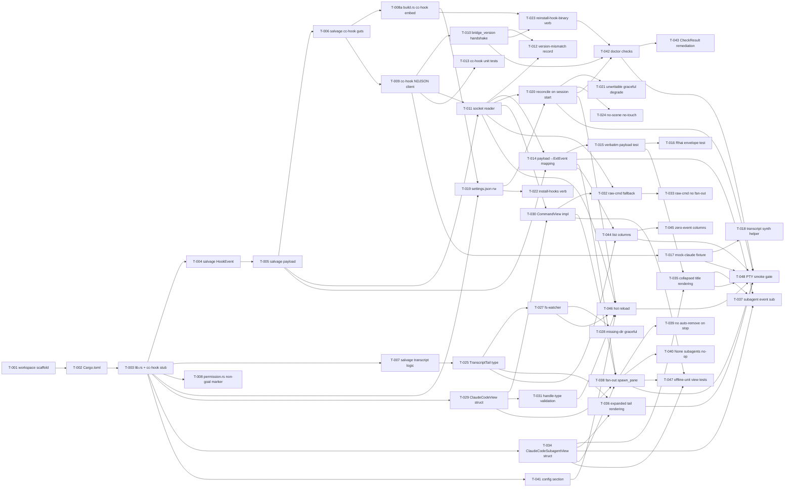

# Build Site: `extensions/claude-code` — Claude Code as an ark Extension

49 tasks across 9 tiers from one kit (`cavekit-claude-code.md`, requirements R1–R13 + R5b). Updated 2026-04-18 with decisions doc resolutions R-13 / R-14.

## Scope

Turns the `claude-code` kit's 13 R's (plus R5b raw-cmd fallback) into
T-numbered tasks for ark's first engine integration shipping as a single-
crate extension at `extensions/claude-code/` (plus a `bin/cc-hook/` sub-
binary). Includes workspace scaffolding, salvage from pre-2026-04-18
deletions (`crates/hook/`, `crates/orchestrators/claude-code/`,
`crates/types/src/permission.rs`), NDJSON hook-payload forwarder,
`~/.claude/settings.json` reconciler, two CommandViews
(`claude-code` + `claude-code-subagent`), transcript fs-watcher, doctor
checks, `ark list` columns, config section, hot-reload hooks, and an
end-to-end mock-claude fixture.

End-to-end gate is the PTY smoke test under `extensions/claude-code/
tests/` running a `mock-claude` fixture under real zellij through a scene
that declares `use "claude-code"` + `stack "@subagents" { claude-code-subagent }`,
asserting (a) socket+settings.json reconciled, (b) `subagent.start`
spawns a stack child with typed attrs, (c) transcript tail populates,
(d) title updates fire on status transitions, (e) `ark doctor` + `ark list`
contributions render.

## Cross-site dependencies

**Blocked by (hard):**

- `build-site-soul-phase-2.md` COMPLETE — ext-surface (`ArkExtension::on_session_start`
  / `on_session_end` / `scene_compile_hook` / `register_intents` /
  `doctor_checks` / `list_columns` / `control_verbs`), ark-view types,
  manifest-driven intent registration (decisions #2/#4), typed
  `Pane<V>`/`Stack<V>` RPC methods (decision #3).
- `build-site-scene-2026-04-18.md` COMPLETE — typed view-parametric
  handles + `stack` primitive. `subagents: Stack<ClaudeCodeSubagent>`
  is the extension's reason to live.
- `build-site-soul-phase-1.md` COMPLETE — `SessionSpec` / `SessionId` /
  `CoreEvent::Ext(ExtEvent)` / `FlatEvent` / `StateLayout::sessions_root()`.
  Phase 1 is the event + id + path vocabulary the ext speaks.

**Blocks:**

- `build-site-soul-phase-4-cleanup.md` — Phase 4 can only delete
  `crates/hook/` + `crates/orchestrators/claude-code/` +
  `crates/types/src/permission.rs` (permission.rs is NOT restored in
  v0.1, see R5/R9 notes) once Tier 1 salvage below is merged. Flag this
  site's Tier 1 as the dependency.
- Phase 5 Engine/Orchestrator trait deletion — independent from this
  site, but this site cannot ship if Phase 4 rolled ahead and wiped the
  salvage sources before Tier 1 reads them. Schedule order: this site's
  Tier 1 FIRST, then Phase 4 cleanup.

**NOT in scope (sibling sites own these):**

- Phase 2 sub-kit tasks (ext-surface, ark-view crate, derive macros).
- Scene crate's typed-handle landing tasks.
- Phase 4/5 deletion tasks.
- MCP server / `ark-mcp` binary (Stretch per kit).
- `CcPermissionView` / policy engine (dropped from v0.1 per kit §Non-goals).
- Pre-compact findings snapshot / multi-claude race / voice (Stretch).

## Flagged kit ambiguities

Resolve during implementation; kit itself flags these as Open Questions:

- **R1 cc-hook install path. RESOLVED per decisions doc R-13.**
  `$XDG_BIN_HOME/cc-hook` (default `~/.local/bin/cc-hook`), written to
  `~/.claude/settings.json` as absolute path. cc-hook is embedded into
  the `ark` binary via `include_bytes!` at build time (build.rs
  compile-time), extracted by `doctor --fix` with `0755`. Mirrors how
  ark ships wasm plugins today. See T-008a (build.rs embedding) and
  T-019 (install path pinned).
- **R1 settings.json marker.** JSON lacks comments; stable marker
  mechanism (nested `"ark_managed": true` object key or similar)
  decided at T-019 implementation.
- **R8 transcript dir encoding. RESOLVED per decisions doc R-14 as
  NON-ISSUE.** Claude Code hook payloads carry `transcript_path` as an
  absolute path; cc-hook forwards it verbatim and ark opens it
  directly. No cwd-encoding probe needed. T-026 deleted (see below).
- **Open question: MCP control surface.** Deferred to v0.2 per handoff
  line 431-436 — no v0.1 task.

---

## Tier 0 — Workspace Scaffolding (No Dependencies)

| Task | Title | Kit | Requirement | Effort |
| --- | --- | --- | --- | --- |
| T-001 | Create `extensions/` workspace directory + register in top-level `Cargo.toml` workspace members | claude-code | R1 (scaffolding) | S |
| T-002 | Scaffold `extensions/claude-code/Cargo.toml` with deps (ark-types, ark-ext-proto, ark-view, scene, notify, tokio, serde, serde_json, tracing) + `[[bin]] name="cc-hook"` target | claude-code | R1 (scaffolding) | M |
| T-003 | Scaffold `extensions/claude-code/src/lib.rs` with `pub struct ClaudeCodeExtension;` + `impl ArkExtension for ClaudeCodeExtension` skeleton (all methods default-routed); `extensions/claude-code/bin/cc-hook/main.rs` stub | claude-code | R1 (scaffolding) | M |

## Tier 1 — Salvage From Pre-2026-04-18 Deleted Crates

Must precede Phase 4 cleanup. Each task copies content from the live
pre-deletion paths into the extension, adapting to the new event /
type vocabulary where needed.

| Task | Title | Kit | Requirement | blockedBy | Effort |
| --- | --- | --- | --- | --- | --- |
| T-004 | Salvage `crates/hook/src/event.rs` `HookEvent` enum (9 Claude Code hook names) into `extensions/claude-code/src/hook_event.rs`; retype to match R3's kind-mapping strings | claude-code | R3 (salvage) | T-003 | S |
| T-005 | Salvage `crates/hook/src/payload.rs` hook-payload deserialisation into `extensions/claude-code/src/hook_payload.rs`; preserve serde derives; add a `payload_to_ext_event` helper mapping to R3's `<ext>.<kind>` naming | claude-code | R2 (salvage) / R3 (salvage) | T-003, T-004 | M |
| T-006 | Salvage `crates/hook/src/{lib,main,cli,run,bridge,pipe,writer,allow}.rs` into `extensions/claude-code/bin/cc-hook/` (flattened or preserved module shape as appropriate); rewire to POST NDJSON to `$STATE/sessions/<sid>/cc-hook.sock` per R2 | claude-code | R1 (salvage) / R2 (salvage) | T-002, T-005 | L |
| T-007 | Salvage `crates/orchestrators/claude-code/src/lib.rs` transcript-tail logic into `extensions/claude-code/src/transcript.rs`; extract the `notify`-based watcher + tail cursor primitives; **do not** bring forward any orchestrator-trait surface (ext owns its lifecycle) | claude-code | R8 (salvage) | T-003 | M |
| T-008 | FLAG: do NOT restore `crates/types/src/permission.rs` (READ_ONLY_TOOLS / PermissionPolicy / POLICY_FILE_NAME) per kit §Non-goals; add a code comment at `extensions/claude-code/src/lib.rs` noting MCP-stretch preservation (git history only) | claude-code | R9 (non-goal marker) | T-003 | S |
| T-008a | **NEW (decisions doc R-13):** Add `crates/cli/build.rs` step that compiles `cc-hook` binary (release profile, host target) and embeds its bytes into the `ark` crate via `include_bytes!`. Mirrors the existing wasm-plugin embedding pattern already in `crates/cli/build.rs`. Exposes `pub const CC_HOOK_BYTES: &[u8]` for consumption by `doctor --fix`. | claude-code | R1 (install) | T-006 | M |

## Tier 2 — Hook IPC Foundation (R2 + R4)

| Task | Title | Kit | Requirement | blockedBy | Effort |
| --- | --- | --- | --- | --- | --- |
| T-009 | `cc-hook` NDJSON client: POST one line per invocation `{kind, session_id, payload, emitted_at}` then exit 0; single process per hook fire (no persistent socket); fail-open (socket absent / unreachable → stderr log + exit 0) | claude-code | R2 | T-006 | M |
| T-010 | `cc-hook` bridge-version handshake: first POST per session adds top-level `bridge_version` matching the crate version (compile-time const); subsequent POSTs omit it | claude-code | R4 | T-009 | S |
| T-011 | Ark-side per-session socket reader (`extensions/claude-code/src/socket.rs`): binds `$STATE/sessions/<sid>/cc-hook.sock` on `on_session_start`, reads NDJSON line-at-a-time, malformed lines → `tracing::warn!` + skip, forwards valid lines to `ExtEvent` translator | claude-code | R2 | T-005, T-009 | L |
| T-012 | Bridge-version mismatch recording: on first-POST bridge_version ≠ crate-version, record one-shot doctor warning in session ext_state (key `claude-code.bridge_version_mismatch`); surfaces on next `ark doctor` | claude-code | R4 | T-010, T-011 | S |
| T-013 | cc-hook unit tests: NDJSON serialisation roundtrip, socket-unreachable exit-0 behaviour, absent-socket fail-open | claude-code | R13 (cc-hook unit) | T-009 | M |

## Tier 3 — Event Forwarding + Mock-Claude Fixture (R3 + R13)

| Task | Title | Kit | Requirement | blockedBy | Effort |
| --- | --- | --- | --- | --- | --- |
| T-014 | `payload_to_ext_event` translator maps all 9 hook kinds to their `claude-code.*` names per R3's table (`session.start`, `session.end`, `user.prompt-submit`, `pre-tool-use`, `post-tool-use`, `subagent.start`, `subagent.stop`, `stop`, `pre-compact`, `notification`) | claude-code | R3 | T-005, T-011 | M |
| T-015 | Verbatim-payload preservation: translator carries hook payload under `ExtEvent.payload` unchanged; exhaustive field test (agent_id, agent_type, agent_transcript_path, tool_name, tool_input, tool_response, last_assistant_message) | claude-code | R3 | T-014 | M |
| T-016 | Rhai reaction envelope test: synthetic `cc-hook` POST with `SubagentStop` payload → `on "claude-code.subagent.stop"` reaction reads `event.payload.{agent_id, agent_type, last_assistant_message, agent_transcript_path}` | claude-code | R3 | T-014, T-015 | M |
| T-017 | Build `crates/test-fixtures/claude-code/` with a `mock-claude` binary supporting `--emit-only`, `--subagent-burst N`, `--transcript-write <path>` flags; scripted event timelines cover SessionStart/SessionEnd/SubagentStart/SubagentStop/PreToolUse/PostToolUse | claude-code | R13 | T-009 | L |
| T-018 | Transcript-synth helper inside `mock-claude` writes JSONL lines matching Claude Code's transcript shape (message/usage/cost_usd fields) to a configurable path | claude-code | R13 | T-017 | M |

## Tier 4 — settings.json Installer + Control Verbs (R1)

| Task | Title | Kit | Requirement | blockedBy | Effort |
| --- | --- | --- | --- | --- | --- |
| T-019 | `settings.json` reader/writer: parses `~/.claude/settings.json`, preserves unknown keys, surgical reconciliation of ark-managed hook entries only (marker via nested `"ark_managed": true` object key per flagged ambiguity). **Install path pinned per decisions doc R-13:** written entries reference `cc-hook` at absolute path `$XDG_BIN_HOME/cc-hook` (default `~/.local/bin/cc-hook`); `doctor --fix` extracts the embedded `CC_HOOK_BYTES` (T-008a) to this path with mode `0755`. | claude-code | R1 | T-003, T-008a | L |
| T-020 | Reconcile-on-session-start: `on_session_start` inspects scene for `use "claude-code"`; if present, reconciles hook entries for all 9 event kinds pointing at the installed `cc-hook --session <sid> --socket <path>`; idempotent | claude-code | R1 | T-019, T-011 | M |
| T-021 | Settings.json unwritable path: `on_session_start` does NOT fail the session; records doctor error; claude launches; zero `claude-code.*` events arrive (graceful degradation) | claude-code | R1 | T-020 | M |
| T-022 | `ark ext claude-code install-hooks` control verb: manually reconciles settings.json outside a live session; registered via `ArkExtension::control_verbs` | claude-code | R1 | T-019 | M |
| T-023 | `ark ext claude-code reinstall-hook-binary` control verb: re-extracts `CC_HOOK_BYTES` (T-008a) and replaces the installed binary at `$XDG_BIN_HOME/cc-hook` with mode `0755` (per decisions doc R-13) | claude-code | R1 / R4 | T-008a, T-010 | M |
| T-024 | Scene-without-`use "claude-code"` path: extension does NOT touch settings.json; cc-hook invoked without a live socket is a no-op (already covered by T-009 fail-open); regression test | claude-code | R1 | T-020 | S |

## Tier 5 — Transcript fs-Watcher (R8)

| Task | Title | Kit | Requirement | blockedBy | Effort |
| --- | --- | --- | --- | --- | --- |
| T-025 | `TranscriptTail` type (from salvaged T-007 logic): pull-model cursor over a JSONL file supporting tail-F semantics (survives truncation / rotation); shared across R6 views and R11 list columns. Takes absolute `transcript_path` from hook payload (per decisions doc R-14); no path derivation required. | claude-code | R8 | T-007 | M |
| ~~T-026~~ | ~~`~/.claude/projects/<encoded-cwd>/` encoding probe~~ **DELETED per decisions doc R-14: NON-ISSUE.** Claude Code hook payloads carry `transcript_path` as an absolute path; cc-hook forwards it verbatim; ark opens it directly. No encoding probe or derivation needed. T-027 now depends only on T-025. | claude-code | — | — | — |
| T-027 | `notify`-based recursive watcher over the active session's transcript directory (derived as `transcript_path.parent()` from the first hook payload per decisions doc R-14) + `.../subagents/` subdir; new file under `subagents/` emits NO ExtEvent (authoritative lifecycle is hook-based per R8) | claude-code | R8 | T-025 | M |
| T-028 | Transcript dir missing at session start: watcher logs + waits; reacts when claude creates it on first session event; regression test | claude-code | R8 | T-027 | S |

## Tier 6 — Views + Fan-Out (R5, R5b, R6, R7)

| Task | Title | Kit | Requirement | blockedBy | Effort |
| --- | --- | --- | --- | --- | --- |
| T-029 | `ClaudeCodeView` struct with `#[derive(Facet, View)]`; facet SHAPE: `model: Option<String>`, `args: Vec<String>`, `cwd: Option<String>`, `subagents: Option<Stack<ClaudeCodeSubagent>>`; registered via scene kit R17 derives | claude-code | R5 (registration + config schema) | T-003 | M |
| T-030 | `impl CommandView for ClaudeCodeView`: argv construction (`["claude"] + --model <model>? + args`), env (pane env wrapper + `CLAUDE_HOOK_SOCKET=<session-sock-path>`), cwd (Rhai-rendered or session default) | claude-code | R5 (argv+env) | T-029, T-011 | M |
| T-031 | Scene-compile handle-type validation: `claude-code subagents=@s` where `@s` is not `Stack<ClaudeCodeSubagent>` surfaces as `error[scene/view-type-mismatch]` at `ark scene check`; test matrix with mismatched handle kinds | claude-code | R5 (handle-type validation) | T-029 | M |
| T-032 | `scene_compile_hook` raw-`command cmd="claude"` fallback (R5b): injects `CLAUDE_HOOK_SOCKET=<session-sock-path>` into any pane whose view is `command cmd=<member-of-[claude-code].match_cmds>`; default `match_cmds = []` (disabled) | claude-code | R5b | T-030, T-011 | M |
| T-033 | Raw-cmd fallback explicitly does NOT provide typed subagent fan-out — no view struct, no typed attrs; regression test asserts subagent events flow to user reactions but no stack spawn occurs | claude-code | R5b | T-032 | S |
| T-034 | `ClaudeCodeSubagentView` struct with `#[derive(Facet, View)]`; alias `claude-code-subagent`; facet SHAPE: `id: String`, `transcript_path: String` (both spawner-set, not author-set); registered via scene kit R17 derives | claude-code | R6 (registration + config schema) | T-003 | M |
| T-035 | `ClaudeCodeSubagentView` collapsed rendering: zellij `RenamePane` emission on each status transition; title format `"{agent_type} · {status} · {last_tool}"` (last_tool truncated to 16 chars; total truncated to 60 chars); status = running/done/failed from SubagentStop | claude-code | R6 (collapsed rendering) | T-034, T-015 | M |
| T-036 | `ClaudeCodeSubagentView` expanded rendering: ratatui-backed tail of `transcript_path` JSONL; renders tool calls + assistant messages; window bounded by `[claude-code] transcript_tail_lines` (default 200); survives truncation via `tail -F`-style (reuses T-025 TranscriptTail) | claude-code | R6 (expanded rendering) | T-034, T-025 | M |
| T-037 | `ClaudeCodeSubagentView` event subscription: filters `claude-code.subagent.start` / `claude-code.subagent.stop` / `claude-code.pre-tool-use` by its `id` field; each event updates cached status + last-tool; triggers `RenamePane` emission | claude-code | R6 (event subscription) | T-034, T-035, T-014 | M |
| T-038 | `ClaudeCodeView` fan-out on `claude-code.subagent.start`: when `subagents` handle is `Some`, calls `subagents.spawn_pane(ClaudeCodeSubagentAttrs { id, transcript_path })` with `id = payload.agent_id`, `transcript_path = payload.agent_transcript_path`; idempotent on duplicate `agent_id` | claude-code | R7 | T-029, T-030, T-034, T-014 | M |
| T-039 | `ClaudeCodeView` on `claude-code.subagent.stop`: does NOT remove the child; status transitions via T-035 title update; user closes via zellij keybind (not ark-driven); regression test | claude-code | R7 | T-038 | S |
| T-040 | `ClaudeCodeView` with `subagents = None` (scene author didn't wire): no-ops on subagent events; events still flow to user reactions; regression test | claude-code | R7 | T-038 | S |

## Tier 7 — Doctor + List Columns + Config (R9, R10, R11)

| Task | Title | Kit | Requirement | blockedBy | Effort |
| --- | --- | --- | --- | --- | --- |
| T-041 | Config section `[claude-code]`: `match_cmds: Vec<String> = []`, `transcript_tail_lines: usize = 200`, `auto_install_hook_entries: bool = true`; unknown keys warn but don't fail; no permission/policy keys | claude-code | R9 | T-003 | M |
| T-042 | `ArkExtension::doctor_checks` impl: `which claude` (error), `cc-hook` binary presence + version match (warning), `~/.claude/settings.json` hooks-block drift across all 9 entries (warning), `$STATE/sessions` writable (error), informational check for `claude-code` view referenced with wired subagents attr | claude-code | R10 | T-020, T-023, T-010 | L |
| T-043 | `CheckResult { kind, level, message, fix? }` remediation hints wired per R10: install-claude hint, `ark ext claude-code reinstall-hook-binary`, `ark ext claude-code install-hooks`; `ark doctor` rendering test | claude-code | R10 | T-042 | M |
| T-044 | `ArkExtension::list_columns` impl: columns `cc model`, `cc tokens`, `cc cost`; populated from transcript tail (`message.model` / `message.usage.{input,output}_tokens` / `message.cost_usd`); persisted under `SessionStatus.ext_state["claude-code"]`; only appear when extension is loaded | claude-code | R11 | T-025, T-014 | L |
| T-045 | List columns with zero claude events: `cc model` empty string, `cc tokens` = 0, `cc cost` empty (no cost_usd field); regression test | claude-code | R11 | T-044 | S |

## Tier 8 — Hot Reload + End-to-End Gate (R12, R13)

| Task | Title | Kit | Requirement | blockedBy | Effort |
| --- | --- | --- | --- | --- | --- |
| T-046 | `ark ext reload claude-code`: re-runs settings.json reconciliation (T-020), re-binds cc-hook socket (T-011), re-runs transcript fs-watcher setup (T-027); live `ClaudeCodeView` instances receive re-initialised socket reader; typed `Stack<_>` ref survives reload; in-flight claude process untouched; config changes (`match_cmds`, `transcript_tail_lines`) visible on next event dispatch; mismatched view-type wiring → reject reload, old scene stays live | claude-code | R12 | T-020, T-011, T-027, T-031, T-041 | L |
| T-047 | Unit-level integration tests: offline-compiled scene instantiates `ClaudeCodeView` + `ClaudeCodeSubagentView` with mock `Stack<ClaudeCodeSubagent>` handles per scene kit R17 test stubs; exercises view logic directly without zellij | claude-code | R13 (unit-level) | T-030, T-034, T-038 | M |
| T-048 | PTY end-to-end gate under `extensions/claude-code/tests/claude_code_smoke.rs`: scene uses `claude-code subagents=@subs` + `stack "@subs" { claude-code-subagent }`; `mock-claude --subagent-burst 3 --transcript-write ...` under real zellij; asserts (a) socket bound + settings.json reconciled, (b) 3 stack children spawned with correct id+transcript_path attrs, (c) `RenamePane` fired per status transition, (d) transcript tail renders, (e) `ark doctor` + `ark list cc model/tokens/cost` contributions render, (f) `cargo test -p ark-ext-claude-code` green, (g) SKIP branch on hosts without zellij on PATH | claude-code | R13 (PTY-level) | T-017, T-020, T-038, T-035, T-036, T-042, T-044, T-046 | L |

## Summary

| Tier | Tasks | Effort |
| --- | ---: | --- |
| 0 | 3 | 2M + 1S |
| 1 | 6 | 1L + 3M + 2S |
| 2 | 5 | 1L + 2M + 2S |
| 3 | 5 | 1L + 4M |
| 4 | 6 | 1L + 4M + 1S |
| 5 | 3 | 2M + 1S |
| 6 | 12 | 9M + 3S |
| 7 | 5 | 2L + 2M + 1S |
| 8 | 3 | 2L + 1M |
| **Total** | **48** (T-001..T-048 + T-008a; T-026 deleted) | **9L + 29M + 10S** |

## Coverage Matrix

Every acceptance criterion of R1–R13 + R5b maps to ≥1 task.

| Kit R | Subject | Task(s) | Status |
| --- | --- | --- | --- |
| R1 | cc-hook binary + settings.json installer | T-002, T-006, T-008a, T-019, T-020, T-021, T-022, T-023, T-024 | COVERED |
| R2 | Hook IPC socket protocol | T-005, T-006, T-009, T-011, T-013 | COVERED |
| R3 | Event forwarding (9 hook kinds → `claude-code.*`) | T-004, T-005, T-014, T-015, T-016 | COVERED |
| R4 | Handshake / bridge-version | T-010, T-012, T-023 | COVERED |
| R5 | `claude-code` CommandView | T-029, T-030, T-031 | COVERED |
| R5b | Raw `command cmd="claude"` fallback | T-032, T-033 | COVERED |
| R6 | `claude-code-subagent` CommandView | T-034, T-035, T-036, T-037 | COVERED |
| R7 | Subagent fan-out on SubagentStart | T-038, T-039, T-040 | COVERED |
| R8 | Transcript fs-watcher | T-007, T-025, T-027, T-028 | COVERED (T-026 deleted per decisions doc R-14) |
| R9 | Config schema | T-008, T-041 | COVERED |
| R10 | Doctor checks | T-042, T-043 | COVERED |
| R11 | List columns | T-044, T-045 | COVERED |
| R12 | Hot reload | T-046 | COVERED |
| R13 | Test harness | T-013, T-017, T-018, T-047, T-048 | COVERED |

## Dependency Graph

## Completion Gate

All of the following must hold:

1. `cargo check --workspace --tests` and `cargo test --workspace` both exit 0
   with `extensions/claude-code/` + `extensions/claude-code/bin/cc-hook/`
   in the workspace.
2. `cargo test -p ark-ext-claude-code` exits 0.
3. T-048 PTY smoke test exits 0 on a host with zellij on PATH; SKIP
   branch intact otherwise.
4. No residual references to deleted salvage sources (`crates/hook/`,
   `crates/orchestrators/claude-code/`, `crates/types/src/permission.rs`)
   elsewhere in the workspace — audit grep returns empty.
5. `ark doctor` on a scene that uses `claude-code` prints the five
   R10 checks with correct level per environment state.
6. `ark list` with the extension loaded shows `cc model` / `cc tokens` /
   `cc cost` columns; absent without it.
7. Kit ambiguities flagged at the top of this site are either resolved
   in the committed code (cc-hook install path fixed to
   `$XDG_BIN_HOME/cc-hook` per decisions doc R-13; transcript dir
   encoding a non-issue per decisions doc R-14; settings.json marker
   decided at T-019) or re-flagged explicitly as deferred open
   questions under `context/plans/` for v0.2.

## Notes

- Tier 1 (salvage) must merge before the Phase-4 cleanup site deletes
  the source crates. Schedule constraint: this site's T-004/T-005/T-006/
  T-007 land FIRST; Phase-4 deletion site second.
- T-008 is deliberately a non-restoration marker: `permission.rs` is the
  one salvage target the kit says NOT to bring into v0.1 (§Non-goals:
  permission UI dropped). Preserved for MCP stretch work (§Stretch).
- T-017's `mock-claude` fixture is the bedrock for every downstream
  integration test; ships under `crates/test-fixtures/` (not
  `extensions/`) so sibling sites can consume it without depending on
  the claude-code extension crate.
- T-026 was deleted per decisions doc R-14; Claude Code project-dir
  encoding is a non-issue because hook payloads carry `transcript_path`
  as an absolute path. cc-hook forwards it verbatim; ark opens it
  directly. No empirical probe needed.
- T-048 is the one task that exercises BOTH (a) the 2026-04-18 typed-
  handle + stack scene revision AND (b) the Phase-2 ext-hook surface
  end-to-end — the site's gate and validator for both sibling sites'
  outputs.
- The kit's "Suggested tier ordering" (8 tiers) maps cleanly onto this
  site's 9 tiers (Tier 0 workspace scaffold + Tier 1 salvage added
  ahead of kit's "foundation" tier).
