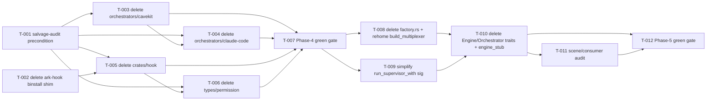

# Build Site: Cavekit Soul Cleanup (Phase 4 + Phase 5 merged)

12 tasks across 4 tiers from 2 kits.

Bundled scope: delete Phase 1's stub-residual orchestrator/hook crates
(`crates/orchestrators/cavekit/`, `crates/orchestrators/claude-code/`,
`crates/hook/`, `crates/types/src/permission.rs`, the `ark-hook` binstall
shim in `crates/cli/Cargo.toml`, workspace + dep entries) AFTER the
claude-code extension has salvaged their content, then delete the
`Engine` / `Orchestrator` core traits (+ `engine_contract`,
`orchestrator_contract`, `engine_stub.rs`, `factory.rs`'s
`build_engine`/`build_orchestrator`), simplifying
`run_supervisor_with`'s signature from
`Option<Box<dyn Engine>>` + `Option<Box<dyn Orchestrator>>` to neither
(both were unconditionally `None` after Phase 1's bare-launch pivot).
End-to-end gate is `cargo check --workspace --tests` + `cargo test
--workspace` green + zero workspace hits for `Engine`, `Orchestrator`,
`ark-orchestrators-cavekit`, `ark-orchestrators-claude-code`,
`ark-hook`, or `ark_types::permission`.

## Cross-site dependency constraints

- **Blocked by (site-level):** the claude-code extension site must land
  first. It imports `crates/hook/` content into
  `extensions/claude-code/bin/cc-hook/`, `crates/types/src/permission.rs`
  into `extensions/claude-code/src/permission.rs`, and transcript-watch
  bits from `crates/orchestrators/claude-code/` — salvage must be
  verified complete before this site flips the deletions.
- **Not blocked by (but in practice follows) Phase 2 / scene-landing
  sites.** No type-surface overlap. Cleanup can land before or after
  those; v0.1 execution order is Phase 2 → claude-code → cleanup.
- **Unblocks:** the v0.1 tag. After this site the workspace has
  zero vestigial `Engine` / `Orchestrator` trait surface, zero ark-side
  orchestrator crates, and `run_supervisor_with` is the final shape
  for the 0.1 release.

## Phase 4 — Delete rehomed crates (Tiers 0-2)

### Tier 0 — No Dependencies (Start Here)

| Task | Title | Kit | Requirement | Effort |
| --- | --- | --- | --- | --- |
| T-001 | Precondition audit — confirm extensions/claude-code/ has salvaged `crates/hook/src/{lib,event,payload,run,bridge,allow,pipe,writer,cli}.rs`, `crates/orchestrators/claude-code/src/lib.rs`, and `crates/types/src/permission.rs`; write a one-paragraph note to `context/impl/cleanup-preconditions.md` listing the ext-side source paths that replace each deleted file (blocks T-003/T-005/T-006). Verifies: `git grep -l READ_ONLY_TOOLS extensions/` returns ≥1 hit; `ls extensions/claude-code/bin/cc-hook/src/` shows salvaged hook surface | soul-phase-4 | P4-R1 | S |
| T-002 | Delete `ark-hook` binstall shim from `crates/cli/Cargo.toml`: remove lines 43-65 (`[[bin]] name = "ark-hook"`, `required-features = ["_binstall_shim"]`, the `_binstall_shim` feature stanza, and surrounding F-706/F-710 comments), update `bin-dir` / `[[bin]]`-template comment block at lines 22-33 to mention only the `ark` binary, leave `default-run = "ark"` intact. Verifies: `grep -c 'ark-hook\|_binstall_shim' crates/cli/Cargo.toml` = 0; `cargo check -p ark-cli` green | soul-phase-4 | P4-R5 | S |

### Tier 1 — Delete Phase-1 stub crates (after audit)

| Task | Title | Kit | Requirement | blockedBy | Effort |
| --- | --- | --- | --- | --- | --- |
| T-003 | Delete `crates/orchestrators/cavekit/` directory outright (no rehoming); remove `ark-orchestrators-cavekit` from `crates/cli/Cargo.toml` (line 80) and `crates/supervisor/Cargo.toml` (line 20); remove `crates/orchestrators/*` workspace-member glob line (Cargo.toml:34) only if both cavekit + claude-code dirs are gone (if claude-code still present, keep glob until T-004 completes, then drop). Verifies: `ls crates/orchestrators/cavekit/` errors; `grep -r 'ark-orchestrators-cavekit\|ark_orchestrators_cavekit\|CavekitOrchestrator' crates/ Cargo.toml` = 0 hits; `cargo check --workspace` green (relies on factory.rs being deleted in T-008 — until then factory.rs references must be no-op'd; see T-003 note below) | soul-phase-4 | P4-R2, P4-R6 | T-001 | M |
| T-004 | Delete `crates/orchestrators/claude-code/` directory outright (content has been salvaged to `extensions/claude-code/` per precondition); remove `ark-orchestrators-claude-code` from `crates/cli/Cargo.toml` (line 81) and `crates/supervisor/Cargo.toml` (line 21); now drop the `crates/orchestrators/*` workspace-glob at top-level Cargo.toml:34 (T-003's glob comment). Verifies: `ls crates/orchestrators/` errors (whole parent dir removed); `grep -r 'ark-orchestrators-claude-code\|ark_orchestrators_claude_code\|ClaudeCodeOrchestrator' crates/ Cargo.toml` = 0 hits | soul-phase-4 | P4-R3, P4-R6 | T-001, T-003 | M |
| T-005 | Delete `crates/hook/` directory outright (content salvaged to `extensions/claude-code/bin/cc-hook/`); remove `"crates/hook"` from `Cargo.toml` workspace `members` (line 7). Verifies: `ls crates/hook/` errors; `grep '"crates/hook"' Cargo.toml` = 0 hits; no stray `ark-hook = {path=...}` anywhere (grep Cargo.toml files) | soul-phase-4 | P4-R4, P4-R6 | T-001, T-002 | S |

### Tier 2 — Delete salvaged type module + consumer cleanup

| Task | Title | Kit | Requirement | blockedBy | Effort |
| --- | --- | --- | --- | --- | --- |
| T-006 | Delete `crates/types/src/permission.rs` (salvaged to `extensions/claude-code/src/permission.rs`); remove `pub mod permission;` (lib.rs:5) and the 4-line `pub use permission::{…}` re-export (lib.rs:15-18); drop the matching line in `crates/types/Cargo.toml` if permission's dependencies (none workspace-specific right now) were gated. Verifies: `ls crates/types/src/permission.rs` errors; `grep -r 'ark_types::permission\|PermissionPolicy\|READ_ONLY_TOOLS\|POLICY_FILE_NAME\|PolicyDecision' crates/ Cargo.toml` = 0 hits (should return clean — the only pre-T-005 consumer was `crates/hook/src/run.rs`, deleted in T-005) | soul-phase-4 | P4-R7 | T-005 | M |
| T-007 | Workspace-check gate for Phase 4: `cargo check --workspace --tests` + `cargo build -p ark-cli` + `cargo test --workspace` all exit 0; grep `ark_hook|ark_orchestrators|CavekitOrchestrator|ClaudeCodeOrchestrator|ark_types::permission` across `crates/` = 0 hits (extensions/ excluded from grep). Verifies: three cargo commands exit 0 recorded in `context/impl/cleanup-loop-log.md` with counts | soul-phase-4 | P4-R6, P4-R8 | T-003, T-004, T-005, T-006 | M |

## Phase 5 — Delete Engine / Orchestrator traits (Tier 3)

### Tier 3 — Trait deletion + supervisor signature simplification

| Task | Title | Kit | Requirement | blockedBy | Effort |
| --- | --- | --- | --- | --- | --- |
| T-008 | Delete `crates/supervisor/src/factory.rs` whole (RESOLVED per phase-2-design-decisions R-11). `build_engine` + `build_orchestrator` are dead code (no runtime callers, test-only). Inline `build_multiplexer` directly into `orchestration.rs:66` — its single call site — rather than rehoming to `crates/mux/zellij/` (micro-decision resolved: inline is simpler, no new public surface on mux crate). Update `crates/supervisor/src/lib.rs:62,69` re-exports — drop `factory::{SupervisorError, build_engine, build_multiplexer, build_orchestrator}` entirely. `SupervisorError` enum moves with whichever residual caller still uses it (or deletes alongside factory.rs if no survivors). Verifies: `ls crates/supervisor/src/factory.rs` errors; `grep -rn 'build_engine\|build_orchestrator\|build_multiplexer' crates/ = 0 hits` (fully inlined — no new location); `cargo check --workspace` green | soul-phase-5 | P5-R3, P5-R4 | T-007 | M |
| T-009 | Simplify `run_supervisor_with` signature (`crates/supervisor/src/orchestration.rs:84-95`) — decision pinned per phase-2-design-decisions R-12: drop `engine: Option<Box<dyn Engine + Send + Sync>>` + `orchestrator: Option<Box<dyn Orchestrator + Send + Sync>>` parameters entirely; drop `run_supervisor`'s local `let engine = None; let orchestrator = None;` at lines 64-65; delete the R3-step-6 diagnostic block at lines 173-179 (`debug!(engine=..., orch=..., ...)`). Also **delete the `run_preflight: bool` param outright** (all callers pass `true`; `engine_stub::preflight` is a no-op). Inline the preflight call at line 188-190, then `engine_stub.rs` becomes dead and is deleted as part of T-010's Engine trait removal (no separate decision required). Verifies: `grep -n 'Option<Box<dyn \(Engine\|Orchestrator\)' crates/supervisor/src/*.rs = 0 hits`; `grep -n 'run_preflight' crates/supervisor/src/*.rs = 0 hits`; `cargo check -p ark-supervisor --tests` green; existing `run_supervisor_with_bare_session_completes` test at line 492 passes after the signature change | soul-phase-5 | P5-R1, P5-R2 | T-007 | S |
| T-010 | Delete `crates/supervisor/src/engine_stub.rs` (file); remove the corresponding `mod engine_stub;` + any `pub use engine_stub::…` in `crates/supervisor/src/lib.rs`; delete `crates/core/src/engine.rs` (trait + `ApprovalPolicy` + `EngineHandle` + mock engine tests), `crates/core/src/engine_contract.rs`, `crates/core/src/orchestrator.rs` (trait + `World` + tests), `crates/core/src/orchestrator_contract.rs`; remove `pub mod engine; pub mod engine_contract; pub mod orchestrator; pub mod orchestrator_contract;` (crates/core/src/lib.rs:29-33) and the `pub use engine::{…}; pub use orchestrator::{Orchestrator, World};` re-exports (lib.rs:38,40); audit `crates/test-fixtures/src/lib.rs:119` doc-comment reference to `ark_core::engine::contract` — rewrite comment or drop. Verifies: `grep -rn 'ark_core::engine\|ark_core::orchestrator\|ApprovalPolicy\|EngineHandle\|pub trait Engine\|pub trait Orchestrator' crates/ = 0 hits`; `ls crates/core/src/{engine,engine_contract,orchestrator,orchestrator_contract}.rs` all error; `cargo check --workspace --tests` green | soul-phase-5 | P5-R1, P5-R2 | T-008, T-009 | L |
| T-011 | Audit + clean up scene / intent module trait references (scene crate's `Engine` is `rhai::Engine`, not `ark_core::Engine` — confirm no cross-contamination): grep `crates/scene/src/` for `ark_core::engine`, `ark_core::orchestrator`, `use ark_core::\(Engine\|Orchestrator\)`, and the `EngineLaunch`/`engine_launch` tokens that Phase 1's T-005 deleted — expected 0 hits for all (Phase 1 T-005 + T-020 removed scene-side consumers). Verifies: the four greps each return 0; `cargo check -p ark-scene --tests` green; also grep `crates/core/src/consumers/` for same tokens = 0 (reaction_dispatcher was cleaned in Phase 1 T-026) | soul-phase-5 | P5-R5 | T-010 | S |
| T-012 | Phase-5 workspace green gate + final audit: `cargo check --workspace --tests` + `cargo test --workspace` exit 0; grep `pub trait Engine\|pub trait Orchestrator\|ark_core::engine\|ark_core::orchestrator\|engine_stub\|build_engine\|build_orchestrator\|Option<Box<dyn Engine\|Option<Box<dyn Orchestrator` across `crates/` = 0 hits; `rg 'TODO\(cavekit-soul\)' crates/ = 0 blocking hits`; PTY smoke test (`cargo test -p ark-cli --test launch_pty -- real_zellij_accepts_compiled_default_layout`) still exits 0 when zellij on PATH; record counts in `context/impl/cleanup-loop-log.md` | soul-phase-5 | P5-R6 (cargo + audit sub-criteria) | T-010, T-011 | M |

## Summary

| Tier | Tasks | Effort |
| --- | ---: | --- |
| 0 | 2 | 2S |
| 1 | 3 | 2M + 1S |
| 2 | 2 | 2M |
| 3 | 5 | 1L + 2M + 2S |
| **Total** | **12** | **1L + 6M + 5S** |

## Coverage Matrix

Every acceptance criterion from every cleanup requirement maps to at
least one task. 100% COVERED (no GAP rows).

### Soul Phase 4 Kit

| Kit | Req | Criterion (abbreviated) | Task(s) | Status |
| --- | --- | --- | --- | --- |
| soul-phase-4 | P4-R1 | Salvage-audit precondition recorded before any deletion | T-001 | COVERED |
| soul-phase-4 | P4-R2 | `crates/orchestrators/cavekit/` removed; `CavekitOrchestrator` zero hits | T-003 | COVERED |
| soul-phase-4 | P4-R2 | `ark-orchestrators-cavekit` dep entries removed from cli + supervisor | T-003 | COVERED |
| soul-phase-4 | P4-R3 | `crates/orchestrators/claude-code/` removed; `ClaudeCodeOrchestrator` zero hits | T-004 | COVERED |
| soul-phase-4 | P4-R3 | `ark-orchestrators-claude-code` dep entries removed from cli + supervisor | T-004 | COVERED |
| soul-phase-4 | P4-R4 | `crates/hook/` directory gone; workspace-members list reduced | T-005 | COVERED |
| soul-phase-4 | P4-R5 | `[[bin]] name = "ark-hook"` + `_binstall_shim` feature removed from cli Cargo.toml | T-002 | COVERED |
| soul-phase-4 | P4-R5 | `cargo check -p ark-cli` green with only `ark` as bin | T-002, T-007 | COVERED |
| soul-phase-4 | P4-R6 | `crates/orchestrators/*` workspace glob removed from top-level Cargo.toml | T-004 | COVERED |
| soul-phase-4 | P4-R6 | `cargo check --workspace` + `cargo test --workspace` green after Phase 4 | T-007 | COVERED |
| soul-phase-4 | P4-R7 | `crates/types/src/permission.rs` deleted | T-006 | COVERED |
| soul-phase-4 | P4-R7 | `ark_types::permission` / `PermissionPolicy` / `READ_ONLY_TOOLS` zero hits under `crates/` | T-006, T-007 | COVERED |
| soul-phase-4 | P4-R8 | Final Phase-4 green gate audits recorded in loop-log | T-007 | COVERED |

### Soul Phase 5 Kit

| Kit | Req | Criterion (abbreviated) | Task(s) | Status |
| --- | --- | --- | --- | --- |
| soul-phase-5 | P5-R1 | `pub trait Engine` zero hits under `crates/` | T-010 | COVERED |
| soul-phase-5 | P5-R1 | `pub trait Orchestrator` zero hits under `crates/` | T-010 | COVERED |
| soul-phase-5 | P5-R1 | `ark_core::engine` / `ark_core::orchestrator` imports zero hits | T-010, T-011 | COVERED |
| soul-phase-5 | P5-R2 | `run_supervisor_with` signature drops Engine + Orchestrator params | T-009 | COVERED |
| soul-phase-5 | P5-R2 | Phase 1's conditional R3 steps 6/13/15 become unconditional-skip | T-009 | COVERED |
| soul-phase-5 | P5-R2 | `run_supervisor_with_bare_session_completes` test still green | T-009, T-012 | COVERED |
| soul-phase-5 | P5-R3 | `crates/supervisor/src/factory.rs` deleted; `build_engine`/`build_orchestrator` zero hits | T-008 | COVERED |
| soul-phase-5 | P5-R3 | Surviving `build_multiplexer` rehomed or inlined | T-008 | COVERED |
| soul-phase-5 | P5-R4 | `supervisor/src/engine_stub.rs` deleted; `AcpEngineStub` zero hits | T-010 | COVERED |
| soul-phase-5 | P5-R5 | Scene crate cross-contamination audit: `ark_core::engine` / `EngineLaunch` zero hits | T-011 | COVERED |
| soul-phase-5 | P5-R5 | `crates/core/src/consumers/` Engine/Orchestrator zero hits (Phase 1 invariant preserved) | T-011 | COVERED |
| soul-phase-5 | P5-R6 | `cargo check --workspace --tests` exit 0 | T-012 | COVERED |
| soul-phase-5 | P5-R6 | `cargo test --workspace` exit 0 | T-012 | COVERED |
| soul-phase-5 | P5-R6 | PTY smoke test still green | T-012 | COVERED |
| soul-phase-5 | P5-R6 | No blocking `TODO(cavekit-soul)` markers | T-012 | COVERED |

**Coverage: 100% (0 GAP rows).**

## Dependency Graph

## Notes

- Single critical path: T-001 → (T-002, T-003, T-004, T-005, T-006) → T-007 → (T-008, T-009) → T-010 → T-011 → T-012. No meaningful parallel fan-out within Phase 4 because the deletions cascade through shared manifests (top-level Cargo.toml + cli/supervisor dep lists), so serialising Tier 1 → Tier 2 avoids `cargo check` thrash between agents.
- **T-008 micro-decision RESOLVED** (phase-2-design-decisions R-11, 2026-04-18). `crates/supervisor/src/factory.rs` bundled three concerns: `build_engine` + `build_orchestrator` (dead code — test-only), `build_multiplexer` (single-caller at `orchestration.rs:66`), and `SupervisorError`. Resolution: delete factory.rs whole; inline `build_multiplexer` directly at its sole call site (no rehome to `crates/mux/zellij/`, no new public surface). Effort downgraded L→M: the rehome ambiguity was the L driver; pure inline is mechanical.
- **T-009 micro-decision RESOLVED** (phase-2-design-decisions R-12, 2026-04-18). `run_preflight: bool` parameter deleted outright — all callers pass `true`, `engine_stub::preflight` is a no-op. Inline the call; `engine_stub.rs` deletion rolls up into T-010 with the Engine trait removal (no separate audit needed). Effort downgraded M→S: the call-site audit scaffold described in the old prose was the M driver; resolution eliminates it.
- **T-010 is the trait-deletion gate of Phase 5.** Once factory.rs + `run_supervisor_with`'s Option params are gone, `ark_core::{Engine, Orchestrator}` have zero callers inside `crates/`. The only residual references (per the 2026-04-18 survey) live in `test-fixtures/src/lib.rs:119` as a doc-comment pointer — non-load-bearing, rewrite or delete in the same commit. Effort = L only because four deletable files (`engine.rs`, `engine_contract.rs`, `orchestrator.rs`, `orchestrator_contract.rs`) each carry unit tests + a mock impl that go with them.
- `T-001`'s salvage-audit precondition is scoped narrow deliberately — it writes a one-paragraph note to impl/cleanup-preconditions.md rather than a full kit, because the salvage itself is owned by the sibling extension-site. This site just verifies "done" before flipping the delete switch.
- No tier 0 task depends on Phase 2 or scene-landing sites. Cross-site serialisation (Phase 2 → claude-code → cleanup) is practical convention, not a type-level dependency — this site can technically start the moment the ext-site lands T-001's preconditions.
- End-to-end completion signal: T-012 — the workspace is fully-cleaned when `cargo test --workspace` + the PTY smoke test are both green AND the Engine/Orchestrator/ark-hook/ark_types::permission greps are all zero.
