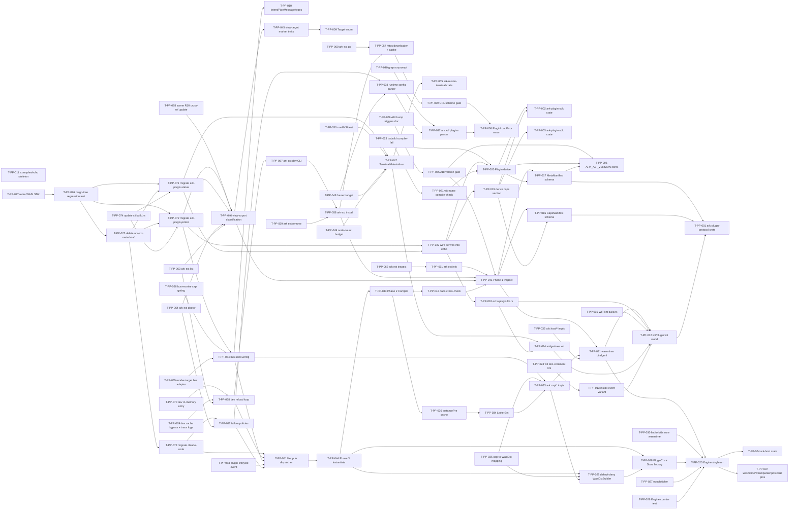

# Build Site — Plugin Protocol (ark-native wasm-component)

Implements `cavekit-plugin-protocol.md` R1-R14 plus the migration tasks induced by amendments to `cavekit-scene.md` R10, `cavekit-claude-code.md`, `cavekit-distribution.md` R3, `cavekit-plugin-status.md`, and `cavekit-plugin-picker.md`.

**Scope shape:** 56 tasks across 9 tiers. Tier 0 = 11 tasks runnable in parallel.

Tasks use `T-PP-NNN` IDs (PP = plugin-protocol, distinct from the in-tree `T-NNN` namespace). `blockedBy` references earlier tasks. Effort scale: S (a few hours), M (a day, multi-file single concern), L (multi-day cross-cutting). Coverage matrix at the bottom assigns every R1-R14 acceptance criterion (and every migration acceptance criterion from the amended kits) to one or more tasks.

Key v1 commitments encoded here (see kit for full rationale):
- **Wasmtime component-model only**, async + epoch interruption + `wasmtime-wasi` p2. Fuel disabled. WASI default-deny baseline (Cluster 3 §3.3 footgun).
- **Hybrid capability declaration**: WIT `ark:cap/*` imports authoritative; `ark-caps:v1` postcard custom section carries display metadata; host cross-checks both before instantiation.
- **Per-cap-profile linker variants** (`LinkerSet`) closed at startup; `InstancePre<PluginCtx>` cache keyed by `(content-hash, CapsKey)`. Approach C (`define_unknown_imports_as_traps`) is forbidden in production.
- **5 lifecycle hooks** — `on-install`, `load`, `update`, `render`, `pipe`. No `deactivate` (Cluster 5 §5.9 sudden-death-safe).
- **3-phase loader** — Inspect (custom-section read first via `wasmparser`, then `Component::new`) → Compile (cross-checks + `instantiate_pre`) → Instantiate (default-deny WasiCtx + epoch deadline + lifecycle dispatch).
- **Typed widget tree** (`terminal-widget-tree`) — plugins emit data, not pixels (Cluster 1 §1 Zed verdict). `TerminalMaterializer` lives in `ark-render-terminal/`.
- **Bare `.wasm` distribution.** No bundles, no sidecar files. URL-as-identity (`file:`/`https:`).
- **Strict-equality ABI gate** via `ARK_ABI_VERSION: u32 = 1` in `ark-types`.
- **Migration kills** `arborium-sysroot`, `facet-kdl`, `facet-format` from the wasm guest dep graph (R12 regression test).

---

## Tier 0 — Foundation (no dependencies, parallel-safe)

| Task | Title | Cavekit | Requirement | blockedBy | Effort |
|------|-------|---------|-------------|-----------|--------|
| T-PP-001 | Scaffold `crates/ark-plugin-protocol/` (Cargo.toml, src/lib.rs, empty `wit/` dir, README); workspace member; edition 2024 | plugin-protocol | R2, R6 | — | S |
| T-PP-002 | Scaffold `crates/ark-plugin-sdk/` proc-macro crate (Cargo.toml + skeleton derive entrypoint, no logic yet); the SINGLE derive crate plugin authors depend on | plugin-protocol | R3, R9 | — | S |
| T-PP-003 | Extend existing `crates/config/` to parse the `plugins { }` block in `ark.kdl` per R5 schema (KDL grammar additions only — semantic validation lives in T-PP-037) | plugin-protocol | R5 | — | S |
| T-PP-004 | Scaffold `crates/ark-host/` runtime substrate crate (Cargo.toml + module skeletons: engine, store, linker_set, loader, lifecycle, cache) | plugin-protocol | R1 | — | S |
| T-PP-005 | Scaffold `crates/ark-render-terminal/` materializer crate (Cargo.toml + lib.rs with `materialize` free-function stub) | plugin-protocol | R10 | — | S |
| T-PP-006 | Add `ARK_ABI_VERSION: u32 = 1` const + `SUPPORTED_PLUGIN_ABIS: &[u32] = &[1]` slice + version-gate error variants in `crates/types/` | plugin-protocol | R14 | — | S |
| T-PP-007 | Pin workspace deps for runtime (`wasmtime` w/ `component-model` + `async`, `wasmtime-wasi` p2 only, `wasmparser`, `postcard`, `notify`, `sha2`) — version pins in workspace Cargo.toml | plugin-protocol | R1, R3, R12, R13 | — | S |
| T-PP-008 | Define stable error-code enum `PluginLoadError` (variants for every `error[plugin/*]` and `error[abi/*]` and `error[ark-kdl/*]` code from R3, R5, R6, R8, R9, R12, R14) in `ark-plugin-protocol` | plugin-protocol | R3, R5, R6, R8, R9, R12, R14 | — | M |
| T-PP-009 | Define `Target` enum (`#[non_exhaustive]`, `Copy + Eq`, variants `Terminal` + reserved `Gui`) in `ark-plugin-protocol`; expose `Host::target()` accessor stub returning const `Target::Terminal` for v1 | plugin-protocol | R6 | — | S |
| T-PP-010 | Define `Intent`, `IntentTarget` (`Broadcast | Plugin(url) | Handle(@h)`), `PipeMessage`, `BusError`, `PipeSource` (`Cli|Plugin|Keybind`) types in `ark-plugin-protocol` | plugin-protocol | R11 | — | S |
| T-PP-011 | Reserve `crates/ark-plugin-protocol/examples/echo/` directory + minimal `Cargo.toml` (cdylib, target `wasm32-wasip2`); placeholder `src/lib.rs` to be filled in T-PP-018 | plugin-protocol | R2 | — | S |

---

## Tier 1 — WIT contract + custom-section schemas

| Task | Title | Cavekit | Requirement | blockedBy | Effort |
|------|-------|---------|-------------|-----------|--------|
| T-PP-012 | Author `crates/ark-plugin-protocol/wit/plugin.wit` — declare `package ark:plugin@0.1.0`; define `world plugin` with the 5 guest exports (`on-install/load/update/render/pipe`) and partition imports under `ark:host/*` (log, clock, plugin-id) and `ark:cap/*` (fs-read, fs-write, network, spawn-process, bus-send, bus-receive) | plugin-protocol | R2 | T-PP-001 | L |
| T-PP-013 | Define `install-event` 4-arm WIT variant (`install`, `update(from-version)`, `host-update(from-host-version)`, `reload`) + sentinel arm for non-exhaustive evolution; doc-comment `on-install` with literal "may run again on the next activation cycle" | plugin-protocol | R7 | T-PP-012 | S |
| T-PP-014 | Author `crates/ark-plugin-protocol/wit/widget-tree.wit` — `widget-tree` variant with `terminal(terminal-widget-tree)` + reserved `gui(gui-widget-tree)`; `terminal-widget-tree` recursive record with `text/row/column/box/spacer/cursor` node kinds; `#[non_exhaustive]` markers | plugin-protocol | R10 | T-PP-012 | M |
| T-PP-015 | Add WIT lint in `ark-plugin-protocol/build.rs`: assert every interface name starts with `ark:host/` or `ark:cap/`; assert no `wasi:cli/environment` re-export; CI-gated | plugin-protocol | R2 | T-PP-012 | S |
| T-PP-016 | Define postcard-encoded `CapsManifest { plugin_name, since_version, caps: Vec<CapDecl { id, display_name, reason }> }` schema in `ark-plugin-protocol` (Rust types, postcard derive) — section name `ark-caps:v1` | plugin-protocol | R3 | T-PP-001 | S |
| T-PP-017 | Define postcard-encoded `MetaManifest { name, version, ark_abi_version }` schema in `ark-plugin-protocol`; semver-validated `version`; regex-validated `name` (`^[a-z][a-z0-9_]*$`) — section name `ark-meta:v1` | plugin-protocol | R9 | T-PP-001, T-PP-006 | S |
| T-PP-018 | Implement reference echo plugin in `examples/echo/src/lib.rs`: exports the full guest world; imports only `ark:host/log` + `ark:cap/fs-read`; CI build gate (`cargo build --target wasm32-wasip2`) — partial (sections wired in T-PP-022) | plugin-protocol | R2 | T-PP-012, T-PP-014 | M |

---

## Tier 2 — Derive macros emit sections

| Task | Title | Cavekit | Requirement | blockedBy | Effort |
|------|-------|---------|-------------|-----------|--------|
| T-PP-019 | Implement `#[derive(Plugin)]` proc-macro in `ark-plugin-sdk` — caps half: parses `capabilities = [...]` attribute list (cap ident + display + reason), emits `#[link_section = "ark-caps:v1"]` static with postcard-encoded `CapsManifest` | plugin-protocol | R3 | T-PP-002, T-PP-016 | M |
| T-PP-020 | Extend `#[derive(Plugin)]` in `ark-plugin-sdk` — meta half: parses `name`/`version`/`abi` attributes, emits `#[link_section = "ark-meta:v1"]` static with postcard-encoded `MetaManifest` (ark_abi_version pulled from `ark-types::ARK_ABI_VERSION` and verified against `abi` attr at compile time) | plugin-protocol | R9, R14 | T-PP-019, T-PP-006, T-PP-017 | M |
| T-PP-021 | Compile-time check in `#[derive(Plugin)]`: assert WIT-world name matches `name` attribute via parsing the crate's `wit/world.wit`; emit proc-macro error with both names on mismatch | plugin-protocol | R9 | T-PP-020 | M |
| T-PP-022 | Wire `#[derive(Plugin)]` into the echo example so its `.wasm` carries both custom sections; CI asserts `wasmparser` finds `ark-caps:v1` + `ark-meta:v1` in the built artifact | plugin-protocol | R2, R3, R9 | T-PP-018, T-PP-020 | S |
| T-PP-023 | trybuild compile-fail tests for `#[derive(Plugin)]`: invalid name regex, invalid semver, world-name mismatch | plugin-protocol | R9 | T-PP-020, T-PP-021 | S |
| T-PP-024 | Doc-comment lint: `wit/plugin.wit` `load` doc-comment carries literal "Nothing in memory survives across calls"; CI grep enforces presence | plugin-protocol | R7 | T-PP-013 | S |

---

## Tier 3 — Wasmtime substrate + capability infrastructure

| Task | Title | Cavekit | Requirement | blockedBy | Effort |
|------|-------|---------|-------------|-----------|--------|
| T-PP-025 | Implement process-global `Engine` singleton in `ark-host`: `Lazy<Engine>` constructed at first plugin-host access; `wasm_component_model(true)`, `async_support(true)`, `epoch_interruption(true)`, `consume_fuel(false)` asserted at construction (panic on drift) | plugin-protocol | R1 | T-PP-004, T-PP-007 | M |
| T-PP-026 | Engine instrumentation counter + integration test asserting `Engine::new` is called ≤1 time across the lifetime of a multi-plugin load test | plugin-protocol | R1 | T-PP-025 | S |
| T-PP-027 | Epoch-ticker mechanism: spawn background task that calls `engine.increment_epoch()` every ~50ms for process lifetime | plugin-protocol | R1 | T-PP-025 | S |
| T-PP-028 | `PluginCtx` struct (per-Store state: WASI ctx, plugin id, granted caps, log sink); `Store<PluginCtx>` factory that sets `set_epoch_deadline(2)` + `epoch_deadline_async_yield_and_update(2)` at construction | plugin-protocol | R1, R8 | T-PP-025 | M |
| T-PP-029 | Default-deny `WasiCtxBuilder` helper: explicitly calls `.allow_tcp(false).allow_udp(false).allow_ip_name_lookup(false)`; no preopens, no env, no args, stdio muted; integration test asserts no network binding leak | plugin-protocol | R1, R4, R8 | T-PP-028 | M |
| T-PP-030 | Lint rule (cargo-deny or custom build.rs check) forbidding `wasmtime::Module`, `wasmtime::Instance` (core), `wasmtime::Linker<T>` (core), `define_unknown_imports_as_traps` outside test-fixtures in `ark-host`; CI-gated | plugin-protocol | R1, R4 | T-PP-025 | S |
| T-PP-031 | Generate host bindings via `wasmtime::component::bindgen!({ path: "wit", world: "plugin", async: true, trappable_imports: true, with: { ... } })` in `ark-host`; produces typed host trait scaffolding | plugin-protocol | R2 | T-PP-012, T-PP-025 | M |
| T-PP-032 | Implement unconditional `ark:host/*` host-fn impls: `log` (routes to ark tracing), `clock` (monotonic + wall), `plugin-id` (introspection of current PluginCtx) | plugin-protocol | R2 | T-PP-031 | M |
| T-PP-033 | Implement capability-gated `ark:cap/*` host-fn impls: `fs-read`, `fs-write`, `network`, `spawn-process`, `bus-send`, `bus-receive`. Each gated via in-fn fine-grain check (Cluster 3 §3.2 approach B — coarse gate at linker variant, fine gate in fn body); denial returns `wasmtime::Error` (not trap) | plugin-protocol | R4, R11 | T-PP-031, T-PP-029 | L |
| T-PP-034 | Build `LinkerSet` infrastructure: scans every plugin's declared caps at startup, computes distinct cap permutations, builds one `Linker<PluginCtx>` per permutation (always includes empty-cap linker = WASI default-deny + `ark:host/*` only); HashMap on `CapsKey` for O(1) lookup | plugin-protocol | R4 | T-PP-033 | L |
| T-PP-035 | Cap-to-WasiCtxBuilder mapping: `fs-read` → `preopened_dir(..., DirPerms::READ, FilePerms::READ)`; `fs-write` → `DirPerms::all() + FilePerms::all()`; `network` → `.allow_tcp(true).allow_udp(true).allow_ip_name_lookup(true)`; `spawn-process` → no WasiCtx mutation (uses `ark:cap/spawn-process`); doc table | plugin-protocol | R4 | T-PP-029, T-PP-033 | M |
| T-PP-036 | `InstancePre<PluginCtx>` cache keyed by `(content_hash, CapsKey)`; HashMap; benchmark asserts <100 ns per `LinkerSet::for_caps` lookup; integration test asserts second instantiation of same (plugin, caps) pair = 1 `instantiate_pre` call total | plugin-protocol | R4 | T-PP-034 | M |
| T-PP-037 | KDL parser for `ark.kdl` `plugins { <name> location="..." { capabilities { ... } } }` block in `crates/config/`; closed-set cap validation with Levenshtein suggestions on unknown cap; duplicate name detection | plugin-protocol | R5 | T-PP-008 | M |
| T-PP-038 | KDL parser for `plugins.<name>.runtime { update-failure-budget=N; render-budget-ms=M }` (defaults 16 / 16); per-plugin runtime config struct | plugin-protocol | R5, R7, R10 | T-PP-037 | S |
| T-PP-039 | URL parser + scheme gate: `file:` (abs or `~`-expand) and `https:` permitted; `http:` refused with explicit diagnostic; other schemes refused | plugin-protocol | R5, R12 | T-PP-008 | S |
| T-PP-040 | Grep-test in CI asserting absence of "prompt"/"grant_request"/"ask_user"/"ark:host/request-capability" anywhere in `ark-host` source (R5 no-runtime-elevation invariant) | plugin-protocol | R5 | T-PP-037 | S |

---

## Tier 4 — Loader, lifecycle dispatch, view-target classification

| Task | Title | Cavekit | Requirement | blockedBy | Effort |
|------|-------|---------|-------------|-----------|--------|
| T-PP-041 | Implement Phase 1 (Inspect) of 3-phase loader: mmap bytes, walk custom sections via `wasmparser::Parser::parse_all` BEFORE `Component::new`, decode `ark-caps:v1` + `ark-meta:v1`, then `Component::new` + enumerate imports/exports via `component_type()`. Stable error codes `plugin/missing-caps`, `plugin/missing-meta`, `plugin/manifest-corrupt` | plugin-protocol | R3, R8, R9, R12 | T-PP-016, T-PP-017, T-PP-031 | L |
| T-PP-042 | Implement caps cross-check (R3): drift checks `section ⊃ imports` (`plugin/cap-drift-section-extra`) + `imports ⊃ section` (`plugin/cap-drift-import-extra`); benchmark asserts custom-section read on 5 MiB plugin in <1 ms vs >10 ms compile | plugin-protocol | R3, R8 | T-PP-041 | M |
| T-PP-043 | Implement Phase 2 (Compile): caps/imports cross-check, user-grant-vs-wants check (`plugin/insufficient-grants` with KDL remediation block per R5), view-target check delegated to T-PP-046, identity invariants (R9 `name` collision, world-name match), R14 ABI version gate (run BEFORE caps check), select `LinkerSet` variant, `linker.instantiate_pre(&component)` cached as `InstancePre` | plugin-protocol | R4, R5, R6, R8, R9, R14 | T-PP-036, T-PP-042 | L |
| T-PP-044 | Implement Phase 3 (Instantiate): `WasiCtxBuilder` default-deny + cap-driven additions (T-PP-035), construct `Store<PluginCtx>`, `pre.instantiate_async(&mut store).await`; lifecycle dispatch entry to T-PP-051; integration test asserts no partial-load state observable from `ark ext list` after each phase failure | plugin-protocol | R8 | T-PP-028, T-PP-029, T-PP-043 | L |
| T-PP-045 | Render-target marker traits in `ark-plugin-protocol`: `TerminalView: View` (re-exports base `View` from `ark-view` per `cavekit-soul-phase-2-ark-view.md` R3) + reserved `GuiView: View`; trybuild fail tests for view implementing none / both | plugin-protocol | R6 | T-PP-009 | M |
| T-PP-046 | View-export classification at host introspection: extract view-type exports from `Component::component_type().exports(&engine)`, classify each by declared marker trait, drop non-matching views with single warn-log per view; refuse load if zero matches (`plugin/no-renderable-views`); error codes `plugin/view-no-target`, `plugin/view-multi-target`, `plugin/widget-tree-target-mismatch` | plugin-protocol | R6, R10 | T-PP-045, T-PP-041 | L |
| T-PP-047 | Implement `TerminalMaterializer::materialize(tree, w, h) -> AnsiBytes` free function in `ark-render-terminal`; no `&mut World`; no in-state struct; integration test asserts byte-identical output across stub-vs-prod swap | plugin-protocol | R10 | T-PP-005, T-PP-014 | M |
| T-PP-048 | Materializer enforces frame budget: render exceeding `render-budget-ms` (default 16 ms, configurable via R5 runtime block) logged warn; on overrun, paint previous frame's tree as placeholder, do NOT kill plugin; rate-limit logs to 1/s per (plugin, view) | plugin-protocol | R7, R10 | T-PP-047, T-PP-038 | M |
| T-PP-049 | Materializer node-count budget: trees > 10,000 nodes per frame return `plugin-error::widget-tree-too-large`, treated as render failure per R7; clipping for over-pane-dim trees is silent + materializer-defined | plugin-protocol | R10 | T-PP-047 | S |
| T-PP-050 | Test: `terminal-widget-tree` carries no raw ANSI (`0x1b` byte) — walk every node variant and string field; reject at materializer-input validation; CI gate | plugin-protocol | R10 | T-PP-047 | S |
| T-PP-051 | Lifecycle dispatcher: `on-install` (with `last-seen-version` host-side persistence to determine `install` vs `update` arm), `load`, `update`, `render`, `pipe`. Concurrency invariant: serialise via single-`Store`-per-plugin; reentrancy guard returns `plugin-error::reentrant-call` | plugin-protocol | R7 | T-PP-044 | L |
| T-PP-052 | Failure policies per hook (R7): `on-install` → log + retry next activation, after 3 consecutive fails mark disabled in `ark.kdl`; `load` → unload immediately; `update` → log + skip event, unload after `update-failure-budget` consecutive fails; `render` → placeholder widget + rate-limited log; `pipe` → return typed error to sender; WASM trap → unload + surface in `ark doctor`, no auto-restart | plugin-protocol | R7 | T-PP-051, T-PP-038 | M |
| T-PP-053 | Cross-plugin lifecycle observation: deliver `event::plugin-lifecycle { plugin-id, kind=loaded|unloaded|crashed|upgraded{from,to} }` through existing `update` channel; no new hook | plugin-protocol | R7 | T-PP-051 | S |

---

## Tier 5 — ark-bus dispatch, distribution, dev mode, ABI gate, CLI

| Task | Title | Cavekit | Requirement | blockedBy | Effort |
|------|-------|---------|-------------|-----------|--------|
| T-PP-054 | Wire `ark:host/bus.send` in cap-gated linker variant: cap-check (`bus-send`) + Intent → existing supervisor intent dispatch bridge; routing key = `intent.name`; unknown names route to no one (no error); cascade-depth budget shared with scene `max-cascade-depth` (`error[bus/cascade-depth]` log + drop) | plugin-protocol | R11 | T-PP-010, T-PP-033, T-PP-051 | M |
| T-PP-055 | Render-target adapter for bus dispatch: when scene render target = zellij, serialise `Intent` to zellij `PipeMessage` (zero-copy passthrough — types isomorphic per R11) and dispatch via zellij targeted-pipe / broadcast; future GUI host = host-internal channel; plugin code unchanged | plugin-protocol | R11 | T-PP-054 | M |
| T-PP-056 | `bus-receive` cap gates broadcast-`pipe` delivery only; targeted (`Plugin(self_url)` / `Handle(@my_handle)`) always permitted regardless of grant; integration test for both paths | plugin-protocol | R11 | T-PP-054 | S |
| T-PP-057 | Implement `https:` plugin downloader + content-addressed cache at `${XDG_CACHE_HOME:-$HOME/.cache}/ark/plugins/<sha256>.wasm`; rehash on every load (mismatch = redownload); `file:` URLs loaded in place + mtime check on every load | plugin-protocol | R12 | T-PP-039 | M |
| T-PP-058 | `ark ext install <url-or-path>` CLI: resolve URL → fetch if needed → run R8 Phase 1 inspect → on success, mutate `ark.kdl` `plugins {}` block within managed-block marker (`// >>> ark ext install: managed block`); on inspect failure, refuse install + zero mutation | plugin-protocol | R12 | T-PP-041, T-PP-057 | M |
| T-PP-059 | `ark ext remove <url-or-name>` CLI: deletes matching `plugins.<name>` entry from managed block; cache file NOT removed (separate `ark ext gc` reaps unreferenced cache entries) | plugin-protocol | R12 | T-PP-058 | S |
| T-PP-060 | `ark ext gc` CLI: walk cache dir, drop `<sha256>.wasm` files with no `ark.kdl` reference across discoverable scenes | plugin-protocol | R12 | T-PP-057 | S |
| T-PP-061 | `ark ext info <url-or-name>` CLI: read cached `.wasm`, render R3 caps manifest (display name, version, declared caps with reasons, abi-version) without instantiation; reuses Phase 1 inspect output | plugin-protocol | R3, R12, R14 | T-PP-041 | S |
| T-PP-062 | `ark ext inspect <path-or-name>` CLI: same data as `info` for a path or name; path arg inspects `.wasm` directly, name resolves through registered-plugin set in `ark.kdl` (does NOT load others) | plugin-protocol | R3, R5 | T-PP-061 | S |
| T-PP-063 | `ark ext list` CLI: enumerate every loaded plugin + dropped-but-discovered plugins (with reason: greyed for `GuiView`-only, `(dev)` marker for R13 dev plugins); columns include declared caps + granted caps drift | plugin-protocol | R5, R6, R13 | T-PP-046, T-PP-068 | M |
| T-PP-064 | `ark ext doctor` CLI: lists every plugin in `ark.kdl`, declared caps (R3 import scan), granted caps (R5 KDL), drift; exits non-zero if any plugin would fail to load; prints `ARK_ABI_VERSION = N` (and `SUPPORTED_PLUGIN_ABIS` if length > 1) in diagnostic header; surfaces `on-install` failures + WASM traps from R7 | plugin-protocol | R5, R7, R14 | T-PP-046, T-PP-052 | M |
| T-PP-065 | ABI version gate (R14): inspect-phase comparison `plugin abi == host abi` → continue; `>` → `error[abi/host-too-old]`; `<` → `error[abi/plugin-too-old]`; missing field → `error[abi/missing-version]`. Strict-equality v1; document `SUPPORTED_PLUGIN_ABIS` future back-compat knob | plugin-protocol | R14 | T-PP-006, T-PP-041 | S |
| T-PP-066 | Document ABI bump triggers in code-doc on `ARK_ABI_VERSION`: (a) new required wasm export, (b) `ark:host/*` rename/remove/sig-change, (c) `Intent` wire-format change, (d) `terminal-widget-tree` shape change, (e) new `Target` enum variant. Document NON-bumps: optional new export, new `ark:cap/*`, new optional import. Plan-overview tracks bumps as release-gate constants | plugin-protocol | R14 | T-PP-065 | S |
| T-PP-067 | `ark ext dev <dir>` CLI: discover wasm artifact at `<dir>/target/wasm32-wasip2/release/<crate-name>.wasm` (override `--artifact/--target/--profile`); wait-and-watch if artifact missing; cancel-safe Ctrl-C exit | plugin-protocol | R13 | T-PP-058 | M |
| T-PP-068 | Dev-mode reload loop: notify-watcher with 250 ms debounce; on change → drop existing `Store`/instance → re-run R8 Phases 1-3 → call `on-install(install-event::reload)` before `load()`; intents arriving during reload buffered to per-plugin FIFO and replayed in order against new instance after `load()` returns ok (integration test fires N intents during forced reload) | plugin-protocol | R7, R13 | T-PP-051, T-PP-067 | L |
| T-PP-069 | Dev-mode plugins skip R12 cache (no `<sha256>.wasm` write); receive trace-level logging on every host-import call, every intent received, every cap check; non-dev plugins log at info+ | plugin-protocol | R13 | T-PP-068 | S |
| T-PP-070 | Dev `plugins {}` entry held in supervisor in-memory config only (NOT persisted to KDL); `ark ext list` marks `(dev)` (handled in T-PP-063); `ark` restart drops entry; multi-`ark ext dev` keyed by canonicalised `<dir>`; re-invoking same dir = no-op | plugin-protocol | R13 | T-PP-068 | M |

---

## Tier 6 — Migration: existing plugins + crate retirement

| Task | Title | Cavekit | Requirement | blockedBy | Effort |
|------|-------|---------|-------------|-----------|--------|
| T-PP-071 | Migrate `crates/plugins/ark-plugin-status/` to ark-native wasm-component: replace `zellij-tile` deps with `wit-bindgen`; convert renderer to emit `terminal-widget-tree`; add `#[derive(Plugin)]`; remove `~/.config/zellij/plugins/` reconciliation path; embedding mechanism (per amended distribution R3) preserved | plugin-protocol, plugin-status | R2, R3, R9, R10, R12 | T-PP-022, T-PP-046, T-PP-047 | L |
| T-PP-072 | Migrate `crates/plugins/ark-plugin-picker/` to ark-native wasm-component: same migration path as T-PP-071; verify `nucleo-matcher` still works under `wasm32-wasip2`; verify host control commands route via `ark:cap/bus-send` instead of legacy zellij host-control socket | plugin-protocol, plugin-picker | R2, R3, R9, R10, R12 | T-PP-022, T-PP-046, T-PP-054 | L |
| T-PP-073 | Migrate `extensions/claude-code/`: replace `control_verbs` (`install-hooks`, `reinstall-hook-binary`) with `on-install(install-event::install|update|host-update|reload)` lifecycle hook that idempotently writes `~/.claude/settings.json` reconciler entry + copies `cc-hook` binary + verifies prerequisites; `load()` opens per-session unix socket, attaches transcript fs-watcher, registers intent handlers | plugin-protocol, claude-code | R7 | T-PP-051, T-PP-052 | L |
| T-PP-074 | Update `crates/cli/build.rs` (or `ark-cli/build.rs` per distribution R3): drop `cargo build --target wasm32-wasip1 -p ark-plugin-{status,picker}` + `~/.config/zellij/plugins/` install path; switch build target to `wasm32-wasip2`; preserve embedding (`include_bytes!` of built `.wasm` artifacts) but mark them as ark-host-loaded artifacts (load via plugin-protocol R8 loader, not zellij); update `ark doctor --fix` to write to ark-host plugin dir instead | plugin-protocol, distribution | R12 | T-PP-071, T-PP-072 | M |
| T-PP-075 | Delete `crates/ark-ext-metadata/` + `crates/ark-ext-metadata-types/` + `crates/ark-ext-derive/`'s `register_extension!` macro; remove from workspace; remove all callers (replaced by `#[derive(Plugin)]`) | plugin-protocol | R3, R9 | T-PP-071, T-PP-072, T-PP-073 | M |
| T-PP-076 | **Regression test (R12 critical):** integration test asserts `cargo tree -p ark-plugin-status --target wasm32-wasip2` and same for `ark-plugin-picker` and `examples/echo/` does NOT include `arborium-sysroot`, `facet-kdl`, or `facet-format` anywhere in the dep graph. Runs in CI on every push. Failure = wasm-component plugin path has regressed to pulling a parser into the guest | plugin-protocol | R12 | T-PP-071, T-PP-072, T-PP-075 | M |
| T-PP-077 | Retire WASI SDK requirement: remove `/opt/wasi-sdk` install steps from `justfile`/`scripts/` + CI; verify `cargo build --target wasm32-wasip2` works on a clean macOS/Linux workstation without WASI SDK; document in README + `ark doctor` | plugin-protocol | R12 | T-PP-076 | S |
| T-PP-078 | Update `cavekit-scene.md` R10 cross-reference notes in code/comments referencing it; ensure reconciler treats wasm-component delivery as ark-host-loaded (not zellij-loaded); scene `pane @h { foo }` referring to a dropped view = `error[scene/view-unavailable]` at `ark scene check`, NOT runtime | plugin-protocol, scene | R6 | T-PP-046 | S |

---

## Summary

- **Total tasks:** 78 (T-PP-001 through T-PP-078)
- **Tiers:** 7 (Tier 0 through Tier 6)
- **Tier 0 (parallel-safe):** 11 tasks (T-PP-001 through T-PP-011)
- **Critical-path tier:** Tier 4 (loader + lifecycle, 13 tasks, several L-effort)
- **Migration tier:** Tier 6 (8 tasks, includes R12 cargo-tree regression test as T-PP-076)
- **L-effort tasks:** 12 (mostly in Tiers 4 and 6 — loader phases, materializer, dev-mode reload, in-tree plugin migrations)

---

## Coverage Matrix

Every acceptance criterion in cavekit-plugin-protocol R1-R14, plus migration acceptance criteria from the amended kits, is mapped to ≥1 task. **100% COVERED — no GAP rows.**

### R1: Wasm runtime substrate
| Acceptance Criterion | Tasks |
|---|---|
| `wasmtime` + `wasmtime-wasi` p2 deps | T-PP-007 |
| No `wasmtime::Module/Instance/Linker<T>` core code | T-PP-030 |
| ≤1 `Engine` per process (counter assertion) | T-PP-025, T-PP-026 |
| Engine config feature flags asserted at construction | T-PP-025 |
| One `Store<PluginCtx>` per plugin (compile-checked `!Sync`) | T-PP-028 |
| WASI default-deny `.allow_tcp(false).allow_udp(false)` | T-PP-029 |
| Default-deny extends to preopens/env/args/stdio/`allow_ip_name_lookup` | T-PP-029 |
| Epoch-ticker every ~50ms | T-PP-027 |
| `Store::set_epoch_deadline(2)` + `epoch_deadline_async_yield_and_update(2)` | T-PP-028 |
| Fuel disabled (`consume_fuel(false)`) | T-PP-025 |
| AOT cache via `Component::serialize/deserialize` content-hashed | T-PP-036 |
| No fallback to `Module::new` | T-PP-030 |
| Cross-ref to scene R10 supersession | T-PP-078 |

### R2: Plugin WIT world
| Acceptance Criterion | Tasks |
|---|---|
| WIT package `ark:plugin@0.1.0` at `wit/plugin.wit` | T-PP-012 |
| `world plugin` exports exactly the 5 lifecycle funcs | T-PP-012, T-PP-013 |
| Imports partition under `ark:host/*` or `ark:cap/*` | T-PP-012, T-PP-015 |
| Unconditional + cap-gated interface lists (v1) | T-PP-012 |
| Guest bindings via `wit-bindgen` for echo example | T-PP-018 |
| Host bindings via `wasmtime::component::bindgen!` | T-PP-031 |
| WASI dep wired separately, not through `ark:plugin` re-exports | T-PP-015 |
| WIT semver discipline (additive minor / rename major) | T-PP-066 |
| Echo plugin compiles + CI gate | T-PP-018, T-PP-022 |
| Cross-ref to scene R10 fourth delivery mode | T-PP-078 |

### R3: Capability declaration mechanism
| Acceptance Criterion | Tasks |
|---|---|
| `Component::component_type().imports(&engine)` enumerates `ark:cap/*` | T-PP-041 |
| `wasmparser::Parser::new(0).parse_all(bytes)` for `ark-caps:v1`, missing = error | T-PP-041 |
| `CapsManifest` postcard-decoded, decode failure = error | T-PP-016, T-PP-041 |
| Drift check section ⊃ imports | T-PP-042 |
| Drift check imports ⊃ section | T-PP-042 |
| Drift errors include path + remediation | T-PP-042 |
| Section read benchmark <1ms vs >10ms compile | T-PP-042 |
| Drift refuses load (no `Store` allocated) | T-PP-041, T-PP-043 |
| Section name `ark-caps:v1`; `:v2` future schema bump | T-PP-016 |
| `#[derive(Plugin)]` emits both `#[link_section]` sections | T-PP-019, T-PP-020, T-PP-022 |
| `ark ext inspect` prints manifest without instantiation | T-PP-061, T-PP-062 |
| Cross-ref scene R10 wasm-component branch | T-PP-078 |

### R4: Capability enforcement
| Acceptance Criterion | Tasks |
|---|---|
| LinkerSet computed at startup, one per cap permutation; empty-cap variant always present | T-PP-034 |
| LinkerSet closed at startup, no mid-session linkers | T-PP-034 |
| Per-cap-profile linker wires only granted interfaces (not stub-trapped) | T-PP-034 |
| `InstancePre` cache keyed by `(content_hash, CapsKey)`; integration test cache hit | T-PP-036 |
| `granted = user-grants ∩ wanted`; select linker; pre-instantiate; cache; instantiate | T-PP-043 |
| `granted ⊊ wanted` → R5 cap-grant refuse before linker selection | T-PP-043 |
| WASI gating per cap (fs-read/fs-write/network/spawn-process mappings) | T-PP-035 |
| Per-resource fine-grain check inside host fn (Approach B) | T-PP-033 |
| Test: declared but ungranted cap fails at `instantiate_pre` | T-PP-033 |
| Test: granted network connects; ungranted fails before connect | T-PP-033 |
| `LinkerSet::for_caps` <100ns benchmark | T-PP-036 |
| Approach C (`define_unknown_imports_as_traps`) forbidden in production | T-PP-030 |
| Cross-ref scene R10 supersession (wasm-only) | T-PP-078 |

### R5: User capability grant in ark.kdl
| Acceptance Criterion | Tasks |
|---|---|
| Top-level `plugins { ... }` block in `ark.kdl` | T-PP-037 |
| `<plugin-name>` regex `[a-z][a-z0-9-]*`; duplicate = error | T-PP-037 |
| `location=` URL with `file:` (v1); resolution + missing-file error | T-PP-039, T-PP-057 |
| `capabilities { ... }` closed-set, Levenshtein on unknown cap | T-PP-037 |
| Capabilities omitted = empty grant | T-PP-037 |
| Compute `wanted` (R3) vs `granted` (R5); `wanted ⊄ granted` refuse | T-PP-043 |
| `cap-not-granted` error w/ exact KDL remediation | T-PP-043 |
| Refusal hard, no `Store` allocated | T-PP-043 |
| No interactive prompt code path (grep CI) | T-PP-040 |
| No runtime cap-elevation API (`ark:host/request-capability` absent) | T-PP-040 |
| `ark ext doctor` lists per-plugin caps + drift, exits non-zero | T-PP-064 |
| `ark ext inspect <name>` shows one plugin's data | T-PP-062 |
| User edits ark.kdl → restart → load works (integration test) | T-PP-037 |
| Hot-reload of cap grants OUT OF SCOPE v1 | T-PP-037 |
| Per-plugin `runtime { update-failure-budget; render-budget-ms }` | T-PP-038 |
| Cross-ref scene R10 cap supersession | T-PP-078 |

### R6: View types are typed and render-target-bound
| Acceptance Criterion | Tasks |
|---|---|
| `TerminalView` + `GuiView` marker traits in `ark-plugin-protocol/` (re-export `View` from `ark-view`) | T-PP-045 |
| View implementing none/both = trybuild compile-fail | T-PP-045 |
| WIT view-type exports as typed records (extracted via export-introspection) | T-PP-046 |
| Loading rule: `provided_views.any(|v| v.target == host.active_target)` | T-PP-046 |
| No plugin-manifest target field (R9 + R3 sections have no target field) | T-PP-017 |
| Host active render target fixed at process start, single value (`Target::Terminal` v1) | T-PP-009 |
| GUI-only on Terminal host: warn-log + refuse + greyed in `ark ext list` | T-PP-046, T-PP-063 |
| Mixed plugin: unavailable views dropped silently; scene `pane @h { foo }` ref to dropped view = scene-check error | T-PP-078 |
| New `Target` variant = MAJOR break + ABI bump; `#[non_exhaustive]` | T-PP-009, T-PP-066 |
| Render-target axis independent of `CommandView`/`ZellijView` axis (trybuild matrix) | T-PP-045 |
| Cross-ref Cluster 6 §6 supersession | T-PP-046 |

### R7: Lifecycle hooks
| Acceptance Criterion | Tasks |
|---|---|
| `on-install(install-event)` once per (id, version, host-uuid) + per dev reload | T-PP-051, T-PP-068 |
| `load()` once per instance after instantiation, before update/render/pipe | T-PP-051 |
| `update(event)` per subscribed event, returns render-bool | T-PP-051 |
| `render(view-id, w, h)` per repaint, returns `widget-tree` | T-PP-047, T-PP-051 |
| `pipe(message)` per inbound intent, render-bool | T-PP-051, T-PP-054 |
| No `deactivate` / `on-unload` / `pre-shutdown` (grep gate) | T-PP-024 |
| `install-event` 4 arms (`install`, `update(from-version)`, `host-update`, `reload`) | T-PP-013 |
| `install-event` `#[non_exhaustive]` via sentinel arm | T-PP-013 |
| Arm names match Chrome `OnInstalledReason` modulo rename (golden test) | T-PP-013 |
| `on-install` re-entrant + doc-comment "may run again on the next activation cycle" | T-PP-024, T-PP-051 |
| `load()` re-entrant + doc-comment "Nothing in memory survives across calls" | T-PP-024 |
| `last-seen-version` host-side persistence | T-PP-051 |
| `update`/`render`/`pipe` re-entrant under failure | T-PP-052 |
| Hooks concurrent across instances, never within one (Store affinity) | T-PP-051 |
| Reentry guard returns `plugin-error::reentrant-call` | T-PP-051 |
| `on-install` failure → log + retry next cycle, 3-strike disable | T-PP-052 |
| `load()` failure → unload immediately | T-PP-052 |
| `update()` failure → log + skip + N-strike unload (`update-failure-budget` per R5) | T-PP-052 |
| `render()` failure → placeholder widget + 1/s rate-limit log | T-PP-048, T-PP-052 |
| `pipe()` failure → typed error to sender | T-PP-052 |
| WASM trap → unload + `ark doctor` surface, no auto-restart | T-PP-052, T-PP-064 |
| No `serialize-state`/`restore-state` exports | T-PP-013 |
| Durable channels = host `Resource<T>` handles + filesystem under preopens | T-PP-035 |
| Cross-plugin `event::plugin-lifecycle` rides `update` channel | T-PP-053 |

### R8: 3-phase loading
| Acceptance Criterion | Tasks |
|---|---|
| Phase 1: read bytes (mmap), `wasmparser::Parser::parse_all` BEFORE `Component::new` | T-PP-041 |
| Extract `ark-caps:v1` postcard, missing/decode-fail errors | T-PP-041 |
| Extract `ark-meta:v1` postcard, missing/decode-fail errors | T-PP-041 |
| `Component::new` + `component_type()` (Cluster 3 verdict: compile in inspect budget) | T-PP-041 |
| Enumerate imports + exports | T-PP-041 |
| Phase 1 zero `PluginCtx`/`Store` constructions (integration test) | T-PP-041, T-PP-044 |
| Inspect failure halts; phases 2+3 skipped | T-PP-041 |
| Phase 2: caps cross-check (`plugin/caps-imports-mismatch`) | T-PP-042 |
| Phase 2: user-grant verify (`plugin/insufficient-grants`) | T-PP-043 |
| Phase 2: view-target match (`plugin/no-renderable-views`) | T-PP-043, T-PP-046 |
| Phase 2: identity invariants (R9 ABI/name-collision/world-name) | T-PP-043, T-PP-065 |
| Phase 2: select `LinkerSet` variant | T-PP-043 |
| Phase 2: `instantiate_pre` cached | T-PP-043 |
| Phase 2 failure halts; Phase 3 skipped | T-PP-043 |
| Phase 3: `WasiCtxBuilder` default-deny + per-grant additions | T-PP-029, T-PP-035, T-PP-044 |
| Phase 3: construct `Store<PluginCtx>` from per-process `Engine` | T-PP-028, T-PP-044 |
| Phase 3: epoch deadline + cooperative-yield set | T-PP-028 |
| Phase 3: `pre.instantiate_async(&mut store).await` | T-PP-044 |
| Phase 3: `last-seen-version` + dispatch `on-install` install vs update | T-PP-051 |
| Phase 3: always call `load()` after on-install ok | T-PP-051 |
| Phase 3: instantiate-fail unloads, but Component + InstancePre cached for retry | T-PP-044 |
| No partial-load observable from `ark ext list` (integration test) | T-PP-044, T-PP-063 |
| Multiple plugins concurrent across phases (parallel-load test) | T-PP-044 |
| Stable per-phase error codes for `ark doctor` aggregation + CI assertion | T-PP-008, T-PP-064 |

### R9: Identity
| Acceptance Criterion | Tasks |
|---|---|
| `ark-meta:v1` custom section postcard-encoded; emit + read sites | T-PP-017, T-PP-020, T-PP-041 |
| `ark-meta:v1` distinct from `ark-caps:v1`; missing meta = error | T-PP-041 |
| `:v1` versioned schema, future `:v2` mirrors `ark-caps:v1` pattern | T-PP-017 |
| `name: String` snake-case `^[a-z][a-z0-9_]*$`, validated at decode | T-PP-017, T-PP-041 |
| `version: String` semver 2.0.0 validated | T-PP-017, T-PP-041 |
| `ark-abi-version: u32` required; v1 = 1; mismatch = error | T-PP-006, T-PP-017, T-PP-065 |
| `#[derive(Plugin)]` emits `#[link_section = "ark-meta:v1"]` static | T-PP-020, T-PP-022 |
| Macro asserts WIT world name == attribute name at compile time | T-PP-021, T-PP-023 |
| No runtime parser in guest (grep gate) | T-PP-020 |
| No sidecar files (grep gate for `manifest|extension.toml|plugin.toml|volt.toml`) | T-PP-020 |
| Host-side `wasmparser` extraction during Phase 1 | T-PP-041 |
| Phase 2: `name` == WIT world name cross-check | T-PP-043 |
| Phase 2: `name` collision check; multi-version forbidden | T-PP-043 |
| ABI version checked BEFORE caps cross-check + view-target + `instantiate_pre` | T-PP-065 |
| Plugin abi > host abi same diagnostic as < | T-PP-065 |
| `name` immutable across versions documented | T-PP-020 |
| `version` monotonicity not enforced at load (downgrade allowed); plugin sees prior version via `update` arm | T-PP-051 |
| `ark-abi-version` bump = host MAJOR; supports at most one prior ABI | T-PP-066 |

### R10: Abstract widget tree per view type
| Acceptance Criterion | Tasks |
|---|---|
| `render` returns `widget-tree` variant; arm must match view target | T-PP-014, T-PP-046 |
| `terminal-widget-tree` recursive WIT with text/row/column/box/spacer/cursor | T-PP-014 |
| `terminal-widget-tree` carries no raw ANSI (test walks variants for `0x1b`) | T-PP-050 |
| `gui-widget-tree` reserved, `#[non_exhaustive]`, may be empty in v1 | T-PP-014 |
| Style records reference theme tokens by string key | T-PP-014, T-PP-047 |
| One materializer per render target in host; v1 = `TerminalMaterializer` only in `ark-render-terminal/` | T-PP-005, T-PP-047 |
| Materializer = free function, no `&mut World`; integration test stub-vs-prod swap | T-PP-047 |
| Plugins receive no zellij `Pane`/ANSI writer/render-backend type (grep gate) | T-PP-014 |
| Materializer enforces `render-budget-ms` (default 16, configurable per R5); placeholder + warn on overrun | T-PP-048 |
| Phase 1: enumerate view-type exports, verify `render` signature matches target | T-PP-046 |
| Phase 3: caches per-view materializer reference for one-indirect-call per frame | T-PP-046 |
| Plugins exporting only `GuiView` never produce widget-tree in v1 | T-PP-046 |
| Backend swap = zero plugin source/binary churn (integration test) | T-PP-047 |
| `terminal-widget-tree` `#[non_exhaustive]` for additive node kinds | T-PP-014 |
| New render target in MAJOR = new materializer + new arm; existing plugins untouched | T-PP-009, T-PP-066 |
| Tree > 10,000 nodes = `widget-tree-too-large` render failure | T-PP-049 |
| Materializer failure = placeholder cell + warn (does NOT propagate to plugin) | T-PP-048 |
| Over-pane-dim trees clipped silently | T-PP-049 |
| Cross-refs to Cluster 1 §1 verdict + scene R10 + soul-phase-2-ark-view R3-R4 | T-PP-046, T-PP-078 |

### R11: Intent dispatch via ark-bus
| Acceptance Criterion | Tasks |
|---|---|
| Host import `ark:host/bus.send(Intent) -> Result<(), BusError>` | T-PP-010, T-PP-054 |
| `pipe(PipeMessage)` lifecycle hook receives intents (zero-copy from zellij wire shape) | T-PP-010, T-PP-051 |
| Routing key = `intent.name`; unknown = no-op (no error) | T-PP-054 |
| Render-target adapter: zellij PipeMessage path + future GUI host-internal channel | T-PP-055 |
| `ark:cap/bus-send` gates `ark:host/bus.send` | T-PP-033, T-PP-054 |
| `ark:cap/bus-receive` gates broadcast `pipe` only; targeted always permitted | T-PP-056 |
| CLI `ark bus intent <view> <name> [k=v ...] [--payload ...]` enqueues with `source = PipeSource::Cli` | T-PP-054 |
| Send-from-keybind: scene `bind` compiles to bus enqueues; receiver sees `PipeSource::Keybind` | T-PP-054 |
| Cascade depth bounded by scene `max-cascade-depth`; `error[bus/cascade-depth]` log+drop | T-PP-054 |
| `Intent` wire format part of ABI (R14 bump trigger) | T-PP-066 |
| Cross-refs cavekit-scene R4/R5/R7/R10 + Cluster D §5 | T-PP-054 |

### R12: Distribution — bare `.wasm` v1
| Acceptance Criterion | Tasks |
|---|---|
| On-disk artifact = exactly one `.wasm`, no sidecar | T-PP-020 |
| Plugin identity = location URL; `file:` + `https:` (v1); `http:` refused | T-PP-039 |
| `https:` cache at `${XDG_CACHE_HOME}/ark/plugins/<sha256>.wasm`; rehash + redownload on mismatch | T-PP-057 |
| `file:` URLs in place + mtime check on every load | T-PP-057 |
| `ark ext install <url-or-path>` runs Phase 1 inspect; refuse on failure with no config mutation | T-PP-058 |
| `ark.kdl` mutation in managed-block marker | T-PP-058 |
| `ark ext remove <url-or-name>` deletes managed-block entry; cache untouched (`ark ext gc` separate) | T-PP-059, T-PP-060 |
| **Regression test:** `cargo tree -p <plugin> --target wasm32-wasip2` excludes `arborium-sysroot`, `facet-kdl`, `facet-format` | T-PP-076 |
| `ark ext info <url-or-name>` displays caps manifest without instantiation | T-PP-061 |
| OCI / marketplace / signed publishers / auto-update OUT OF SCOPE v1 | T-PP-058 |
| Cross-ref distribution R3 amendment | T-PP-074 |

### R13: Dev mode — `ark ext dev <dir>`
| Acceptance Criterion | Tasks |
|---|---|
| Discover artifact at `<dir>/target/wasm32-wasip2/release/<crate-name>.wasm`; `--artifact/--target/--profile` overrides | T-PP-067 |
| Wait-and-watch if artifact missing | T-PP-067 |
| Notify-watcher with 250ms debounce; rerun inspect + reload on change | T-PP-068 |
| Reload sequence: drop instance + Store → R8 phases 1-3 → `on-install(reload)` → `load()` | T-PP-068 |
| Atomic reload: intents arriving during reload window buffered to per-plugin FIFO + replayed in arrival order (integration test) | T-PP-068 |
| Dev plugins skip R12 cache (no `<sha256>.wasm` write) | T-PP-069 |
| Dev plugins receive trace-level logging on host-imports/intents/cap-checks; non-dev = info+ | T-PP-069 |
| `on-install(reload)` distinct from install/update/host-update | T-PP-013, T-PP-068 |
| Dev `plugins {}` entry in supervisor in-memory only (NOT persisted) | T-PP-070 |
| `ark ext list` marks `(dev)` | T-PP-063, T-PP-070 |
| Ctrl-C exit clean; Store dropped, entry removed | T-PP-067, T-PP-070 |
| Multi-`ark ext dev` keyed by canonicalised dir; re-invoke = no-op | T-PP-070 |
| Compiled-in workspace-crate edge case documented | T-PP-067 |

### R14: ABI versioning
| Acceptance Criterion | Tasks |
|---|---|
| `ark-meta:v1` carries required `ark-abi-version: u32`; missing = `error[abi/missing-version]` | T-PP-017, T-PP-041, T-PP-065 |
| Host const `pub const ARK_ABI_VERSION: u32 = 1;` in `ark-types` | T-PP-006 |
| Inspect-phase strict equality; `>` = `host-too-old`, `<` = `plugin-too-old` | T-PP-065 |
| `SUPPORTED_PLUGIN_ABIS: &[u32]` future back-compat knob documented | T-PP-006, T-PP-066 |
| Bump triggers documented (5 conditions) + non-bump conditions documented | T-PP-066 |
| `ark doctor` prints `ARK_ABI_VERSION = N` + `SUPPORTED_PLUGIN_ABIS` | T-PP-064 |
| `ark ext info` displays plugin's declared abi-version alongside semver | T-PP-061 |
| ABI version independent of plugin semver | T-PP-020 |
| Plan-overview tracks `ARK_ABI_VERSION` as release-gate constant with changelog | T-PP-066 |
| Cross-refs distribution R4c + Cluster D §6 | T-PP-066 |

### Migration acceptance criteria (cross-kit amendments)

| Source | Migration Criterion | Tasks |
|---|---|---|
| cavekit-scene.md R10 (SUPERSEDED for wasm) | wasm-component manifest = `ark-meta:v1` + `ark-caps:v1` (postcard, no facet-kdl in guest) | T-PP-019, T-PP-020, T-PP-022, T-PP-075 |
| cavekit-scene.md R10 | Scene `pane @h { foo }` ref to dropped view = `error[scene/view-unavailable]` at scene check | T-PP-078 |
| cavekit-scene.md R10 | `wasm-component` listed as the third delivery mode (replacing `zellij-wasm`) | T-PP-078 |
| cavekit-claude-code.md R7-style hooks | claude-code drops `control_verbs` (`install-hooks`, `reinstall-hook-binary`); replaces with `on-install(install|update|host-update|reload)` lifecycle hook | T-PP-073 |
| cavekit-claude-code.md | claude-code `load()` opens per-session unix socket, attaches transcript fs-watcher, registers intent handlers | T-PP-073 |
| cavekit-distribution.md R3 (AMENDED) | Embedding mechanism preserved; build path moves to component-model (no facet-kdl into guest); `ark doctor --fix` no longer writes `~/.config/zellij/plugins/`; loading goes through plugin-protocol R8 loader | T-PP-074 |
| cavekit-plugin-status.md (transitional) | `ark-plugin-status` rebuilt as ark-native wasm-component; renderer emits `terminal-widget-tree` | T-PP-071 |
| cavekit-plugin-picker.md (transitional) | `ark-plugin-picker` rebuilt as ark-native wasm-component; host control via `ark:cap/bus-send`; nucleo-matcher verified under `wasm32-wasip2` | T-PP-072 |
| Migration Notes (kit, line 452-454) | Delete `ark-ext-metadata` + `ark-ext-metadata-types` crates; `register_extension!` replaced by `#[derive(Plugin)]` | T-PP-075 |
| Migration Notes (kit, line 454) | Retire WASI SDK requirement (`/opt/wasi-sdk` no longer needed) | T-PP-077 |
| Migration Notes (kit) | Migration sequencing non-atomic across plugins | (encoded in T-PP-071/T-PP-072/T-PP-073 independence — no cross-blocking) |

**Coverage status: 100% — every acceptance criterion (kit + amendments) is mapped to ≥1 task. No GAP rows.**

---

## Dependency Graph

Arrows point from dependency → dependent. Tasks at the same depth with no edges between them can run in parallel. Tier 0 (T-PP-001..T-PP-011) is fully parallel-safe.

---

## Notes for builders

- **Tier 0 fan-out:** all 11 Tier 0 tasks are independent and should be dispatched in parallel. The bottleneck for downstream progress is the WIT world (T-PP-012) which depends only on T-PP-001.
- **Critical path:** T-PP-001 → T-PP-012 → T-PP-031 → T-PP-041 → T-PP-043 → T-PP-044 → T-PP-051 → migration (T-PP-073). This is the spine; everything else is a side-tree.
- **The R12 cargo-tree regression test (T-PP-076) is a release-gate.** If it fails, the wasm-component path has regressed to pulling a parser into the guest — investigate the dep that re-introduced `arborium-sysroot`/`facet-kdl`/`facet-format` rather than papering over.
- **No agent on this site touches existing build sites** (`build-site.md`, `build-site-claude-code-ext.md`, `build-site-cleanup.md`, etc. — those are closed). Migration tasks T-PP-071..T-PP-078 modify in-tree code those sites originally produced; that is expected and intentional.
- **`ark.kdl` schema design (RESOLVED 2026-04-20):** single `ark.kdl` file holds scene + plugins{} + everything else. Per user.
- **`ark.kdl` parser ownership (RESOLVED 2026-04-20):** parser lives in existing `crates/config/` (T-PP-003 + T-PP-037). One config surface. Per user.
- **Derive crate split (RESOLVED 2026-04-20):** ONE crate (`ark-plugin-sdk`) ships ONE `#[derive(Plugin)]` macro that emits BOTH `ark-caps:v1` and `ark-meta:v1` sections. T-PP-002 scaffolds the crate; T-PP-019 + T-PP-020 implement the two halves of the same derive. Per user.
- **WIT-bindgen vs raw WIT files:** T-PP-018 assumes the echo example uses `wit-bindgen` for guest bindings, but several wasm component-model SDKs are stabilizing — confirm `wit-bindgen 0.30+` is the target.
- **wasm target (RESOLVED 2026-04-20):** `wasm32-wasip2` everywhere — component-model native, matches R1's `wasmtime-wasi::p2` mandate. Per user.

