# Build Site: Scene — Reactive KDL Configuration + Extension System (v3)

## Why this exists

`cavekit-scene.md` v3 (2026-04-16) is a full architectural redraw. Ark owns a native layout DSL (`row`/`col`/`@handle`/`span`/`cells`/`overlay`). Views replace plugins. Rhai (expression-only mode) is the only expression language (minijinja + CEL removed). Extensions are unified (compiled-in / subprocess / zellij-wasm) with agent-as-capability (ACP, no `agent { }` block). Reconciler reconciles zellij toward desired state via `override-layout` + env `ARK_HANDLE` wrapper. Composition is `include`-only (no `extends`). CLI is redesigned around bare `ark`. Rust extension DX is code-generated from derives.

This site supersedes `archive-build-site-scene-v2.md` and maps every acceptance criterion in R1–R17 to at least one task.

## Stack decision (locked 2026-04-16)

`facet` + `facet-kdl` for parse/reflect/schema; `kdl = 6.5` for formatter; `rhai = 1.19` for expression-only evaluator (non-TC config); `miette = 7` for diagnostics; `inventory` / `linkme` for compiled-in extension auto-registration; `interprocess = 2.4` for subprocess extension unix sockets; `notify` for file-watcher; `agent-client-protocol` for ACP; `wasmparser` + `wasm-metadata` for wasm custom-section emission.

## Milestone map

| Milestone | Covers | Tasks |
|---|---|---|
| **v0.1 — Scene DSL + Reconciler** | Grammar, scope rules, layout DSL, Rhai (expression-only mode), views (primitives), reconciler via override-layout, env wrapper, default scene, reactions + binds on `AgentEvent` only, miette diagnostics, scene CLI (check/fmt/schema-dump). No extensions. No ACP. | Tiers 0–4 |
| **v0.2 — Extensions** | Extension protocol (JSON-RPC over NDJSON stdio), code-generated manifest (derives + traits), CommandView / ZellijView, typed pane handles, view resolution through extension registry, 3 delivery modes, `ark ext add/list/info/inspect/remove`. | Tiers 4–6 |
| **v0.3 — ACP + Composition** | ACP extension capability, `acp.*` sub-namespaced ops, permission dispatch, turn-inflight tracker, `include` + scene fragments, cross-extension wiring via events, default scene migrates to `use "status"`. | Tiers 5–7 |
| **v0.4 — Hot reload + CLI polish** | `reload_scene` op + file-watcher, `ark scene reload`, scene graph / explain / dry-run, extension update flow, reload telemetry. | Tiers 6–8 |
| **v1.0 — Freeze** | v1 strict mode, intent surface freeze, protocol v1 lock, formal spec docs. | Final tier |

---

## Tier 0 — Foundations (no dependencies)

| Task | Title | Cavekit / criterion | blockedBy | Effort |
|------|-------|---------------------|-----------|--------|
| T-001 | New crate `crates/scene/` in workspace. Cargo.toml deps: `facet = "0"`, `facet-kdl = "0"`, `kdl = "6.5"`, `miette = { version = "7", features = ["fancy"] }`, `rhai = { version = "1.19", default-features = false, features = ["sync"] }`, `regex = "1"`, `blake3 = "1"`, `globset`, `strsim`, `thiserror`. Delete `minijinja`, `knuffel`, `kdl-schema-check` from `Cargo.lock` consumption. Workspace re-exports as `ark_scene`. | R1 (parse stack) | none | S |
| T-002 | Delete all minijinja + `validate_kdl` brace-scanner usage. Remove `minijinja` crate (and any prior `cel-interpreter` dep if present) from all Cargo.tomls. Replace all template rendering sites with `todo!("rhai rendering — T-024")` stubs. CI confirms no `minijinja::` or `cel_interpreter::` imports remain. | R8 (no minijinja anywhere; no CEL anywhere) | none | S |
| T-003 | Core AST node types in `crates/scene/src/ast/mod.rs`: `SceneNode`, `UseNode`, `IncludeNode`, `LayoutNode`, `ModeNode`, `OnNode`, `BindNode`, `ClearReactionsNode`, `ClearBindNode`, `DisableExtensionNode`. All `#[derive(Facet)]` with doc-comments per field. Spans propagate via facet-kdl. | R1 (single top-level scene node; scene-root body node set) | T-001 | M |
| T-004 | Layout AST types in `crates/scene/src/ast/layout.rs`: `TabNode`, `RowNode`, `ColNode`, `PaneNode`, `OverlayAttrs`, `SizingAttrs (span/cells/min/max)`. All `#[derive(Facet)]`. Handle type `Handle(String)` with `@` prefix validation. | R2 (layout body structure); R3 (structure, sizing, overlay attrs) | T-001 | M |
| T-005 | Op AST types in `crates/scene/src/ast/ops.rs`: one facet-derived struct per op (`FocusOp`, `CloseOp`, `RenameOp`, `ResizeOp`, `MoveOp`, `PinOp`, `UnpinOp`, `SpawnOp`, `NewTabOp`, `UseModeOp`, `PipeOp`, `EmitOp`, `SetStatusOp`, `AcpPromptOp`, `AcpCancelOp`, `AcpPermitOp`, `AcpSetModeOp`, `ExecOp`, `ReloadSceneOp`). | R7 (op vocabulary) | T-001 | M |
| T-006 | Error hierarchy in `crates/scene/src/error.rs`: `SceneError` enum, `miette::Diagnostic` impl per variant. Codes: `scene/parse`, `scene/misplaced-node`, `scene/unknown-node`, `scene/unknown-view`, `scene/handle-clash`, `scene/handle-type-mismatch`, `scene/handle-missing`, `scene/unknown-event-field`, `scene/op-failed`, `scene/unknown-op`, `scene/ambiguous-file-shape`, `scene/empty-or-unknown`, `scene/engine-conflict`, `scene/rhai-parse`, `scene/rhai-scope-mismatch`, `scene/rhai-eval`, `scene/rhai-oom`, `ext/missing`, `ext/cycle`, `ext/crashed`, `ext/reserved-namespace`, `ext/bad-config`, `ext-proto/unsupported-version`, `ext-proto/capability-denied`, `op/unresolved-ref`, `op/handle-type-mismatch`, `acp/no-agent`. Every variant has `code()`, `severity()`, `help()`, `labels()`. | R12 (diagnostics namespaced, miette impl, per-code unit test infra) | T-001 | M |
| T-007 | `SceneId` type in `crates/scene/src/id.rs`: `SceneId { path: PathBuf, content_hash: blake3::Hash }`. Drives hot-reload delta detection + `ark scene explain` attribution. Display impl formats `<path>#<hash-prefix-8>`. Unit tests. | R14 (reload; identity for graph/explain) | T-001 | S |
| T-008 | Add `UserEvent { name: String, source: String, payload: serde_json::Value }` variant to `AgentEvent` in `crates/types/src/event.rs`. Reserved payload top-level keys: `name`, `source`, `payload`. `source` canonical values: `"scene"`, `"ext:<name>"`, `"hook:<name>"`, `"core"`, `"acp"`. Update serde tag + event.rs tests + schema snapshot. | R4 (UserEvent hybrid payload access); R10 (events) | none | S |
| T-009 | Reaction / bind shared grammar types in `crates/scene/src/ast/selector.rs`: `EventSelector { kind: String, field_patterns: BTreeMap<String, FieldPattern> }`, `FieldPattern { raw: String, match_type: MatchType }`, `MatchType { Glob, Exact, Regex }`. Parses `(glob)`, `(exact)`, `(regex)` type annotations. Default glob for path-like fields, exact for strings/enums. | R4 (field pattern default match types; type annotations) | T-001 | M |
| T-010 | Snapshot-test harness using `insta` for `SceneError` rendering. Fixture `tests/fixtures/errors/*.kdl`; one per error code. Stripped-of-ANSI snapshots committed. CI check. | R12 (unit test per error code) | T-006 | S |

---

## Tier 1 — Parser + grammar (depends on Tier 0)

| Task | Title | Cavekit / criterion | blockedBy | Effort |
|------|-------|---------------------|-----------|--------|
| T-011 | `parse_scene(src, path) -> Result<SceneIR, SceneError>` in `crates/scene/src/parse.rs`. Uses `facet_kdl::from_str::<SceneNode>`. Span preservation via facet-kdl. Secondary `kdl::KdlDocument` pass for formatter round-trip only. | R1 (parser uses facet-kdl derive macros with spans) | T-003, T-004, T-005, T-006 | M |
| T-012 | Single-top-level-scene enforcement: walk parse result, error on zero or multiple `scene` nodes. | R1 (single top-level `scene` node; multiple = parse error) | T-011 | S |
| T-013 | Scope-rule validation pass: walk SceneIR, reject misplaced nodes. Matrix: `on`/`bind`/`use`/`include`/`mode`/`clear-*`/`disable-extension` only at scene root; `tab` only inside `layout`; `row`/`col`/`pane` only inside `tab` or nested; `when=` legal on tabs/panes/rows/cols and ops. Emit `error[scene/misplaced-node]` with parent context. | R2 (scope rules; all 7 criteria) | T-011 | M |
| T-014 | Handle validation: `@handle` required on every `tab` + `pane` node. Flat scene-scoped namespace; tab + pane share namespace. Duplicate = `error[scene/handle-clash]`. Missing = `error[scene/handle-missing]`. | R2 (@handle required on every tab/pane; flat namespace; duplicate = error) | T-013 | M |
| T-015 | "Did-you-mean" suggestions with `strsim::jaro_winkler` at threshold 0.75. Surfaces on unknown scene-root nodes, unknown op verbs, unknown views, unknown extensions, unknown event fields. Top 3 suggestions. | R1 (unknown node = parse error with "did you mean..."); R12 (help text) | T-013 | S |
| T-016 | Node-ordering semantics: `use`/`include`/`layout`/`mode`/`clear-*`/`disable-extension` ordering irrelevant; `on` and `bind` execute in textual order within the scene file. Parser preserves relative order of `on`/`bind` nodes for later compile. Documented. | R1 (node ordering semantic rule; EXCEPTION for on/bind) | T-011 | S |
| T-017 | Scene compile cache keyed by `SceneId`: re-parse only if content hash changed. Used by reload path. | R14 (hot reload — content-hash detection) | T-007, T-011 | S |
| T-018 | Fixture-driven diagnostic snapshot tests: 20+ KDL fixtures covering R1, R2, handle-clash, handle-missing. Every diagnostic code from T-006 has a fixture. | R12 (per-error-code unit tests) | T-010, T-011, T-013, T-014 | M |

---

## Tier 2 — Rhai + expression language

| Task | Title | Cavekit / criterion | blockedBy | Effort |
|------|-------|---------------------|-----------|--------|
| T-019 | `crates/scene/src/rhai.rs`: thin wrapper over `rhai` crate in expression-only mode. Build shared `Engine` via `Engine::new_raw()`; disable symbols `fn`/`while`/`for`/`loop`/`return`/`break`/`continue`/`=` (and all compound assigns)/`import`/`export`; set `set_max_expr_depths(32, 32)`, `set_max_operations(10_000)`, `set_max_string_size(4096)`, `set_max_array_size(256)`, `set_max_map_size(256)`. API: `compile(src: &str) -> Result<AST, SceneError>` (uses `engine.compile_expression`), `eval_bool(&AST, &Scope) -> Result<bool, SceneError>`, `eval_value(&AST, &Scope) -> Result<Dynamic, SceneError>`. Rhai `ParseError` translated to `error[scene/rhai-parse]`; eval errors to `error[scene/rhai-eval]`; operation-limit breaches to `error[scene/rhai-oom]`. Rhai `Position` mapped onto containing KDL attribute span for miette diagnostics. | R8 (Rhai parsed once at compile, stored as AST; engine config; resource limits) | T-001, T-006 | M |
| T-020 | Two-scope Rhai binding system. `RhaiScope::Spawn` bindings: `cwd: String`, `id: String`, `name: String`, `env: Map<String, String>`. `RhaiScope::Event` bindings: `event: Map`, `payload: Map`, `agent: Map`, `session: Map`, plus selector-captured locals. Scope kind attached to each compiled `AST`; eval rejects mismatched scope with `error[scene/rhai-scope-mismatch]` (lists expected vs actual bindings). Spawn scope uses `rhai::Scope::new()` prepopulated with spawn bindings; event scope similarly. | R8 (two evaluation scopes; compile-time scope enforcement) | T-019 | M |
| T-021 | Rhai custom functions + stdlib surface: register ark-owned helpers via `Engine::register_fn` — `glob(path, pattern)` via `globset`, `matches(str, regex)` via `regex` crate (RE2 flavor, no backrefs), `basename(path)`, `dirname(path)`. Confirm Rhai built-in string methods usable in expression-only mode: `starts_with`, `ends_with`, `contains`, `len`, `to_upper`, `to_lower`, `trim`, `replace`, `split`. Confirm Rhai array methods: `len`, `contains`, `index_of`, `is_empty`. Unit tests per registered function + smoke tests for each built-in used in scene docs. | R8 (registered helper functions + Rhai built-ins list) | T-019 | S |
| T-022 | `{Rhai}` brace-hole interpolation in strings. `crates/scene/src/interp.rs`: `parse_interp(raw: &str) -> Vec<InterpSegment>` where `InterpSegment::Literal(String) \| Hole(AST)`. Single-hole whole-value (`"{expr}"`) → typed pass-through (preserve `i64`/`bool`/`f64` for typed op attrs). Multi-hole or mixed (`"text {expr} more"`) → coerce hole to string via `.to_string()`, concat. Zero holes → verbatim string, no Rhai invocation. | R8 (`{<Rhai>}` in string values — brace-delimited holes; single-hole typed pass-through; multi-hole concat; zero-hole verbatim) | T-019 | M |
| T-023 | `when="<Rhai>"` parse: bare expression, no braces. Attached to tabs, panes, rows, cols, and op nodes. Compiled at parse via `compile_expression`. Detect KDL raw-string vs plain-string form — no semantic difference, just enable users to embed `"` in predicates. `ark scene fmt` MUST promote plain → raw when body contains `"`. | R8 (`when="<Rhai>"` bare expression; raw-string rule for embedded quotes); R4 (when= on `on` blocks and individual ops) | T-019 | M |
| T-024 | Compile-pass Rhai + interpolation validation: walk SceneIR; pre-compile every `when=` and every `{Rhai}` hole in every string value. Scope resolved from AST context (layout → Spawn, `on`/`bind` → Event). Errors surface at `ark scene check`. Static guards: max expression length 4096 bytes (redundant with engine limit, enforced earlier for better diag). | R8 (compile-time Rhai validation); R12 (compile errors at check time) | T-020, T-022, T-023 | M |
| T-025 | Scope builders: `build_spawn_scope(cwd, id, name, env)` and `build_event_scope(event: &AgentEvent, agent: &AgentSnapshot, session: &SessionSnapshot, locals: &BTreeMap)`. Event-scope `event` map flat-maps variant fields onto `event.*` (same idiom as prior k8s CEL design). Conversion `AgentEvent → rhai::Map` via facet SHAPE traversal. Unit tests per `AgentEvent` variant. | R8 (two scopes); R4 (event/payload/agent/session bindings + captured locals) | T-020, T-008 | M |

---

## Tier 3 — View registry + primitives

| Task | Title | Cavekit / criterion | blockedBy | Effort |
|------|-------|---------------------|-----------|--------|
| T-026 | `crates/scene/src/view/mod.rs`: `ViewRegistry` with three tiers scanned in order — primitives (compiled-in kernel), shipped extensions, user extensions, project-local extensions. First match wins. `resolve(name) -> Option<ViewMeta>`. | R6 (three tiers, same namespace); R3 (view resolution via registry) | T-001 | M |
| T-027 | `ViewMeta` struct (`#[derive(Facet)]`): `name`, `source` (Primitive/Shipped/User/Project), `render_mode` (CommandView | ZellijView | DataOnly), `config_schema: facet::Shape`. Used by compiler for view resolution + typed pane handle inference. | R6 (view rendering mode determined by trait impl); R17 (CommandView/ZellijView) | T-026 | S |
| T-028 | Primitive view `command` in `crates/scene/src/view/primitives/command.rs`. Config: `cmd: String`, `args: Vec<String>`. Compiles to zellij `pane { command "env" "ARK_HANDLE=<handle>" "<cmd>"; args <args> }`. Implements `CommandView` trait. | R6 (command primitive); R3 (env ARK_HANDLE wrapper on every pane command) | T-027 | S |
| T-029 | Primitive view `shell`. No config. Compiles to zellij `pane { command "env" "ARK_HANDLE=<handle>" "$SHELL" }`. Implements `CommandView`. | R6 (shell primitive) | T-027 | S |
| T-030 | Primitive view `edit`. Config: `path: String`. Compiles to zellij `pane { edit "<path>" }`. No env wrapper (zellij native edit pane, not subprocess). Handle identity via zellij pane name attribute. | R6 (edit primitive) | T-027 | S |
| T-031 | Unknown-view error path: `pane @x { mystery }` → `error[scene/unknown-view]` with registry-backed suggestions (top 3 by Jaro-Winkler). | R3 (unknown view = error with suggestions) | T-026, T-015 | S |
| T-032 | Pane child-count validation: every `pane @x { }` must contain exactly one view child. Zero = `error[scene/pane-no-view]`; >1 = `error[scene/pane-multiple-views]`. Compile-time. | R3 (pane must contain exactly one view child; 0 or >1 = compile error) | T-011 | S |
| T-033 | Typed pane handle types in `crates/scene/src/handle.rs`: `Handle`, `TabHandle`, `PaneHandle`, `CommandPane`, `PluginPane`. Compile-time inference from view render mode. Methods: `CommandPane::env()`, `.write_stdin()`, `.pid()`; `PluginPane::pipe()`; both: `.emit()`, `.handle()`. | R6 (typed pane handles); R17 (CommandView intents → CommandPane, ZellijView → PluginPane) | T-027 | M |

---

## Tier 4 — Layout compile + reconciler foundation

| Task | Title | Cavekit / criterion | blockedBy | Effort |
|------|-------|---------------------|-----------|--------|
| T-034 | `crates/scene/src/compile/layout.rs`: lower `LayoutNode` AST → zellij KDL via `kdl::KdlDocument` builder API (no string concat). Pass-through attrs zellij owns (name, command, args, size). Strip ark-only attrs (`when`, `@handle` → zellij `name`). | R3 (layout body contains only tab @handle; compile to zellij KDL) | T-004, T-026, T-028 | L |
| T-035 | Row/col split compilation: `row { }` → zellij `pane split_direction="horizontal"`; `col { }` → `split_direction="vertical"`. Nesting preserved. | R3 (row = horizontal split; col = vertical split; zellij mapping) | T-034 | M |
| T-036 | Span/cells/min/max sizing compilation. `span=N` → normalize siblings to 100% then emit `size="N%"`; `cells=N` → `size=N`; `min=N` / `max=N` → size bounds. Unit tests for normalization (3 siblings with span 1/2/3 → 16.6%/33.3%/50%). | R3 (span=N normalize to 100%; cells=N fixed; min/max bounds) | T-034 | M |
| T-037 | Overlay compilation: `pane @x overlay pos=
 size=<WxH> sticky=<bool>` → zellij `floating_panes { pane name="x" x=… y=… width=… height=… pinned=<sticky> }`. Parse `pos` values (`top-right`, `top-left`, `bottom-right`, `bottom-left`, `center`, `X%xY%`); parse `size` (`WxH` cells or `W%xH%` percentage). Anchor position math computed against terminal size. | R3 (overlays — pos values, size values, sticky, zellij floating_panes mapping) | T-034 | M |
| T-038 | Tab attribute compilation: `cwd` (spawn-scope Rhai interp evaluated), `name` (fallback to handle), `focus` (exactly one per layout, error if !=1), `when` (spawn-scope Rhai predicate; runtime handled via reconciler). | R3 (tab attrs); R9 (when= triggers re-render) | T-034, T-025 | M |
| T-039 | Env `ARK_HANDLE=@<handle>` wrapper applied to every `CommandView` pane. Transparent — pane process has extra env var but runs normally. Used as identity key for override-layout matching. Unit test: two shell panes with different handles produce different `command`/`args` tuples. | R3 (env wrapper for pane identity); R9 (env wrapper ensures no ambiguity) | T-028, T-029 | S |
| T-040 | Rendered layout writer: write compiled KDL to `${XDG_RUNTIME_DIR}/ark/layouts/{id}-scene.kdl`. Validate output parses via `kdl::KdlDocument::parse` before handoff. Extension enforcement (`.kdl`). 0600 perms. | R3 (rendered output written to layout path; parses before handoff) | T-034 | S |
| T-041 | `crates/scene/src/reconciler.rs` module scaffold: `Reconciler { scene: CompiledScene, last_scope: RhaiScope, zellij: Arc<ZellijMux> }`. Methods: `reconcile(new_scope) -> Result<()>` (re-eval predicates, render, emit override-layout), `reconcile_mode(mode_name)`, `render_desired_layout_kdl`. Placeholder; full logic in T-042+. | R9 (reconciler mechanism) | T-034, T-040 | M |
| T-042 | Reconciler: `reconcile()` re-evaluates all `when=` predicates with new context, renders complete desired layout KDL (include/exclude based on truth values), invokes `zellij action override-layout <path> --retain-existing-terminal-panes --retain-existing-plugin-panes`. | R9 (re-evaluate predicates; render desired layout; issue override-layout) | T-041 | M |
| T-043 | Reconciler debounce: 200ms debounce on `when=` input changes (tokio `Instant` + `Sleep`); coalesce rapid transitions. Applied to both predicate-change triggers and file-edit triggers. | R9 (debounced 200ms); R14 (file-watcher debounce 200ms) | T-042 | S |
| T-044 | Reconciler drift tolerance: user-initiated changes (manual pane close, add tab via keybind) tolerated — reconciler only forces convergence on `when=` transitions and mode switches. Document in module doc. Integration test: manually close a pane via `zellij action close-pane`, reconciler does NOT recreate on next tick. | R9 (drift tolerance) | T-042 | M |
| T-045 | Modes: compile `mode "name" { tab @handle { … } }` blocks. Each mode pre-rendered to its own KDL artifact at `${XDG_RUNTIME_DIR}/ark/layouts/{id}-mode-<name>.kdl`. Handle preservation: same `@handle` across base + mode uses identity matching. | R9 (mode layouts pre-rendered; handles survive swap) | T-034, T-040 | M |
| T-046 | `use_mode "name"` op impl: locate pre-rendered mode KDL, invoke `zellij action override-layout <path> --apply-only-to-active-tab --retain-existing-terminal-panes --retain-existing-plugin-panes`. `use_mode "default"` reverts. Modes do NOT use `swap_tiled_layout`. | R9 (use_mode → override-layout --apply-only-to-active-tab); R7 (mode ops) | T-045 | M |

---

## Tier 5 — Op registry + intent dispatch

| Task | Title | Cavekit / criterion | blockedBy | Effort |
|------|-------|---------------------|-----------|--------|
| T-047 | `crates/scene/src/intent.rs`: `trait Intent { type Args; async fn dispatch(&self, args, ctx: &IntentContext) -> Result<Option<IntentValue>> }`. `IntentRegistry` with `register(name, Box<dyn DynIntent>)` + `dispatch_dyn(name, kdl_args, ctx)`. `IntentContext { mux, bus, supervisor, scene_id, origin, handle_type_hint }`. | R7 (each op maps to named intent; extensions register namespaced intents) | T-005 | M |
| T-048 | Core pane/tab ops as intent impls in `crates/scene/src/ops/panes.rs`: `focus @handle`, `close @handle` (polymorphic tab-or-pane via compile-time handle type resolution), `rename @handle to="name"` (tab only), `resize @handle direction=<dir> by=<inc\|dec>` (pane only), `move @handle to=<anchor>` (pane), `pin @handle` / `unpin @handle` (overlay pane). Each registered as `ark.core.<op>`. | R7 (pane/tab ops, polymorphic, handle-type-resolved) | T-047, T-033 | L |
| T-049 | Core spawn ops in `crates/scene/src/ops/spawn.rs`: `spawn @handle { <view> }` (tiled), `spawn @handle overlay pos size { <view> }` (overlay), `new_tab @handle name cwd` (new tab). All emit `AgentEvent::TabOpened` / `PaneOpened` where applicable. | R7 (spawn ops) | T-047, T-037 | L |
| T-050 | Core messaging ops in `crates/scene/src/ops/messaging.rs`: `pipe from=@handle to=@handle payload="…"` (multi-target, both panes), `emit "<event-name>" { <kv payload> }` (auto-namespaces `user.*` for scene; `<ext-name>.*` for extension fragments), `set_status text severity ttl_ms` (global, routes to status extension). | R7 (messaging ops: pipe, emit, set_status) | T-047 | M |
| T-051 | Control ops: `exec script shell timeout_ms` runs shell script (tokio::process), captures stdout/stderr, respects timeout; `reload_scene` (stub — wired in T-083). | R7 (control ops: exec, reload_scene) | T-047 | M |
| T-052 | Op reference validation at scene compile: walk `on`/`bind` bodies; validate `@handle` refs resolve to declared tabs/panes; validate handle type matches op (focus/close polymorphic; rename tab-only; resize/move/pin/unpin pane-only). Error `op/unresolved-ref` or `op/handle-type-mismatch` with span. | R7 (handle type mismatches = compile error); R2 (handle type validation) | T-047, T-014 | M |
| T-053 | Op schema validation via facet SHAPE: each op's Args struct has a reflected KDL schema. `ark scene check` validates op node kdl against schema. Unknown op = `error[scene/unknown-op]` with suggestions. | R7 (each op has KDL schema; unknown op = error with suggestions) | T-047, T-015 | M |
| T-054 | Op arg interpolation at dispatch: render every string arg with event-scope Rhai holes (T-022). Unit test: `exec script="cargo test {payload.filter}"` resolves at fire time. | R7 (all op string attrs support `{Rhai}` interpolation) | T-047, T-022 | S |
| T-055 | Op idempotency + fail-fast policy. `focus/close/rename/resize/move/pin/unpin/reload_scene` idempotent-noop-on-absent; `spawn/new_tab` if-absent-create-else-focus; `pipe/emit/exec/set_status` always side-effect. Fail-fast: op failure logs `error[scene/op-failed]` with reaction origin + op kind + error; remaining ops in that reaction skipped; event loop continues. | R4 (op failure logs error, remaining ops skipped, loop continues) | T-048, T-049, T-050, T-051 | S |

---

## Tier 6 — Reactions + keybinds runtime

| Task | Title | Cavekit / criterion | blockedBy | Effort |
|------|-------|---------------------|-----------|--------|
| T-056 | `crates/scene/src/reactions.rs`: `ReactionRegistry` with primary index by `EventKind`; secondary index for `UserEvent` by namespaced `name`. Entry: `{selector, predicate: Option<rhai::AST>, ops: Vec<CompiledOp>, origin: ReactionOrigin}`. Populated at scene compile. | R4 (selector + predicate + ordered op list) | T-047, T-019 | M |
| T-057 | Event field validation against `AgentEvent` variant fields via facet SHAPE. Walk each reaction's selector; verify each field name exists on the target variant. Unknown field → `error[scene/unknown-event-field]` with suggestions. | R4 (field names validated against AgentEvent via facet SHAPE; unknown field = error) | T-056, T-008 | M |
| T-058 | Selector-captured locals: field patterns bind as locals in op body Rhai scope. `on FileEdited path="**/*.md"` matching `src/README.md` → `{path}` evaluates to `"src/README.md"`. Implemented by capturing match groups at match time, injecting into event-scope builder. | R4 (selector-captured locals bind as locals in op body) | T-056, T-025 | M |
| T-059 | UserEvent payload hybrid access: for UserEvent selectors, bare field names route into `payload` lookup. Reserved top-level keys: `name`, `source`, `payload`. `payload.X` prefix as explicit escape hatch. Tested: `on ark.acp.tool_call tool=Bash` and `on ark.acp.tool_call payload.tool=Bash` equivalent; `name=X` and `source=X` bypass payload. | R4 (UserEvent payload hybrid access; reserved top-level keys) | T-056 | M |
| T-060 | `when="<Rhai>"` evaluation per fire on both `on` block and individual ops inside. False = skip (reaction root) or skip single op (op-level guard). | R4 (when= on `on` block per-fire; when= on individual ops per-op guards) | T-056, T-023 | S |
| T-061 | `ReactionDispatcher` consumer task in supervisor: subscribes to `broadcast<AgentEvent>`, looks up reactions by event kind (+ name for UserEvent), filters by selector field patterns + `when=` predicate, dispatches matching op list in textual order. Integrates with existing supervisor consumer set (replaces any prior `hook_dispatcher`). | R4 (reactions runtime); Supervisor R3 (event bus wiring) | T-056, T-058, T-059, T-060, T-055 | L |
| T-062 | Cascade depth bounding: per-event-chain counter incremented on `emit` op; exceeds bound → `error[scene/cascade-depth-exceeded]` log + drop. Default 4; configurable via `scene "<name>" max-cascade-depth=<N>`. | R4 (emit op cascade depth bounded at 4, configurable) | T-061, T-050 | S |
| T-063 | Overlapping selectors: multiple `on` blocks with matching selectors each run (no dedup). Document semantics; unit test multiple-match case. | R4 (multiple on blocks with overlapping selectors each run) | T-061 | S |
| T-064 | `bind "<chord>" { <ops> }` parsing. Chord string validated against zellij-compatible grammar: `(Mod )*KEY` where Mod ∈ {Ctrl, Alt, Shift, Super} and KEY is alphanumeric or zellij-known special. Reject clearly-invalid forms at compile; finer errors surface at zellij handoff. | R5 (chord uses zellij notation; key string validated at compile time) | T-003 | S |
| T-065 | Keybind compilation to zellij: each `bind` becomes a `MessagePlugin "ark-bus" { name "ark-intent"; payload "<JSON>"; }` entry in the `keybinds { }` block at top of rendered layout. No `clear-defaults=true` — user zellij binds survive additively. | R5 (compile to MessagePlugin; keybinds additive without clear-defaults) | T-064, T-040 | M |
| T-066 | Keybind resolution: last-wins per chord across scene + included fragments. `clear-bind "<chord>"` removes specific inherited bind. | R5 (last-wins per chord; clear-bind removes inherited) | T-065 | S |
| T-067 | `clear-reactions event="<selector>"` directive: removes matching reactions from included fragments. Parse into ClearNode; apply at compose stage (post-include, pre-scene-own). | R11 (clear-reactions removes matching); R5 (clear-bind removes inherited) | T-056 | S |
| T-068 | `disable-extension "<name>"` directive: prevents an extension from activating. Evaluated pre-resolution in compose stage. | R11 (disable-extension prevents activation) | T-011 | S |

---

## Tier 7 — ark-bus bridge + keybind plumbing

| Task | Title | Cavekit / criterion | blockedBy | Effort |
|------|-------|---------------------|-----------|--------|
| T-069 | New crate `crates/plugins/ark-bus/` — headless zellij wasm plugin. `Cargo.toml` with `crate-type = ["cdylib"]`, `zellij-tile = "0.*"`. Skeleton: `ZellijPlugin` impl, `register_plugin!` macro. Build via `cargo build --target wasm32-wasip1 -p ark-bus`. | R5 (keybinds compile via ark-bus) | none | M |
| T-070 | ark-bus intent dispatch via hidden-command-pane bridge. Pipe endpoint `ark-intent` receives JSON `{intent: <name>, args: <map>}`. ark-bus spawns a hidden command pane running `ark-hook intent --json "<payload>"`; `ark-hook` connects to supervisor control socket and dispatches through intent registry. | R5 (keybind → MessagePlugin → intent dispatch) | T-069, T-047 | L |
| T-071 | ark-bus event forwarder: subscribe to zellij events (`CommandPaneOpened`, `CommandPaneExited`, `PaneClosed`, `FileSystemUpdate`); on match, spawn `ark-hook emit --event '<json>'` which routes to supervisor, broadcasting as `UserEvent { name: "ark.zellij.<kind>", payload, source: "ext:ark-bus" }`. Closes the pane-lifecycle CLI gap. | R4 (reactions on zellij-side events via UserEvent bridge) | T-069, T-008 | M |
| T-072 | ark-bus rebind endpoint: receives `{rebind: [{chord, action}…]}`, invokes zellij-tile `rebind_keys` shim. Used by `reload_scene` keybind diff. | R14 (keybind diff via rebind_keys) | T-069 | M |
| T-073 | ark-bus auto-mount: scene compiler injects `plugin "ark-bus" { source "shipped:ark-bus"; mount "hidden" }` into rendered KDL IF any `bind` declared OR any `on` subscribes to zellij-side events OR any extension pipes events through. Skip injection for pure-AgentEvent scenes. | R5 (ark-bus auto-mount); R4 (zellij-side event integration) | T-065, T-071 | S |

---

## Tier 8 — Composition (include + namespacing)

| Task | Title | Cavekit / criterion | blockedBy | Effort |
|------|-------|---------------------|-----------|--------|
| T-074 | `include "<path>"` path form: splice another KDL fragment verbatim at include point. Path resolved relative to current scene file. Multiple includes allowed. | R11 (include splices fragment verbatim at include point; no merge logic) | T-011 | M |
| T-075 | `include "ext:<name>/<fragment>"` extension-fragment form: resolve to extension's declared fragment (via extension registry). Validate extension is `use`d in same scene (error `scene/ext-not-used`). | R10 (fragments opt-in via include `ext:<name>/<fragment>`); R11 (include ext:name/fragment) | T-074, T-093 | M |
| T-076 | Include cycle detection: track include stack by absolute path + fragment key; error `scene/include-cycle` with file trace on revisit. | R11 (conflicts = compile error; cycle detection) | T-074 | S |
| T-077 | Include conflict detection: duplicate `tab @handle` or `pane @handle` across included fragments → compile error (no merge). Matches R11 "conflicts = compile error." | R11 (no merge logic; fragment nodes inserted verbatim; conflicts = error) | T-074 | S |
| T-078 | Namespacing enforcement: `<owner>.<name>` format mandatory for intents + events. Owners: `ark.core.*` (reserved), `<ext-name>.*`, `user.*`. Context-sensitive rewrite: user-scene unprefixed `emit "foo"` → `user.foo`; extension-fragment unprefixed → `<ext-name>.foo`. Collision with `ark.core.*` = `error[ext/reserved-namespace]`. | R11 (namespacing mandatory; context-sensitive unprefixed rewrite) | T-050 | M |
| T-079 | Load order enforcement: extensions (topo order) → includes (source order) → user scene (last). Reactions additive in load order. Keybinds last-wins per chord. Documented + tested via fixture. | R11 (load order rules) | T-074, T-066 | M |
| T-080 | Composition merge tests: `insta`-snapshot fixtures exercising include, clear-reactions + clear-bind within included fragments, disable-extension, cycle detection, conflict errors, load-order precedence. 8+ fixtures. | R11 (all composition behaviours) | T-074, T-067, T-068, T-078, T-079 | M |

---

## Tier 9 — Extension protocol (runtime RPC)

| Task | Title | Cavekit / criterion | blockedBy | Effort |
|------|-------|---------------------|-----------|--------|
| T-081 | New crate `crates/ark-ext-proto/` — canonical `ArkExtension` trait with default-impl methods per R16 method surface: lifecycle (`initialize`, `initialized`, `shutdown`, `ping`), events (`event/subscribe`, `event/unsubscribe`, `event/emit`, `event/notify`), intents (`intent/register`, `intent/unregister`, `intent/dispatch`), UI (`ui/keybind/register`, `ui/keybind/unregister`, `ui/status/push`), workspace (`workspace/applyEdit`, `workspace/configuration`, `workspace/showMessage`). Every request/response type `#[derive(Facet)]` + `#[async_trait]`. | R16 (method surface v1) | T-001 | L |
| T-082 | JSON-RPC 2.0 framing over NDJSON stdio for subprocess extensions: `crates/ark-ext-proto/src/transport/ndjson.rs`. Bidirectional, request/notification/response with `id` correlation. Default 5s per-call timeout (overridable); `$/progress` notifications cancel the timeout. `$/cancel` notification aborts in-flight request by id. | R16 (per-call timeout 5s; extensions extend via progress heartbeats) | T-081 | M |
| T-083 | In-process trait dispatcher for compiled-in extensions: `crates/ark-ext-proto/src/transport/in_proc.rs`. `Arc<dyn ArkExtension>` registry, zero JSON-RPC cost, same trait signature. | R10 (compiled-in delivery mode: in-process trait dispatch; inventory/linkme registration) | T-081 | M |
| T-084 | Zellij-wasm transport: delivered via ark-bus pipe bridge. Wasm plugin receives intents on `ark-intent` pipe, emits events via `ark-event` pipe. Same contract, pipe-framed. | R10 (wasm delivery mode) | T-081, T-071 | M |
| T-085 | Handshake + capability negotiation: `initialize` carries `{protocolVersion, clientCapabilities}` → `{protocolVersion, extensionCapabilities, extensionInfo}`. Dual scheme: semver `protocolVersion` + capability flags (object-of-objects per R10). Mismatch = `error[ext-proto/unsupported-version]`. | R16 (version negotiation: semver + capability flags) | T-082, T-083 | M |
| T-086 | Subprocess supervision: shutdown stdin-close → 2s → SIGTERM → SIGKILL. Per-extension `SupervisorHandle` tracks pid + log tail for crash diagnostics. Crash → emit `UserEvent:ark.ext.crashed { name, exit_code, stderr_tail, source: "core" }`. No auto-restart v1. | R16 (supervision: shutdown sequence; crash = error[ext/crashed] event) | T-082 | M |
| T-087 | Protocol conformance test harness in `crates/ark-ext-proto/tests/conformance/`: spec suite that both subprocess + in-process dispatchers must pass. Exercises every method, error code, handshake edge case. | R16 (method surface conformance) | T-082, T-083, T-085 | L |

---

## Tier 10 — Extensions (code-generated manifest + resolution)

| Task | Title | Cavekit / criterion | blockedBy | Effort |
|------|-------|---------------------|-----------|--------|
| T-088 | `crates/ark-ext-metadata-types/` — shared `ExtensionMetadata { name, version, ark_range, requires, intents: Vec<IntentDecl>, events: Vec<EventDecl>, views: Vec<ViewDecl>, config: ConfigSchema, capabilities: CapabilitySet }`. All `#[derive(Facet)]`. Imported by both plugin + core. | R10 (identical manifest format across delivery modes) | T-001 | M |
| T-089 | `#[derive(Extension)]` proc-macro in `crates/ark-ext-derive/`: consumes `#[extension(name = "…")]`, emits `inventory::submit!` block registering `ExtensionMeta` via facet SHAPE. One crate = one extension convention. Auto-groups all derives in same crate via `module_path!()`. | R17 (derive(Extension) — extension identity + config schema); R17 (one-crate-per-extension; auto-grouping) | T-088 | L |
| T-090 | `#[derive(View)]` proc-macro: emits `ViewMeta` registration with config schema from facet SHAPE. Detects trait impls via marker trait pattern — if the type also `impl CommandView for T` or `impl ZellijView for T`, render_mode is set accordingly. | R17 (derive(View) — view config schema; render mode via trait impl) | T-088, T-089 | L |
| T-091 | `#[derive(Event)]` proc-macro: emits `EventMeta` registration with payload schema. Event name auto-derived from struct name (snake_case). Auto-namespaced by extension name at emit time. | R17 (derive(Event) — payload schema; name auto-derived; auto-namespaced) | T-088, T-089 | M |
| T-092 | `#[ark::intent]` attribute macro: walks method signatures, emits `IntentMeta` registration with typed args extracted via facet SHAPE. Location-based scope: on `impl ExtensionStruct` → global intent (no pane target required); on `impl ViewStruct` → targeted intent (pane handle required at call site). | R17 (ark::intent; location-based scope); R7 (each op maps to named intent) | T-088, T-089 | L |
| T-093 | Extension search path resolver in `crates/scene/src/ext/resolve.rs`: scan order — (1) compiled-in registry (auto-registered via `inventory` at boot), (2) user-installed (`${XDG_DATA_HOME}/ark/extensions/<name>/` which is `~/.local/share/ark/extensions/<name>/`), (3) project-local (`.ark/extensions/<name>/`). First match wins. Missing = `error[ext/missing]` with Levenshtein suggestions. | R10 (resolution scanning order; no central registry file; missing = error with suggestions) | T-088 | M |
| T-094 | `use "<ext>"` directive: parse, resolve via T-093, load extension metadata, register namespaced intents + events + views in scene symbol table. Lazy activation — extension loaded only when `use`d. | R10 (activation lazy, on use) | T-093 | M |
| T-095 | Transitive `use`: if extension's scene fragment contains `use "<other>"`, resolve recursively. Topological sort. Cycle detection = `error[ext/cycle]`. Depth limit 16. | R11 (use transitive; cycle = error) | T-094 | M |
| T-096 | Extension config ownership: `use "<ext>" config { … }` block parsed via facet-kdl directly into plugin's declared `Config` struct. Type mismatches → `error[ext/bad-config]` with span + typo suggestions. Unknown config keys → `error[ext/unknown-config-key]`. Ark validates at `ark scene check`; plugin receives validated config at activation. | R17 (config ownership split); R10 (config schema validated) | T-094 | M |
| T-097 | Subprocess-extension manifest: hand-written `extension.kdl` alongside binary. Parsed via facet-kdl into `ExtensionMetadata`. Same schema as compiled-in. | R10 (subprocess manifest hand-written extension.kdl) | T-088 | S |
| T-098 | Wasm-extension manifest: embedded as `ark.metadata` custom section in `.wasm`. `crates/scene/src/ext/wasm_meta.rs` reads section via `wasmparser`, decodes via facet-kdl into `ExtensionMetadata`. Emitted at plugin build via `wasm-metadata` crate or `.custom_section` linker attr. | R10 (wasm manifest embedded as ark.metadata custom section) | T-088 | M |
| T-099 | Extension-pipe-proto binding: when pane mounts a view from a subprocess extension, ark starts the protocol handler; zellij runs the view command in the pane; protocol handler connects to view process via app-native RPC. Documented pattern. | R10 (one extension, one use; protocol handler + view renderer as two runtime components) | T-093, T-098, T-082 | M |
| T-100 | Own-namespace-only emission policy: extensions can emit only their own events (compile-time check on `ctx.emit(E)` / `pane.emit(E)` — event must belong to own crate per module_path!). Open subscription: any extension or scene subscribes. Cross-extension wiring via scene-mediated reactions. | R17 (events emitted via ctx.emit; auto-namespaced; own events only) | T-091 | M |

---

## Tier 11 — ACP extension capability

| Task | Title | Cavekit / criterion | blockedBy | Effort |
|------|-------|---------------------|-----------|--------|
| T-101 | Add `agent-client-protocol = "*"` crate as workspace dep. Vendored/pinned version tracked in cavekit-distribution. | R17 (ACP) | none | S |
| T-102 | Agent-extension capability declaration in extension metadata. `capabilities { agent { speaks "acp" } launch { command "claude" args ["--acp"] } }`. Parsed into `AgentCapability { speaks: "acp", launch: LaunchSpec }`. | R10 (extension manifest declares capabilities.agent.speaks=acp + launch spec) | T-088 | M |
| T-103 | `crates/acp-client/` — ark's ACP client. Wraps `agent-client-protocol::Client`; translates ACP session events (session/update stream: plan, agent_message_chunk, tool_call, tool_call_update; session/request_permission; fs/*; terminal/*) into internal `AgentEvent::UserEvent { name: "ark.acp.<kind>", payload, source: "acp" }`. | R17 (ACP events at ark.acp.* namespace) | T-101, T-008 | L |
| T-104 | Scene activates ACP via `use "claude-code"`. Supervisor detects agent-capability extension in scene; starts ACP handshake at session start; tracks turn-inflight state per session. No `agent { }` block — removed per R10. | R10 (no agent scene-root block; use claude-code; ACP handshake at session start) | T-102, T-103 | M |
| T-105 | ACP ops in `crates/scene/src/ops/acp.rs`: `acp.prompt text="…"`, `acp.cancel`, `acp.permit request_id outcome=<allow\|reject_once\|reject_always>`, `acp.set_mode mode="…"`. Each maps to the corresponding ACP method via acp-client. `acp.cancel` blocks up to 5s for `stopReason: cancelled`. Sub-namespaced under `acp.*` (dots — KDL-legal, unlike `acp/`). Registered as intents. | R7 (ACP ops sub-namespaced acp.*) | T-103, T-047 | M |
| T-106 | ACP ops no-op with warning if no ACP-capable extension active. Detected at dispatch: registry has no extension declaring `capabilities.agent.speaks=acp`. Emit `set_status severity=warn text="no ACP agent active"`. | R7 (ACP ops no-op with warning if no ACP-capable extension) | T-105 | S |
| T-107 | Turn-inflight tracker. Per ACP session, maintain `turn_inflight: AtomicBool`, set true on `session/prompt` dispatch, cleared on response with any `stopReason` (`end_turn`, `max_tokens`, `max_turn_requests`, `refusal`, `cancelled`). `SupervisorHandle::any_turn_inflight() -> bool` for reload gate. Wait table keyed by `(session_id, jsonrpc_id)`; late responses drop + debug log. | R14 (turn-inflight gate); R17 (ACP session tracking) | T-103 | M |
| T-108 | Tool-permission dispatch: on ACP `session/request_permission`, emit `UserEvent:ark.acp.permission_requested { request_id, tool, params, options, source: "acp" }`. Scene reactions respond via `acp.permit` op. Routes to ACP by request_id correlation. Permission-timeout config `[acp] permission_timeout_ms` default 300_000 (0 in non-interactive); on expiry respond `reject_once` with `option_id = "timeout"`. | R17 (ACP permission flow) | T-105 | L |
| T-109 | `ark doctor` ACP check: spawns default engine with `--acp`; verifies `initialize` round-trip <1s. Failure = actionable diagnostic (e.g., "claude not on PATH"). | R13 (ark doctor) | T-103 | S |

---

## Tier 12 — Default scene + migration

| Task | Title | Cavekit / criterion | blockedBy | Effort |
|------|-------|---------------------|-----------|--------|
| T-110 | Embedded default scene: `crates/scene/src/assets/default.kdl` compiled into binary via `include_str!`. Contents: `scene "default" { use "status"; layout { tab @main cwd="{cwd}" focus=true { col { pane @shell { shell }; pane @status cells=1 { status } } } } }`. 1 tab, 1 shell pane, status bar. No agent. No reactions. | R15 (default scene embedded; 1 tab + 1 shell + status bar; no agent; no reactions) | T-028, T-029 | S |
| T-111 | User default-scene override: `~/.config/ark/scenes/default.kdl` takes precedence over embedded. Path via `$XDG_CONFIG_HOME/ark/scenes/default.kdl`. | R15 (user overrides via ~/.config/ark/scenes/default.kdl) | T-110 | S |
| T-112 | File-shape detection on load: (a) `scene "<name>" { }` → use directly; (b) top-level `layout { }` without wrapper → auto-wrap as `scene "default" { layout { … } }` + debug log; (c) neither → `error[scene/empty-or-unknown]`; (d) both `scene` and bare `layout` → `error[scene/ambiguous-file-shape]`. | R15 (file-shape detection — all 4 cases) | T-011 | M |
| T-113 | Scene path resolver as pure function `resolve_scene_path(flag, env_scene, env_appname, cwd) -> Result<PathBuf>`. Precedence: (1) `--scene` flag; (2) `ARK_SCENE` env; (3) `./.ark/scene.kdl`; (4) `$XDG_CONFIG_HOME/<appname>/scenes/default.kdl` (appname default `ark`, override via `ARK_APPNAME`); (5) built-in default (T-110). Unit tests per rung. | R13 (--scene flag); R15 (fallback to built-in) | T-110 | M |
| T-114 | Port remaining shipped layouts in `crates/mux/zellij/layouts/*.kdl` → `crates/mux/zellij/scenes/*.kdl` as minimal scene wrappers (`scene "<name>" { layout { … } }`). Preserve exact runtime behaviour. Keep old files for N versions per cavekit-layouts R5. | R15 (migration — existing layout users work) | T-112 | M |

---

## Tier 13 — CLI surface

| Task | Title | Cavekit / criterion | blockedBy | Effort |
|------|-------|---------------------|-----------|--------|
| T-115 | Bare `ark` launches default session: resolves default scene via T-113, compiles, spawns. No subcommand. Remove `ark spawn` verb entirely. | R13 (bare ark = default session; no ark spawn) | T-113 | M |
| T-116 | `ark --scene <name-or-path>` flag: name resolves via scene-search-path; path used verbatim. | R13 (ark --scene) | T-113 | S |
| T-117 | `ark --session <name>` flag: attach-or-create named zellij session. Integrates with `$ZELLIJ` detection (inside = switch-session; outside = new session). | R13 (ark --session) | T-115 | M |
| T-118 | `ark scene check [path]` subcommand in `crates/cli/src/commands/scene/check.rs`: full parse + resolve-extensions + validate + Rhai-compile + schema-check. Exit 0 on green; non-zero with every diagnostic printed. | R13 (ark scene check); R12 (check exits non-zero on any error; prints every diagnostic) | T-024, T-057 | M |
| T-119 | `ark scene fmt [path]`: canonical format using `kdl` 6.5 formatter + ark-specific node ordering (use/include → layout → mode → on → bind). Idempotent. `--check` flag for CI. Preserves relative order of `on`/`bind` (per R1 exception). | R13 (ark scene fmt); R1 (fmt preserves relative order of on/bind) | T-016 | M |
| T-120 | `ark scene dry-run --event '<selector>' [--payload <json>]`: simulate event fire against current scene; print resolved op list per matching reaction without side effects. Shares reaction registry + Rhai eval with runtime. | R13 (ark scene dry-run) | T-061 | M |
| T-121 | `ark scene graph [path]`: attribution tree of extensions, views, reactions, keybinds. Each leaf tagged with origin file:line. Default ASCII-tree; `--format json` for scripts. | R13 (ark scene graph text tree: extensions, views, reactions, keybinds) | T-094 | L |
| T-122 | `ark scene explain <ref>`: refs `intent:<name>`, `bind:<chord>`, `view:<name>`, `reaction:<event>`. Prints definition file:line, overrides, final resolution. | R13 (ark scene explain) | T-121 | M |
| T-123 | `ark scene reload --session <name>`: sends `ReloadScene` message to supervisor via control socket. Handler invokes `reload_scene` op (T-126). | R13 (ark scene reload); R14 (CLI reload enters reconcile path) | T-126 | S |
| T-124 | `ark scene schema-dump [--format kdl\|json]`: emits scene-grammar schema from facet SHAPE. Default kdl; `--format json` for JSON-Schema-based editors. Useful for editor integration + CI regression. | R13 (ark scene schema-dump) | T-004 | S |
| T-125 | `ark ext` subcommand tree. Subs: `add <source>` (sources `path:<dir>`, `url:<https-tarball>`, `github:<user>/<repo>[@<ref>]`; install target `${XDG_DATA_HOME}/ark/extensions/<name>/`); `list`; `info <name>` (full metadata + available scene fragments); `inspect <path>` (metadata dump without installing); `remove <name>`; `update [name]`. | R13 (ark ext add/list/info/inspect/remove/update); R10 (ark ext info lists fragments) | T-093, T-098 | L |
| T-126 | `ark doctor` subcommand: runs preflight checks — default scene parses, extensions resolve, ACP agent connects (via T-109). Actionable error messages. | R13 (ark doctor) | T-109, T-115 | M |

---

## Tier 14 — Hot reload

| Task | Title | Cavekit / criterion | blockedBy | Effort |
|------|-------|---------------------|-----------|--------|
| T-127 | `reload_scene` op impl: re-parse current scene file, compile, diff against live state, apply deltas in safety order (reactions → keybinds → plugins → layout). On parse/compile failure: keep old, surface error via `set_status` + `UserEvent:ark.scene.reload_failed { stage, error }`. Do NOT tear down. | R14 (reconcile algorithm step 1: keep old on failure) | T-061, T-072 | L |
| T-128 | Turn-inflight gate: if any ACP session has a prompt awaiting response, queue the reload + emit `UserEvent:ark.scene.reload_pending`. Apply when every session receives a `stopReason`. Uses `SupervisorHandle::any_turn_inflight()` (T-107). | R14 (turn-inflight gate — queue reload until all sessions get stopReason) | T-127, T-107 | M |
| T-129 | Re-entry guard: single-slot `reload_in_progress: AtomicBool`; concurrent `reload_scene` while reload active = drop + debug log. Prevents cascade-induced infinite reload. | R14 (single-slot re-entry guard) | T-127 | S |
| T-130 | Subscription-set diff via AST-structural hashing: hash = `blake3(normalized_selector ‖ compiled_predicate_ir ‖ ops_ir)`. Add + remove sets applied atomically to registry after in-flight reaction drain. Comment/whitespace edits do NOT register. | R14 (diff subscription set; add new on blocks, drop removed) | T-127 | M |
| T-131 | Keybind diff: compare old vs new keybind map by chord; added/removed/changed → batched `rebind_keys` via ark-bus. | R14 (diff keybinds; issue rebind_keys) | T-127, T-072 | M |
| T-132 | Reload triggers full reconciler run (T-042): re-evaluate all `when=` predicates with current context, render new desired layout, issue `override-layout`. | R14 (re-evaluate predicates; render new layout; override-layout) | T-127, T-042 | S |
| T-133 | File watcher (optional, opt-in): `[scene] watch = true` in `config.toml`. Uses `notify` crate; watches resolved scene path; debounced 200ms; ignores temp-file suffixes (`.swp`, `.tmp`, trailing `~`, leading `.#`, `.bak`). Auto-fires `reload_scene`. | R14 (file-watcher optional, config knob, notify debounced 200ms, ignore temp files) | T-127 | M |
| T-134 | Reload telemetry: every completed reload emits `UserEvent:ark.scene.reloaded { duration_ms, reactions_added, reactions_removed, keybinds_changed, plugins_changed, status: "ok"\|"partial"\|"failed" }` + logs at `scene::reload` tracing target. | R14 (reload telemetry event: ark.scene.reloaded) | T-127 | S |

---

## Tier 15 — v1.0 freeze + docs

| Task | Title | Cavekit / criterion | blockedBy | Effort |
|------|-------|---------------------|-----------|--------|
| T-135 | `ark scene check --v1-strict` flag: enforces v1.0 contract. Used as CI gate for shipped scenes. | R13 (scene check strict mode) | T-118 | S |
| T-136 | Document frozen `ark.core.*` intent surface in `context/refs/intent-api-v1.md`: full schema for each op, version compatibility contract, deprecation policy. | R7 (intent surface freeze) | T-047 | M |
| T-137 | Document wasm metadata v1 format: field-by-field spec, custom section name, KDL 2.0 reference, example emission via proc-macro. | R10 (wasm manifest v1 lock) | T-098 | S |
| T-138 | Document extension-protocol v1: canonical `extension-protocol.kdl` spec file emitted via T-139; annotated reference guide. | R16 (protocol v1 lock) | T-081 | M |
| T-139 | Build binary `gen-extension-spec` that walks `ArkExtension` trait via facet SHAPE and emits `extension-protocol.kdl`. CI diffs regenerated vs committed to catch drift. | R16 (protocol spec emission) | T-081 | M |
| T-140 | Build binary `gen-scene-schema` that walks scene AST via facet SHAPE, emits `scene.kdl-schema`. CI diffs regenerated vs committed. Ships at `crates/scene/share/scene.kdl-schema` for editor consumption. | R1 (parser uses facet-kdl; schema derivable from SHAPE); R13 (schema-dump foundation) | T-003, T-004, T-005 | M |

---

## Tier 16 — Peer review fixes (2026-04-17)

| Task | Title | Cavekit / criterion | blockedBy | Effort |
|------|-------|---------------------|-----------|--------|
| T-141 | Fix `reload_scene` to return `(CompiledScene, ReloadResult)` instead of dropping the compiled scene. | R14 (reconcile algorithm); F-0015 P0 | T-127 | S |
| T-142 | Fix `trigger_reconcile` to return `true` for `Partial` status (not just `Ok`). | R14 (reconcile algorithm); F-0017 P1 | T-127 | S |
| T-143 | Include path sandboxing: reject absolute paths and `..`-escaping includes with `error[scene/include-escape]`. | R11 (include sandboxing); F-0022 P2 | T-074 | S |
| T-144 | Fix include diamond detection: distinguish diamond (same file from two paths) from cycle. Use DFS gray/black or `scene/include-duplicate` error. | R11 (include composition); F-0018 P2 | T-074 | S |
| T-145 | File watcher: add `ignore_prefixes` to config with `.#` default for Emacs lock files. | R14 (file-watcher temp-file ignore); F-0019 P2 | T-133 | S |
| T-146 | Wire structural `diff_reactions`/`diff_keybinds` into `compute_delta` (replace count-based diff). | R14 (subscription-set diff); F-0023 P2 | T-130, T-131 | S |
| T-147 | Fix `shape.rs` span lookup to use KDL node spans instead of `str::find`. | R12 (diagnostics); F-0020 P3 | T-112 | S |
| T-148 | Replace `Debug`-based reaction hashing with field-by-field `Hash` impl. | R14 (AST-structural hashing); F-0021 P3 | T-130 | S |

---

## Summary

- **Total tasks:** 148
- **Total tiers:** 16 (Tier 0 through Tier 15)
- **Tasks per milestone:**
  - **v0.1 — Scene DSL + Reconciler:** T-001 … T-068, T-110 … T-114, T-118, T-119, T-124, T-140 — 73 tasks
  - **v0.2 — Extensions:** T-069 … T-100 — 32 tasks
  - **v0.3 — ACP + Composition:** T-074 … T-080 (composition overlap), T-101 … T-109, T-125 — 17 new tasks
  - **v0.4 — Hot reload + CLI polish:** T-115 … T-117, T-120 … T-123, T-126 … T-134 — 16 tasks
  - **v1.0 — Freeze:** T-135 … T-139 — 5 tasks

(Task counts overlap where a task enables a later milestone's feature but lands earlier — the tiers are the ground truth; milestones are shipping boundaries.)

---

## Coverage matrix

Every acceptance criterion in R1–R17 mapped to at least one task.

### R1 — Scene file grammar

| # | Criterion | Task(s) | Status |
|---|---|---|---|
| R1.1 | Single top-level `scene` node; multiple = parse error | T-012 | COVERED |
| R1.2 | Scene-root body node set (use/include/layout/mode/on/bind/clear-*/disable-extension); unknown = parse error with suggestion | T-003, T-013, T-015 | COVERED |
| R1.3 | Node ordering semantic rules (use/include/layout/mode/clear-*/disable-extension order-irrelevant; on/bind textual order); fmt preserves | T-016, T-119 | COVERED |
| R1.4 | Parser uses facet-kdl derive macros with span info | T-011, T-003, T-004, T-005 | COVERED |
| R1.5 | Parse errors surface via miette::Diagnostic with file/line/col/caret/help | T-006, T-018 | COVERED |

### R2 — Scope rules

| # | Criterion | Task(s) | Status |
|---|---|---|---|
| R2.1 | use/include/on/bind/mode/clear-*/disable-extension only at scene root | T-013 | COVERED |
| R2.2 | tab only inside layout; no bare pane/row/col at layout root | T-013 | COVERED |
| R2.3 | row/col/pane only inside tab or nested row/col | T-013 | COVERED |
| R2.4 | when= legal on tab/pane/row/col and op nodes | T-023, T-013 | COVERED |
| R2.5 | @handle required on every tab and pane; compile error if missing | T-014 | COVERED |
| R2.6 | Flat scene-scoped handle namespace; tab+pane share; duplicate = error | T-014 | COVERED |
| R2.7 | Scope violation → error[scene/misplaced-node] with parent context | T-013, T-006 | COVERED |

### R3 — Layout DSL

| # | Criterion | Task(s) | Status |
|---|---|---|---|
| R3.1 | Layout body contains only tab @handle nodes; no bare panes/rows/cols at root | T-013, T-034 | COVERED |
| R3.2 | Tab attrs: cwd (Rhai interp), name, focus (exactly one), when (Rhai predicate) | T-038 | COVERED |
| R3.3 | row = horizontal split; col = vertical split; zellij mapping | T-035 | COVERED |
| R3.4 | pane @handle = leaf; must contain exactly one view child; 0 or >1 = error | T-032 | COVERED |
| R3.5 | span=N relative weight; siblings normalize to 100%; compiles to size="N%" | T-036 | COVERED |
| R3.6 | cells=N fixed N cells; compiles to size=N | T-036 | COVERED |
| R3.7 | min=N / max=N bounds in cells | T-036 | COVERED |
| R3.8 | pane @handle overlay pos= size= floating pane; tab-scoped | T-037 | COVERED |
| R3.9 | pos values (top-right/left/bottom-right/left/center/X%xY%) | T-037 | COVERED |
| R3.10 | size values (WxH cells or W%xH%) | T-037 | COVERED |
| R3.11 | sticky=true → zellij pinned=true | T-037 | COVERED |
| R3.12 | Compiles to zellij floating_panes { pane name x y width height } | T-037 | COVERED |
| R3.13 | View child resolved via registry tiers (primitive → compiled-in → user → project); first match wins | T-026 | COVERED |
| R3.14 | Unknown view = error[scene/unknown-view] with suggestions | T-031 | COVERED |
| R3.15 | Every pane command wrapped with env ARK_HANDLE=@<handle> | T-039 | COVERED |
| R3.16 | Rendered output written to ${XDG_RUNTIME_DIR}/ark/layouts/{id}-scene.kdl | T-040 | COVERED |
| R3.17 | Rendered output passes kdl::KdlDocument::parse before handoff | T-040 | COVERED |

### R4 — Reactions

| # | Criterion | Task(s) | Status |
|---|---|---|---|
| R4.1 | Selector syntax: on EventKind field=pattern { ops } | T-009, T-056 | COVERED |
| R4.2 | Field names validated against AgentEvent variant fields via facet SHAPE | T-057 | COVERED |
| R4.3 | Field pattern default match types (glob for path-like, exact for strings); (glob)/(exact)/(regex) overrides | T-009 | COVERED |
| R4.4 | when="<Rhai>" on `on` block per fire | T-060, T-023 | COVERED |
| R4.5 | when="<Rhai>" on individual op nodes (per-op guards) | T-060 | COVERED |
| R4.6 | Selector-captured locals bind in op body | T-058 | COVERED |
| R4.7 | UserEvent payload hybrid access; reserved keys (name/source/payload) | T-059, T-008 | COVERED |
| R4.8 | Multiple overlapping on blocks each run; no silent dedup | T-063 | COVERED |
| R4.9 | Op failure logs scene/op-failed; remaining ops skipped; loop continues | T-055 | COVERED |
| R4.10 | emit cascade depth bounded at 4 (default); configurable via scene attribute | T-062 | COVERED |

### R5 — Keybinds

| # | Criterion | Task(s) | Status |
|---|---|---|---|
| R5.1 | Syntax: bind "<chord>" { <ops> } with zellij notation | T-064 | COVERED |
| R5.2 | Key string validated against zellij key chord lexer at compile time | T-064 | COVERED |
| R5.3 | Block body uses same op grammar as `on` reactions | T-064, T-047 | COVERED |
| R5.4 | Compiled to MessagePlugin "ark-bus" { name="ark-intent"; payload=JSON } | T-065, T-070 | COVERED |
| R5.5 | Keybinds additive; no clear-defaults=true so user zellij config binds survive | T-065 | COVERED |
| R5.6 | Last-wins per chord across scene + included fragments | T-066 | COVERED |
| R5.7 | clear-bind "<chord>" removes specific inherited bind | T-066, T-067 | COVERED |

### R6 — Views

| # | Criterion | Task(s) | Status |
|---|---|---|---|
| R6.1 | Three tiers same namespace: primitives / shipped / user-installed | T-026 | COVERED |
| R6.2 | View child syntax: pane @h { <alias> <attrs> }; schema validated against facet SHAPE | T-027, T-053 | COVERED |
| R6.3 | command primitive: pane @x { command cmd args } → zellij command env wrapped | T-028 | COVERED |
| R6.4 | shell primitive: pane @x { shell } → zellij command env $SHELL | T-029 | COVERED |
| R6.5 | edit primitive: pane @x { edit path } → zellij edit native | T-030 | COVERED |
| R6.6 | View rendering mode via trait impl: CommandView / ZellijView | T-027, T-090 | COVERED |
| R6.7 | Typed pane handles: CommandPane / PluginPane; compiler validates target types | T-033, T-052 | COVERED |

### R7 — Op vocabulary

| # | Criterion | Task(s) | Status |
|---|---|---|---|
| R7.1 | focus @handle polymorphic tab/pane | T-048 | COVERED |
| R7.2 | close @handle polymorphic | T-048 | COVERED |
| R7.3 | rename @handle to="name" tab only | T-048 | COVERED |
| R7.4 | resize @handle direction by pane only | T-048 | COVERED |
| R7.5 | move @handle to=<anchor> pane | T-048 | COVERED |
| R7.6 | pin @handle / unpin @handle overlay pane | T-048 | COVERED |
| R7.7 | spawn @handle { <view> } tiled pane | T-049 | COVERED |
| R7.8 | spawn @handle overlay pos size { <view> } overlay pane | T-049 | COVERED |
| R7.9 | new_tab @handle name cwd create tab | T-049 | COVERED |
| R7.10 | use_mode "name" switch active tab to mode layout | T-046 | COVERED |
| R7.11 | use_mode "default" revert to primary | T-046 | COVERED |
| R7.12 | pipe from=@h to=@h payload | T-050 | COVERED |
| R7.13 | emit "<event-name>" { <kv> } emit UserEvent | T-050 | COVERED |
| R7.14 | set_status text severity ttl_ms (global, status extension) | T-050 | COVERED |
| R7.15 | acp.prompt text | T-105 | COVERED |
| R7.16 | acp.cancel | T-105 | COVERED |
| R7.17 | acp.permit request_id outcome | T-105 | COVERED |
| R7.18 | acp.set_mode mode | T-105 | COVERED |
| R7.19 | ACP ops no-op with warning if no ACP-capable extension | T-106 | COVERED |
| R7.20 | exec script shell timeout_ms run shell script | T-051 | COVERED |
| R7.21 | reload_scene re-parse + reconcile | T-051, T-127 | COVERED |
| R7.22 | Each op has KDL schema (facet SHAPE); ark scene check validates | T-053 | COVERED |
| R7.23 | Unknown op = error[scene/unknown-op] with suggestions | T-053, T-015 | COVERED |
| R7.24 | All op string attrs support {Rhai} interpolation | T-054 | COVERED |
| R7.25 | Handle type mismatches = compile error | T-052 | COVERED |
| R7.26 | Extensions register additional namespaced intents | T-047, T-092 | COVERED |

### R8 — Expression language (Rhai expression-only mode)

| # | Criterion | Task(s) | Status |
|---|---|---|---|
| R8.1 | Rhai expressions parsed once at compile; stored as `rhai::AST` | T-019 | COVERED |
| R8.2 | when="<Rhai>" bare expression, no braces; KDL raw strings for predicates containing `"` | T-023 | COVERED |
| R8.3 | {<Rhai>} in string values — brace-delimited interpolation holes | T-022 | COVERED |
| R8.4 | Two evaluation scopes: spawn scope / event scope | T-020, T-025 | COVERED |
| R8.5 | Compiler enforces scope; mismatch = error[scene/rhai-scope-mismatch] | T-020, T-024 | COVERED |
| R8.8 | Engine non-TC: `Engine::new_raw` + symbol disables (fn/loops/assignment) + resource limits (ops/depth/sizes) | T-019 | COVERED |
| R8.6 | Rhai custom helpers (glob/matches/basename/dirname) + Rhai built-in methods (starts_with/ends_with/contains/len) | T-021 | COVERED |
| R8.7 | No minijinja; validate_kdl brace scanner deleted | T-002 | COVERED |

### R9 — Reconciler

| # | Criterion | Task(s) | Status |
|---|---|---|---|
| R9.1 | When predicate inputs change, re-evaluate all predicates | T-042 | COVERED |
| R9.2 | Render complete desired layout KDL (include/exclude on truth values) | T-042 | COVERED |
| R9.3 | Issue zellij action override-layout --retain-existing-terminal-panes --retain-existing-plugin-panes | T-042 | COVERED |
| R9.4 | Zellij reconciles (retain matched, create missing, close extras) | T-042 | COVERED |
| R9.5 | Every pane command wrapped with env ARK_HANDLE=@<handle> | T-039 | COVERED |
| R9.6 | Override-layout matching by command + args; env wrapper ensures uniqueness | T-039 | COVERED |
| R9.7 | when= predicate input change → re-eval → override-layout (debounced 200ms) | T-042, T-043 | COVERED |
| R9.8 | Scene file edit + save → re-read → override-layout (debounced 200ms) | T-133, T-043 | COVERED |
| R9.9 | use_mode "name" → render mode layout → override-layout --apply-only-to-active-tab | T-046 | COVERED |
| R9.10 | User-initiated changes tolerated; reconciler only forces convergence on transitions | T-044 | COVERED |
| R9.11 | Named alternate whole-tab layouts: mode "name" { tab @handle { … } } | T-045 | COVERED |
| R9.12 | Handles survive swap; same @handle across base + mode = same subprocess preserved | T-045 | COVERED |
| R9.13 | Modes do NOT use zellij swap_tiled_layout | T-046 | COVERED |

### R10 — Extensions

| # | Criterion | Task(s) | Status |
|---|---|---|---|
| R10.1 | Identical manifest format across compiled-in / subprocess / wasm | T-088 | COVERED |
| R10.2 | Compiled-in: manifest code-generated via #[derive(Extension)] + facet SHAPE; zero manifest file | T-089 | COVERED |
| R10.3 | Subprocess: hand-written extension.kdl alongside binary | T-097 | COVERED |
| R10.4 | Wasm: manifest embedded as ark.metadata custom section | T-098 | COVERED |
| R10.5 | Compiled-in delivery: in-process trait dispatch; inventory/linkme registration | T-083, T-089 | COVERED |
| R10.6 | Subprocess delivery: NDJSON JSON-RPC over unix socket | T-082 | COVERED |
| R10.7 | Wasm delivery: zellij plugin runtime; ark protocol via pipe through ark-bus | T-084 | COVERED |
| R10.8 | Resolution scanning (compiled-in → user-installed → project-local); first match wins | T-093 | COVERED |
| R10.9 | Missing extension = error[ext/missing] with Levenshtein suggestions | T-093 | COVERED |
| R10.10 | Activation lazy; extension loaded only when used | T-094 | COVERED |
| R10.11 | No agent { } scene-root block; ACP is extension capability | T-104 | COVERED |
| R10.12 | Extension manifest declares capabilities.agent.speaks=acp + launch spec | T-102 | COVERED |
| R10.13 | Scene activates via use "claude-code"; ACP handshake at session start | T-104 | COVERED |
| R10.14 | ACP events emitted as ark.acp.* on bus | T-103 | COVERED |
| R10.15 | One extension, one use; protocol handler + view renderer as two runtime components | T-099 | COVERED |
| R10.16 | Subprocess extension: ark starts protocol handler; zellij runs view command; handler connects to view process via app-native RPC | T-099 | COVERED |
| R10.17 | Extensions may ship scene fragments | T-075 | COVERED |
| R10.18 | Fragments NOT auto-merged; scene author opts in via include "ext:name/fragment" | T-075 | COVERED |
| R10.19 | ark ext info <name> lists available fragments | T-125 | COVERED |

### R11 — Composition

| # | Criterion | Task(s) | Status |
|---|---|---|---|
| R11.1 | use "<ext>" activates extension; transitive; cycle = error[ext/cycle] | T-094, T-095 | COVERED |
| R11.2 | include "<path-or-ext:fragment>" splices KDL fragment verbatim at include point; no merge; conflicts = compile error | T-074, T-075, T-077 | COVERED |
| R11.3 | No extends; flat-first composition | T-003 (omission) | COVERED |
| R11.4 | Namespacing mandatory <owner>.<name>; owners ark.core.*/ext-name.*/user.* | T-078 | COVERED |
| R11.5 | Context-sensitive unprefixed rewrite (user → user.*; extension → ext-name.*) | T-078 | COVERED |
| R11.6 | clear-reactions event="<selector>" removes matching reactions from included fragments | T-067 | COVERED |
| R11.7 | clear-bind "<chord>" removes matching keybind from included fragments | T-066, T-067 | COVERED |
| R11.8 | disable-extension "<name>" prevents activation | T-068 | COVERED |
| R11.9 | Load order: extensions (topo) → includes (source order) → user scene (last); reactions additive; keybinds last-wins | T-079 | COVERED |

### R12 — Diagnostics

| # | Criterion | Task(s) | Status |
|---|---|---|---|
| R12.1 | Error codes namespaced (scene/*, ext/*, op/*, scene/rhai-*, acp/*) | T-006 | COVERED |
| R12.2 | All errors implement miette::Diagnostic with code/severity/help/labels | T-006 | COVERED |
| R12.3 | Every AST node retains origin span; included fragments track source file + line | T-003, T-004, T-074 | COVERED |
| R12.4 | ark scene check exits non-zero on error; prints every diagnostic | T-118 | COVERED |
| R12.5 | Runtime reaction errors logged at warn; do not crash supervisor | T-055, T-061 | COVERED |
| R12.6 | Unit test per error code verifying diagnostic output snapshot | T-010, T-018 | COVERED |

### R13 — CLI surface

| # | Criterion | Task(s) | Status |
|---|---|---|---|
| R13.1 | ark (bare) — launch default session; no subcommand | T-115 | COVERED |
| R13.2 | ark --scene <name-or-path> launch named scene | T-116 | COVERED |
| R13.3 | ark --session <name> attach-or-create named session | T-117 | COVERED |
| R13.4 | ark scene check [path] parse + validate; exit 0 on green | T-118 | COVERED |
| R13.5 | ark scene fmt [path] canonical format; idempotent | T-119 | COVERED |
| R13.6 | ark scene dry-run --event '<selector>' print ops | T-120 | COVERED |
| R13.7 | ark scene graph [path] text tree | T-121 | COVERED |
| R13.8 | ark scene explain <ref> (intent:/bind:/view:/reaction:) | T-122 | COVERED |
| R13.9 | ark scene reload --session <name> hot-reload | T-123 | COVERED |
| R13.10 | ark scene schema-dump emit schema from facet SHAPE | T-124 | COVERED |
| R13.11 | ark ext add <source> (github:/path:/url:) | T-125 | COVERED |
| R13.12 | ark ext list / info <name> / inspect <path> / remove <name> / update [name] | T-125 | COVERED |
| R13.13 | ark ext info <name> lists available scene fragments | T-125 | COVERED |
| R13.14 | ark doctor diagnostics (default scene, extensions, ACP agent) | T-126 | COVERED |
| R13.15 | No ark spawn; bare ark = default session | T-115 | COVERED |

### R14 — Hot reload

| # | Criterion | Task(s) | Status |
|---|---|---|---|
| R14.1 | reload_scene op + ark scene reload CLI both enter reconcile path | T-127, T-123 | COVERED |
| R14.2 | Turn-inflight gate: queue reload until all sessions stopReason | T-128 | COVERED |
| R14.3 | Reconcile algorithm: parse+validate, re-eval predicates, render, override-layout, diff subs, diff keybinds | T-127, T-130, T-131, T-132 | COVERED |
| R14.4 | On parse/compile failure: keep old, surface error, do NOT tear down | T-127 | COVERED |
| R14.5 | Single-slot re-entry guard | T-129 | COVERED |
| R14.6 | Reload telemetry event: ark.scene.reloaded { duration_ms, status } | T-134 | COVERED |
| R14.7 | File-watcher optional ([scene] watch = true); notify debounced 200ms; ignore temp files | T-133 | COVERED |

### R15 — Migration + backward compatibility

| # | Criterion | Task(s) | Status |
|---|---|---|---|
| R15.1 | scene "<name>" { } wrapper → use directly | T-112 | COVERED |
| R15.2 | Top-level layout { } without scene → auto-wrap as scene "default" + debug log | T-112 | COVERED |
| R15.3 | Neither → error[scene/empty-or-unknown] | T-112 | COVERED |
| R15.4 | Both scene AND bare layout → error[scene/ambiguous-file-shape] | T-112 | COVERED |
| R15.5 | Default scene embedded as asset; user overrides via ~/.config/ark/scenes/default.kdl | T-110, T-111 | COVERED |
| R15.6 | Default scene: 1 tab, 1 shell pane, status bar; no agent; no reactions | T-110 | COVERED |

### R16 — Extension protocol (runtime RPC)

| # | Criterion | Task(s) | Status |
|---|---|---|---|
| R16.1 | Method surface: lifecycle / events / intents / UI / workspace | T-081 | COVERED |
| R16.2 | Version negotiation: semver protocolVersion + capability flags | T-085 | COVERED |
| R16.3 | Agent-lifecycle methods use ACP (not extension protocol) | T-103 | COVERED |
| R16.4 | Per-call timeout 5s default; $/progress heartbeats | T-082 | COVERED |
| R16.5 | Supervision: shutdown stdin-close → 2s → SIGTERM → SIGKILL; crash = error[ext/crashed] | T-086 | COVERED |

### R17 — Rust DX (code-generated manifest)

| # | Criterion | Task(s) | Status |
|---|---|---|---|
| R17.1 | One crate = one extension; derives auto-group via module_path!() | T-089 | COVERED |
| R17.2 | #[derive(Facet, Extension)] extension identity + config schema | T-089 | COVERED |
| R17.3 | #[derive(Facet, View)] view config schema; exactly one view per pane | T-090, T-032 | COVERED |
| R17.4 | #[derive(Facet, Event)] event payload schema; name auto-derived snake_case | T-091 | COVERED |
| R17.5 | #[ark::intent] on Extension methods → global intent; on View methods → targeted intent | T-092 | COVERED |
| R17.6 | View render mode via trait impl: CommandView → command pane; ZellijView → wasm plugin | T-090 | COVERED |
| R17.7 | Typed pane handles: CommandPane (.env/.write_stdin/.pid) / PluginPane (.pipe); both .emit/.handle | T-033 | COVERED |
| R17.8 | Events emitted via ctx.emit(E) (global) or pane.emit(E) (source handle); auto-namespaced | T-091, T-100 | COVERED |
| R17.9 | Extensions can only emit own events; open subscription; scene-mediated cross-ext wiring | T-100 | COVERED |
| R17.10 | Extension dependencies via normal crate deps; import event/intent types from other ext crates | T-095 | COVERED |
| R17.11 | Config ownership: extension owns schema+defaults; scene owns values; ark validates | T-096 | COVERED |

**Every criterion COVERED. Zero GAPs.**

---

## Dependency graph

```mermaid
graph LR
    T001[T-001 crates/scene] --> T003[T-003 AST]
    T001 --> T004[T-004 layout AST]
    T001 --> T005[T-005 op AST]
    T001 --> T006[T-006 error enum]
    T001 --> T007[T-007 SceneId]
    T001 --> T009[T-009 selector types]
    T001 --> T019[T-019 Rhai wrap]
    T001 --> T026[T-026 view registry]
    T001 --> T081[T-081 ext proto trait]
    T001 --> T088[T-088 ext metadata types]

    T002[T-002 delete minijinja]
    T008[T-008 UserEvent variant]

    T003 --> T011[T-011 parse_scene]
    T004 --> T011
    T005 --> T011
    T006 --> T011
    T006 --> T010[T-010 snapshot infra]
    T007 --> T017[T-017 compile cache]

    T011 --> T012[T-012 single top-level]
    T011 --> T013[T-013 scope rules]
    T011 --> T016[T-016 node order]
    T011 --> T017
    T011 --> T074[T-074 include path]
    T011 --> T112[T-112 file-shape detect]

    T013 --> T014[T-014 handle validation]
    T013 --> T015[T-015 did-you-mean]

    T019 --> T020[T-020 two-scope Rhai]
    T019 --> T021[T-021 Rhai helpers]
    T019 --> T022[T-022 interp holes]
    T019 --> T023[T-023 when= bare]

    T020 --> T024[T-024 compile validate]
    T020 --> T025[T-025 context builders]
    T008 --> T025

    T022 --> T024
    T023 --> T024

    T026 --> T027[T-027 ViewMeta]
    T027 --> T028[T-028 command primitive]
    T027 --> T029[T-029 shell primitive]
    T027 --> T030[T-030 edit primitive]
    T027 --> T033[T-033 typed handles]

    T026 --> T031[T-031 unknown-view error]
    T015 --> T031

    T004 --> T034[T-034 layout compile]
    T026 --> T034
    T028 --> T034

    T034 --> T035[T-035 row/col split]
    T034 --> T036[T-036 span/cells]
    T034 --> T037[T-037 overlay]
    T034 --> T038[T-038 tab attrs]
    T034 --> T040[T-040 layout writer]
    T025 --> T038

    T028 --> T039[T-039 ARK_HANDLE wrap]
    T029 --> T039

    T034 --> T041[T-041 reconciler scaffold]
    T040 --> T041
    T041 --> T042[T-042 reconcile impl]
    T042 --> T043[T-043 debounce]
    T042 --> T044[T-044 drift tolerance]
    T034 --> T045[T-045 modes]
    T040 --> T045
    T045 --> T046[T-046 use_mode op]

    T005 --> T047[T-047 intent registry]
    T047 --> T048[T-048 pane/tab ops]
    T033 --> T048
    T047 --> T049[T-049 spawn ops]
    T037 --> T049
    T047 --> T050[T-050 messaging ops]
    T047 --> T051[T-051 control ops]
    T047 --> T052[T-052 ref validation]
    T014 --> T052
    T047 --> T053[T-053 op schema]
    T015 --> T053
    T047 --> T054[T-054 op interp]
    T022 --> T054
    T048 --> T055[T-055 op policy]
    T049 --> T055
    T050 --> T055
    T051 --> T055

    T047 --> T056[T-056 reaction registry]
    T019 --> T056
    T056 --> T057[T-057 field validation]
    T008 --> T057
    T056 --> T058[T-058 captured locals]
    T025 --> T058
    T056 --> T059[T-059 UserEvent hybrid]
    T056 --> T060[T-060 when= eval]
    T023 --> T060

    T056 --> T061[T-061 dispatcher]
    T058 --> T061
    T059 --> T061
    T060 --> T061
    T055 --> T061

    T061 --> T062[T-062 cascade depth]
    T050 --> T062
    T061 --> T063[T-063 overlapping]

    T003 --> T064[T-064 bind parse]
    T064 --> T065[T-065 keybind compile]
    T040 --> T065
    T065 --> T066[T-066 last-wins]
    T056 --> T067[T-067 clear-reactions]
    T003 --> T068[T-068 disable-ext]

    T069[T-069 ark-bus crate]
    T069 --> T070[T-070 intent dispatch bridge]
    T047 --> T070
    T069 --> T071[T-071 event forwarder]
    T008 --> T071
    T069 --> T072[T-072 rebind endpoint]
    T065 --> T073[T-073 auto-mount]
    T071 --> T073

    T011 --> T074
    T074 --> T075[T-075 ext:frag]
    T074 --> T076[T-076 cycle detection]
    T074 --> T077[T-077 conflict detect]
    T050 --> T078[T-078 namespacing]
    T074 --> T079[T-079 load order]
    T066 --> T079
    T074 --> T080[T-080 merge tests]
    T067 --> T080
    T068 --> T080
    T078 --> T080
    T079 --> T080

    T081 --> T082[T-082 NDJSON transport]
    T081 --> T083[T-083 in-proc dispatch]
    T081 --> T084[T-084 wasm transport]
    T071 --> T084
    T082 --> T085[T-085 handshake]
    T083 --> T085
    T082 --> T086[T-086 supervision]
    T082 --> T087[T-087 conformance]
    T083 --> T087
    T085 --> T087

    T088 --> T089[T-089 derive Extension]
    T088 --> T090[T-090 derive View]
    T089 --> T090
    T088 --> T091[T-091 derive Event]
    T089 --> T091
    T088 --> T092[T-092 ark::intent macro]
    T089 --> T092
    T088 --> T093[T-093 ext search path]
    T093 --> T094[T-094 use directive]
    T094 --> T095[T-095 transitive use]
    T094 --> T096[T-096 config block]
    T088 --> T097[T-097 subproc manifest]
    T088 --> T098[T-098 wasm manifest]
    T093 --> T099[T-099 ext pipe proto]
    T098 --> T099
    T082 --> T099
    T091 --> T100[T-100 own-ns emission]

    T075 --> T094
    T094 --> T075

    T101[T-101 ACP crate]
    T088 --> T102[T-102 agent capability]
    T101 --> T103[T-103 acp-client]
    T008 --> T103
    T102 --> T104[T-104 ACP activation]
    T103 --> T104
    T103 --> T105[T-105 acp ops]
    T047 --> T105
    T105 --> T106[T-106 no-agent warn]
    T103 --> T107[T-107 turn-inflight]
    T105 --> T108[T-108 permission dispatch]
    T103 --> T109[T-109 doctor ACP check]

    T028 --> T110[T-110 default scene]
    T029 --> T110
    T110 --> T111[T-111 user override]
    T110 --> T113[T-113 path resolver]
    T112 --> T114[T-114 port layouts]

    T113 --> T115[T-115 bare ark]
    T113 --> T116[T-116 --scene flag]
    T115 --> T117[T-117 --session flag]
    T024 --> T118[T-118 ark scene check]
    T057 --> T118
    T016 --> T119[T-119 ark scene fmt]
    T061 --> T120[T-120 ark scene dry-run]
    T094 --> T121[T-121 ark scene graph]
    T121 --> T122[T-122 ark scene explain]
    T004 --> T124[T-124 schema-dump]
    T093 --> T125[T-125 ark ext]
    T098 --> T125
    T109 --> T126[T-126 ark doctor]
    T115 --> T126

    T061 --> T127[T-127 reload_scene op]
    T072 --> T127
    T127 --> T128[T-128 turn-inflight gate]
    T107 --> T128
    T127 --> T129[T-129 re-entry guard]
    T127 --> T130[T-130 subs diff]
    T127 --> T131[T-131 keybind diff]
    T072 --> T131
    T127 --> T132[T-132 reconciler invoke]
    T042 --> T132
    T127 --> T133[T-133 file-watcher]
    T127 --> T134[T-134 telemetry]
    T127 --> T123[T-123 ark scene reload]

    T118 --> T135[T-135 --v1-strict]
    T047 --> T136[T-136 intent API docs]
    T098 --> T137[T-137 wasm metadata docs]
    T081 --> T138[T-138 ext proto docs]
    T081 --> T139[T-139 gen-ext-spec]
    T003 --> T140[T-140 gen-scene-schema]
    T004 --> T140
    T005 --> T140
```

---

## Verification

### v0.1 green
- `cargo build --workspace` compiles.
- `cargo test -p ark_scene` green (all parser, scope, Rhai, layout, view, reaction, keybind unit tests).
- E2E: scene with `on FileEdited path="**/*.md" { exec script="touch <tmp>/fired" }` — edit `.md` file, supervisor fires reaction, touch happens within 2s.
- E2E: scene with `bind "Alt q" { close @shell }` — dispatching via `zellij action message-plugin ark-bus --name ark-intent --payload '…'` closes pane within 2s.
- `ark scene check` exits 0 on default scene.
- `ark` bare launches default session (1 tab + shell + status bar).
- Reconciler: scene with `pane @plan when="{agent.phase == 'planning'}"` creates/removes pane on phase transition within 200ms debounce.

### v0.2 green
- `ark ext inspect path/to/.wasm` dumps metadata.
- `ark ext list` shows compiled-in + installed extensions.
- Compiled-in extension with `#[derive(Extension,View)]` + `impl CommandView` renders command in pane with env wrapper; `#[ark::intent]` method dispatches via intent registry.
- Subprocess extension with hand-written `extension.kdl` + NDJSON transport connects, handshakes, dispatches intents.

### v0.3 green
- `ark ext add path:./my-acp-agent` installs; `use "my-acp-agent"` in scene starts ACP handshake on session start.
- Scene reactions on `ark.acp.tool_call` / `ark.acp.permission_requested` fire.
- `include "ext:my-ext/defaults"` splices fragment.
- `acp.cancel` aborts in-flight turn within 5s.

### v0.4 green
- Edit scene file with `[scene] watch = true`; session updates within 500ms.
- `ark scene dry-run --event 'FileEdited{path="foo.md"}'` prints matching ops without side effects.
- `ark scene graph` shows attribution tree.
- `ark scene reload` via CLI round-trips through control socket.

### v1.0 green
- `ark scene check --v1-strict` green on shipped scenes.
- `extension-protocol.kdl` + `scene.kdl-schema` regenerated and committed with no diff.

---

## Open questions

All prior open questions resolved by v3 convergence:
- Layout DSL vocabulary locked (row/col/span/cells/overlay).
- Expression language locked (Rhai expression-only mode; CEL + minijinja both removed).
- Extension unification locked (3 modes; no shipped-vs-user distinction).
- Agent-as-capability locked (no `agent { }` block).
- Composition locked (include only).
- Reconciler mechanism locked (override-layout + env wrapper).

Outstanding v1.x+ design work (out of this site):
- Multi-agent UX.
- `wasm-component` WASI p2 delivery mode.
- Runtime capability enforcement.
- `stack` (tabbed pane cluster).
- Chord sequences.
