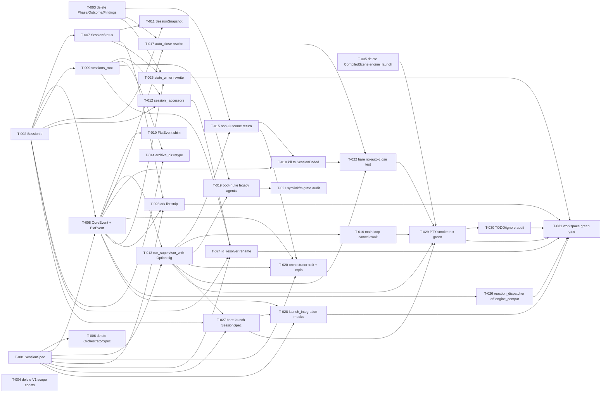

# Build Site: Cavekit Soul Phase 1

31 tasks across 8 tiers from 4 kits.

Phase 1 bundled scope: types surgery (`AgentSpec`/`AgentId`/`AgentStatus`/
`AgentEvent` → `Session*` + `CoreEvent` + `ExtEvent` + `FlatEvent`),
state-layout rename (`agents/` → `sessions/`) with boot-time nuke,
supervisor `Option<Orchestrator>` + `Option<Engine>` signatures with bare
path skipping R3 steps 6/13/15, CLI consumer rewrites against `CoreEvent`,
bare `ark` launch building `SessionSpec` and invoking the supervisor with
`None, None`. End-to-end gate is the PTY smoke test
(`real_zellij_accepts_compiled_default_layout`) flipping green + full
`cargo check --workspace --tests` + `cargo test --workspace`.

## Tier 0 — No Dependencies (Start Here)

| Task | Title | Kit | Requirement | Effort |
| --- | --- | --- | --- | --- |
| T-001 | Introduce `SessionSpec` in `crates/types/src/spec.rs` | types | R1 | M |
| T-002 | Introduce `SessionId` with `new(name)` constructor baking in ulid | types | R3 | M |
| T-003 | Delete `Phase` enum, `Outcome` enum, `Findings` struct (+ `Severity`) from core types | types | R5 | S |
| T-004 | Delete `ENGINES_V1` / `ORCHESTRATORS_V1` / `is_v1_engine` / `is_v1_orchestrator` scope consts + predicates | types | R8 | S |
| T-005 | Delete `CompiledScene.engine_launch` field + `with_engine_launch` builder in `scene_runtime.rs` | supervisor | R7 | S |

## Tier 1 — Types + First State-Layout

| Task | Title | Kit | Requirement | blockedBy | Effort |
| --- | --- | --- | --- | --- | --- |
| T-006 | Delete `OrchestratorSpec` alias from `crates/types/src/spec.rs` | types | R2 | T-001 | S |
| T-007 | Introduce `SessionStatus` in `crates/types/src/status.rs` (replaces `AgentStatus`) | types | R4 | T-002 | M |
| T-008 | Introduce `CoreEvent` + `ExtEvent` in `event.rs`; delete `AgentEvent` + supplementary enums (`TabRole`, `TabHandle`, `MessageRole`, `PermissionDecision`) | types | R6 | T-001, T-002 | L |
| T-009 | Rename `StateLayout::agents_root()` → `sessions_root()` + path leaf | state-layout | R1 | T-002 | S |

## Tier 2 — Follow-on Types + State-Layout Accessors + Supervisor Signature

| Task | Title | Kit | Requirement | blockedBy | Effort |
| --- | --- | --- | --- | --- | --- |
| T-010 | Introduce `FlatEvent` shim + `From<&CoreEvent>` / `From<&ExtEvent>` impls with `ark.core.*` prefix | types | R7 | T-008 | M |
| T-011 | Introduce `SessionSnapshot` in `crates/scene/src/context.rs`; rewire `build_event_scope` + Rhai `session.extensions` binding | types | R9 | T-002, T-007 | M |
| T-012 | Rename per-session `StateLayout` accessors (`agent_dir` → `session_dir`, `agent_socket_path` → `session_socket_path`) + retype to `&SessionId` | state-layout | R2 | T-002, T-009 | M |
| T-013 | Change `run_supervisor_with` signature to `Option<Box<dyn Orchestrator>>` + `Option<Box<dyn Engine>>` + gate R3 steps 6/13/15 behind `Some(...)` | supervisor | R1 | T-001, T-008 | L |

## Tier 3 — State-Layout Tail + Supervisor Return + Main Loop

| Task | Title | Kit | Requirement | blockedBy | Effort |
| --- | --- | --- | --- | --- | --- |
| T-014 | Retype `StateLayout::archive_dir` to accept `&SessionId`, keep `archive/<date>/<leaf>` shape | state-layout | R3 | T-002, T-009 | S |
| T-015 | Rewrite `run_supervisor_with` + `run_supervisor` return type off `Outcome` (non-`Outcome` shape); delete `outcome_exit_code` helper; retype daemon exit-code derivation | supervisor | R3 | T-003, T-013 | M |
| T-016 | Reduce supervisor main loop to `world.cancel.cancelled().await` on the `orchestrator = None` path; keep consumers + reaction dispatcher spawning | supervisor | R2 | T-013 | M |

## Tier 4 — Supervisor Lifecycle Rewrite + Boot-Nuke

| Task | Title | Kit | Requirement | blockedBy | Effort |
| --- | --- | --- | --- | --- | --- |
| T-017 | Rewrite `auto_close.rs`: delete `AutoClosePolicy` (`on_done`/`on_fail`/`on_kill`); reduce `apply_auto_close_policy` to `CoreEvent::SessionEnded` hook + bare-session no-op | supervisor | R4 | T-003, T-008 | M |
| T-018 | Rewrite `kill.rs` grace-expiry broadcast: `CoreEvent::SessionEnded { terminated_at }` instead of `AgentEvent::Done { Outcome::Killed }`; keep tab-registry teardown; retype `kill_handler` return | supervisor | R5 | T-008, T-015 | M |
| T-019 | Wire supervisor boot to nuke legacy `$STATE/agents/` directory recursively before any `sessions/` creation; emit one `tracing::info!` record naming the removed path | state-layout | R4 | T-009, T-013 | M |
| T-020 | Update `Orchestrator` trait in `crates/core/src/orchestrator.rs` to take `SessionSpec` + non-`Outcome` return; adopt in `crates/orchestrators/cavekit/` + `crates/orchestrators/claude-code/`; keep `Some(...)` integration test passing | supervisor | R8 | T-001, T-008, T-013, T-015 | L |

## Tier 5 — Negative-Space Audits + Core Consumers + CLI List/Resolver

| Task | Title | Kit | Requirement | blockedBy | Effort |
| --- | --- | --- | --- | --- | --- |
| T-021 | Audit: no `symlink` / `migrate` / `legacy_agents` code paths under state-dir or supervisor; no `state_dir_compat.rs` / `legacy_paths.rs` / `migrate.rs` files | state-layout | R5 | T-019 | S |
| T-022 | Bare-session no-auto-close integration test: `run_supervisor_with(spec, None, None, ...)` against scripted mux records zero `close-tab-at-index` calls and writes `spec.json` + `status.json` under `<state>/sessions/<id>/` | supervisor | R6 | T-013, T-017, T-018 | M |
| T-023 | Strip `ark list`: remove `--orchestrator` flag, `PHASE_NAMES`, `is_known_phase`, `phase_name`, `--status` filter, `orchestrator`/`engine`/`phase`/`layout`/`tab count`/`last event`/`findings`/`source` columns; reduce to `id`/`name`/`cwd`/`uptime`/`running?`; update help-parse and rendering tests | cli-and-launch | R1 | T-001, T-007, T-008 | M |
| T-024 | Rename `id_resolver.rs` entry points (`list_agent_ids` → `list_session_ids`); retype to `SessionId`; walk `state_layout.sessions_root()`; preserve exact/prefix/substring/name resolve tiers | cli-and-launch | R2 | T-001, T-002, T-009, T-012 | M |
| T-025 | Rewrite `crates/core/src/consumers/state_writer.rs` against `CoreEvent`: delete `AgentEvent` / `Phase::` / `Outcome::` branches; handle only `SessionStarted` + `SessionEnded`; append every `Ext` event to `events.jsonl`; leave `ext_state` empty (Phase-2 seam TODO) | cli-and-launch | R3 | T-007, T-003, T-008 | M |
| T-026 | Rewrite `crates/core/src/consumers/reaction_dispatcher.rs`: drop every `engine_compat::*` invocation; keep `OpNode::Acp*` placeholder arms emitting a `tracing::warn!` "acp dispatch disabled; re-home Phase 3"; keep `Pipe`/`Emit`/`SetStatus`/`Exec`/`ReloadScene`/`Unknown` routing | cli-and-launch | R4 | T-008 | M |

## Tier 6 — Bare Launch Wiring + Mock Harness

| Task | Title | Kit | Requirement | blockedBy | Effort |
| --- | --- | --- | --- | --- | --- |
| T-027 | Bare-launch `SessionSpec` construction in `crates/cli/src/commands/launch/mod.rs`: build `SessionSpec { id: SessionId::new(&session), name: session.clone(), scene_path: scene_file, cwd, env, created_at: Utc::now(), ext_config }` and plumb through `SupervisorSpawner::spawn_and_wait_for_ready`; `ForkSupervisor` in `real.rs` calls `supervisor_main(... , None, None, ...)` — no `build_orchestrator` / `build_engine` / hardcoded slug strings | cli-and-launch | R5 | T-001, T-002, T-013 | M |
| T-028 | Keep `crates/cli/tests/launch_integration.rs` mock tests green: mock `SupervisorSpawner` records `SessionSpec` (not `AgentSpec`); verify no residual `--orchestrator` / `--status` / `outcome_exit_code` / `Outcome::*` / `Phase::*` / `AgentStatus::*` / `AgentSpec::*` references | cli-and-launch | R7 | T-001, T-008, T-027 | S |

## Tier 7 — End-to-End Gate

| Task | Title | Kit | Requirement | blockedBy | Effort |
| --- | --- | --- | --- | --- | --- |
| T-029 | PTY smoke test flips green: `cargo test -p ark-cli --test launch_pty -- real_zellij_accepts_compiled_default_layout` exits 0 when zellij on PATH; SKIP branch intact; assertions unchanged | cli-and-launch | R6 | T-013, T-016, T-022, T-005, T-027 | M |
| T-030 | Audit: no `TODO(cavekit-soul)` hits block Phase 1 scope; no new `#[ignore]` papering over breakage under `crates/cli/tests/` / `crates/supervisor/src/` / `crates/core/src/` | cli-and-launch | R8 (TODO/ignore sub-criterion) | T-029 | S |
| T-031 | Workspace green gate: `cargo check --workspace --tests` + `cargo test --workspace` both exit 0; regression sweep (382 ark-cli / 174 ark-plugin-picker / etc.) | cli-and-launch | R8 (cargo sub-criterion) | T-023, T-024, T-025, T-026, T-028, T-029, T-030 | M |

## Summary

| Tier | Tasks | Effort |
| --- | ---: | --- |
| 0 | 5 | 2M + 3S |
| 1 | 4 | 1L + 2M + 1S |
| 2 | 4 | 1L + 3M |
| 3 | 3 | 2M + 1S |
| 4 | 4 | 1L + 3M |
| 5 | 6 | 4M + 2S |
| 6 | 2 | 1M + 1S |
| 7 | 3 | 2M + 1S |
| **Total** | **31** | **3L + 17M + 11S** |

## Coverage Matrix

Every acceptance criterion from every Phase-1 requirement maps to at least
one task. 100% COVERED (no GAP rows).

### Types Kit

| Kit | Req | Criterion (abbreviated) | Task(s) | Status |
| --- | --- | --- | --- | --- |
| types | R1 | `pub struct SessionSpec` exactly once in spec.rs | T-001 | COVERED |
| types | R1 | `pub struct AgentSpec` zero hits in types/src/ | T-001 | COVERED |
| types | R1 | No `AgentSpec` residue in types/src/ | T-001 | COVERED |
| types | R1 | `SessionSpec` carries exact field set (id/name/scene_path/cwd/env/created_at/ext_config) | T-001 | COVERED |
| types | R1 | `SessionSpec` does NOT carry orchestrator/engine/cmd/layout/session/runner_config | T-001 | COVERED |
| types | R1 | `SessionSpec` serde_json roundtrip test | T-001 | COVERED |
| types | R1 | `env: BTreeMap` deterministic sort order | T-001 | COVERED |
| types | R1 | `ext_config: BTreeMap` deterministic serialisation | T-001 | COVERED |
| types | R2 | `OrchestratorSpec` zero hits across crates/ | T-006 | COVERED |
| types | R2 | `cargo check --workspace` passes without replacement alias | T-006, T-031 | COVERED |
| types | R3 | `pub struct SessionId` exactly once in id.rs | T-002 | COVERED |
| types | R3 | `pub struct AgentId` zero hits in id.rs | T-002 | COVERED |
| types | R3 | `AgentId` zero hits across types/src/ | T-002 | COVERED |
| types | R3 | `SessionId::new("foo").as_path_leaf()` matches `^foo-[0-9a-z]{26}$` | T-002 | COVERED |
| types | R3 | Two `::new("foo")` return distinct values (ulid differs) | T-002 | COVERED |
| types | R3 | `::new` takes exactly one `&str`; no orchestrator param | T-002 | COVERED |
| types | R3 | Public `name()` + `ulid()` accessors | T-002 | COVERED |
| types | R3 | Adversarial-name sanitisation (`/`, whitespace, control, `..`, null) | T-002 | COVERED |
| types | R3 | `#[serde(transparent)]`-style single-string serialisation | T-002 | COVERED |
| types | R4 | `pub struct SessionStatus` exactly once in status.rs | T-007 | COVERED |
| types | R4 | `pub struct AgentStatus` zero hits | T-007 | COVERED |
| types | R4 | `AgentStatus` zero hits in types/src/ | T-007 | COVERED |
| types | R4 | Exact field set (id/started_at/terminated_at/ext_state); no phase/progress/last_event_*/tab_handles/supervisor_pid/stalled_since/findings/hide/spec | T-007 | COVERED |
| types | R4 | Serde_json roundtrip | T-007 | COVERED |
| types | R4 | `ext_state` BTreeMap + deterministic serialisation | T-007 | COVERED |
| types | R5 | `pub enum Phase` zero hits | T-003 | COVERED |
| types | R5 | `pub enum Outcome` zero hits | T-003 | COVERED |
| types | R5 | `pub struct Findings` zero hits | T-003 | COVERED |
| types | R5 | `Severity` zero hits (or non-reexported) | T-003 | COVERED |
| types | R5 | No re-exports of Phase/Outcome/Findings from lib.rs | T-003 | COVERED |
| types | R6 | `pub enum CoreEvent` exactly once | T-008 | COVERED |
| types | R6 | `pub enum AgentEvent` zero hits | T-008 | COVERED |
| types | R6 | `AgentEvent` zero hits in types/src/ | T-008 | COVERED |
| types | R6 | Exactly five variants (Log/Error/SessionStarted/SessionEnded/Ext) + exhaustiveness test | T-008 | COVERED |
| types | R6 | No deleted variants (Started/TabOpened/TabClosed/Progress/TaskDone/Iteration/PhaseTransition/ToolUse/Message/FileEdited/ReviewComment/PermissionAsked/PermissionResolved/Stall/UserEvent/Done) | T-008 | COVERED |
| types | R6 | `pub struct ExtEvent { ext, kind, payload }` construction test | T-008 | COVERED |
| types | R6 | `SessionStarted` carries `spec: SessionSpec` | T-008 | COVERED |
| types | R6 | `SessionEnded` carries `terminated_at`; no `outcome` | T-008 | COVERED |
| types | R6 | Per-variant serde_json roundtrip | T-008 | COVERED |
| types | R6 | `Ext(ExtEvent{...})` tagged-string serialisation roundtrip | T-008 | COVERED |
| types | R6 | Supplementary enums (TabRole/TabHandle/MessageRole/PermissionDecision) deleted or moved | T-008 | COVERED |
| types | R7 | `pub struct FlatEvent { name, payload }` exists | T-010 | COVERED |
| types | R7 | `From<&CoreEvent>` impl with `ark.core.*` prefix test | T-010 | COVERED |
| types | R7 | `From<&ExtEvent>` impl with `<ext>.<kind>` format test | T-010 | COVERED |
| types | R7 | Every CoreEvent variant produces `ark.core.` prefix (exhaustive) | T-010 | COVERED |
| types | R7 | `FlatEvent` Clone+Debug+PartialEq + serde_json roundtrip | T-010 | COVERED |
| types | R8 | `ENGINES_V1` zero hits | T-004 | COVERED |
| types | R8 | `ORCHESTRATORS_V1` zero hits | T-004 | COVERED |
| types | R8 | `is_v1_engine` zero hits | T-004 | COVERED |
| types | R8 | `is_v1_orchestrator` zero hits | T-004 | COVERED |
| types | R8 | `MUX_V1` survives (at least one hit) | T-004 | COVERED |
| types | R8 | `is_v1_mux` survives | T-004 | COVERED |
| types | R8 | `cargo test -p ark-types` passes | T-004, T-031 | COVERED |
| types | R9 | `pub struct AgentSnapshot` zero hits in scene/ | T-011 | COVERED |
| types | R9 | `pub struct SessionSnapshot` exactly once in context.rs | T-011 | COVERED |
| types | R9 | Public `extensions` field BTreeMap<String, serde_json::Value> | T-011 | COVERED |
| types | R9 | `build_event_scope` signature takes `session: &SessionSnapshot` | T-011 | COVERED |
| types | R9 | Rhai scope: no `agent` binding OR deprecated backward-compat only; test against `session.name` / `session.id` / `session.extensions[...]` | T-011 | COVERED |
| types | R9 | Rhai `session.extensions["acp"]["field"]` roundtrip test | T-011 | COVERED |
| types | R9 | `cargo test -p ark-scene` passes | T-011, T-031 | COVERED |

### State Layout Kit

| Kit | Req | Criterion (abbreviated) | Task(s) | Status |
| --- | --- | --- | --- | --- |
| state-layout | R1 | `fn agents_root` zero hits in state_dir.rs | T-009 | COVERED |
| state-layout | R1 | `fn sessions_root` exactly once | T-009 | COVERED |
| state-layout | R1 | `sessions_root()` returns `/state/sessions` (test) | T-009 | COVERED |
| state-layout | R1 | No `"agents"` literal segment in state_dir.rs | T-009 | COVERED |
| state-layout | R1 | No caller uses `agents_root()` across crates/ | T-009 | COVERED |
| state-layout | R2 | `fn agent_dir` zero hits | T-012 | COVERED |
| state-layout | R2 | `fn session_dir` exactly once | T-012 | COVERED |
| state-layout | R2 | `fn agent_socket_path` zero hits | T-012 | COVERED |
| state-layout | R2 | `fn session_socket_path` exactly once | T-012 | COVERED |
| state-layout | R2 | `session_dir(&id)` returns `<base>/sessions/<leaf>` | T-012 | COVERED |
| state-layout | R2 | `session_socket_path(&id)` returns `<runtime>/sessions/<leaf>.sock` | T-012 | COVERED |
| state-layout | R2 | Every surviving accessor takes `&SessionId` + returns under `sessions/` leaf | T-012 | COVERED |
| state-layout | R2 | `&AgentId` zero hits in state_dir.rs | T-012 | COVERED |
| state-layout | R3 | `archive_dir` produces `<base>/archive/YYYY-MM-DD/<leaf>` (not `archived/` or `sessions/archive/`) | T-014 | COVERED |
| state-layout | R3 | `archive_dir` takes `&SessionId` | T-014 | COVERED |
| state-layout | R4 | Supervisor boot invokes nuke against `<base>/agents/` before sessions/ creation | T-019 | COVERED |
| state-layout | R4 | Seeded `<base>/agents/somefile` is removed after boot (integration test) | T-019 | COVERED |
| state-layout | R4 | Absent legacy directory: boot succeeds without error + does not create one | T-019 | COVERED |
| state-layout | R4 | Exactly one `tracing::info!` record with path substring | T-019 | COVERED |
| state-layout | R4 | No `symlink|migrate|legacy_agents` code paths | T-019, T-021 | COVERED |
| state-layout | R5 | No `symlink` create/deref of path named `agents` | T-021 | COVERED |
| state-layout | R5 | No `state_dir_compat.rs`/`legacy_paths.rs`/`migrate.rs` files under crates/types/src/ or crates/supervisor/src/ | T-021 | COVERED |

### Supervisor Kit

| Kit | Req | Criterion (abbreviated) | Task(s) | Status |
| --- | --- | --- | --- | --- |
| supervisor | R1 | `fn run_supervisor_with` signature shows `Option<Box<dyn Orchestrator>>` + `Option<Box<dyn Engine>>` | T-013 | COVERED |
| supervisor | R1 | Workspace test: `run_supervisor_with(spec, None, None, ...)` against stub mux returns cleanly with spec.json + status.json | T-013, T-022 | COVERED |
| supervisor | R1 | Existing `cargo test -p ark-supervisor` passes (Some/Some path) | T-013, T-020, T-031 | COVERED |
| supervisor | R1 | `engine = None` never calls any engine method (assertion stub unobserved) | T-013 | COVERED |
| supervisor | R1 | `orchestrator = None` does not block / times out within 5s | T-013, T-016 | COVERED |
| supervisor | R2 | On `orchestrator = None`, path reduces to `cancel.cancelled().await`; external cancel returns within 5s | T-016 | COVERED |
| supervisor | R2 | Consumers still spawn on None path: `events.jsonl` contains at least `SessionStarted` | T-016, T-025 | COVERED |
| supervisor | R2 | `World` on None path has no orchestrator-handle field populated | T-016 | COVERED |
| supervisor | R3 | `-> Result<Outcome` zero hits in supervisor/src/ | T-015 | COVERED |
| supervisor | R3 | `Outcome::` zero hits in supervisor/src/ | T-015 | COVERED |
| supervisor | R3 | `cargo check --workspace --tests` passes | T-015, T-031 | COVERED |
| supervisor | R3 | Every `run_supervisor(_with)` call-site compiles against new return type | T-015, T-020, T-027 | COVERED |
| supervisor | R3 | Outer daemon derives exit code without `outcome_exit_code`; zero hits | T-015 | COVERED |
| supervisor | R4 | `pub struct AutoClosePolicy` zero hits | T-017 | COVERED |
| supervisor | R4 | `on_done|on_fail|on_kill` zero hits in auto_close.rs | T-017 | COVERED |
| supervisor | R4 | `Outcome::` zero hits in auto_close.rs | T-017 | COVERED |
| supervisor | R4 | Module compiles under workspace check | T-017, T-031 | COVERED |
| supervisor | R4 | Bare session + scripted mux records zero `close-tab-at-index` calls | T-017, T-022 | COVERED |
| supervisor | R4 | Module survives as placeholder OR deleted; no residual `auto_close` in lib.rs if deleted | T-017 | COVERED |
| supervisor | R5 | `Outcome::Killed` zero hits in kill.rs | T-018 | COVERED |
| supervisor | R5 | `AgentEvent::Done` zero hits in kill.rs | T-018 | COVERED |
| supervisor | R5 | `CoreEvent::SessionEnded` at least one hit in kill.rs | T-018 | COVERED |
| supervisor | R5 | `kill_handler` + slow orchestrator emits `CoreEvent::SessionEnded{terminated_at}` and no `AgentEvent::Done` | T-018 | COVERED |
| supervisor | R5 | `kill_handler` return type no longer mentions `Outcome` | T-018 | COVERED |
| supervisor | R5 | Tab-teardown continues: `mux.close_tab` records per registry entry | T-018 | COVERED |
| supervisor | R6 | Bare session + scripted mux + external cancel: zero `close-tab-at-index` invocations | T-022 | COVERED |
| supervisor | R6 | `spec.json` + `status.json` written to `<state>/sessions/<id>/` | T-022 | COVERED |
| supervisor | R7 | `engine_launch` zero hits in scene_runtime.rs | T-005 | COVERED |
| supervisor | R7 | `with_engine_launch` zero hits in supervisor/src/ | T-005 | COVERED |
| supervisor | R7 | `EngineLaunch` zero hits in scene_runtime.rs | T-005 | COVERED |
| supervisor | R7 | `CompiledScene` still carries source/ir/scene_id/registry/max_cascade_depth | T-005 | COVERED |
| supervisor | R7 | `cargo test -p ark-supervisor` passes | T-005, T-031 | COVERED |
| supervisor | R8 | `cargo check --workspace --tests` passes | T-020, T-031 | COVERED |
| supervisor | R8 | `cargo test -p ark-orchestrator-cavekit` passes | T-020, T-031 | COVERED |
| supervisor | R8 | `cargo test -p ark-orchestrator-claude-code` passes | T-020, T-031 | COVERED |
| supervisor | R8 | `Outcome|AgentSpec` zero hits in `crates/core/src/orchestrator.rs` | T-020 | COVERED |
| supervisor | R8 | `fn run(` signature takes `SessionSpec` | T-020 | COVERED |
| supervisor | R8 | Scripted `run_supervisor_with(spec, Some(orch), Some(engine), ...)` passes with cavekit + stub engine | T-020, T-031 | COVERED |

### CLI and Launch Kit

| Kit | Req | Criterion (abbreviated) | Task(s) | Status |
| --- | --- | --- | --- | --- |
| cli-and-launch | R1 | `orchestrator` zero hits in list.rs | T-023 | COVERED |
| cli-and-launch | R1 | `PHASE_NAMES` zero hits in list.rs | T-023 | COVERED |
| cli-and-launch | R1 | `phase_name`/`is_known_phase` zero hits | T-023 | COVERED |
| cli-and-launch | R1 | `--orchestrator` / `--status` flags gone from CLI flag definitions | T-023 | COVERED |
| cli-and-launch | R1 | `fn phase_str` zero hits (or only via running? discriminator) | T-023 | COVERED |
| cli-and-launch | R1 | `ark list --help`: no `--orchestrator` / `--status` (clap-derive test) | T-023 | COVERED |
| cli-and-launch | R1 | Table columns reduced to `id`/`name`/`cwd`/`uptime`/`running?` | T-023 | COVERED |
| cli-and-launch | R1 | `ark list <id>` detail view prints only reduced set | T-023 | COVERED |
| cli-and-launch | R1 | `cargo test -p ark-cli` passes | T-023, T-031 | COVERED |
| cli-and-launch | R2 | `fn list_agent_ids` zero hits | T-024 | COVERED |
| cli-and-launch | R2 | `fn list_session_ids` exactly once | T-024 | COVERED |
| cli-and-launch | R2 | `AgentId` zero hits in id_resolver.rs | T-024 | COVERED |
| cli-and-launch | R2 | `SessionId` at least one hit | T-024 | COVERED |
| cli-and-launch | R2 | `resolve_session_id` walks `sessions_root()` (test) | T-024 | COVERED |
| cli-and-launch | R2 | Name-match tier reads `name` from `SessionSpec`-shaped spec.json | T-024 | COVERED |
| cli-and-launch | R2 | Exact/prefix/substring/name tier semantics preserved | T-024 | COVERED |
| cli-and-launch | R2 | `cargo test -p ark-cli` passes | T-024, T-031 | COVERED |
| cli-and-launch | R3 | `AgentEvent` zero hits in state_writer.rs | T-025 | COVERED |
| cli-and-launch | R3 | `Phase::|Outcome::` zero hits in state_writer.rs | T-025 | COVERED |
| cli-and-launch | R3 | `fn update_status` exactly once; branches on `SessionEnded`, not on deleted variants | T-025 | COVERED |
| cli-and-launch | R3 | Test: SessionStarted+SessionEnded → `terminated_at = Some(_)` | T-025 | COVERED |
| cli-and-launch | R3 | Test: `Ext` event appended to events.jsonl, ext_state stays empty | T-025 | COVERED |
| cli-and-launch | R3 | `PhaseTransition` zero hits in state_writer.rs | T-025 | COVERED |
| cli-and-launch | R3 | `cargo test -p ark-core` passes | T-025, T-031 | COVERED |
| cli-and-launch | R4 | `engine_compat` zero hits in reaction_dispatcher.rs | T-026 | COVERED |
| cli-and-launch | R4 | `OpNode::Acp` at least one hit (placeholder arms preserved) | T-026 | COVERED |
| cli-and-launch | R4 | Placeholder `Acp*` arms emit `tracing::warn!` with "acp dispatch disabled" + test: `OpNode::AcpPrompt` dispatch doesn't panic / doesn't invoke engine-compat | T-026 | COVERED |
| cli-and-launch | R4 | `cargo test -p ark-core` passes | T-026, T-031 | COVERED |
| cli-and-launch | R4 | `cargo check -p ark-scene` passes with engine_compat.rs public API intact | T-026, T-031 | COVERED |
| cli-and-launch | R5 | `AgentSpec` zero hits under commands/launch/ | T-027 | COVERED |
| cli-and-launch | R5 | `AgentId::new` zero hits | T-027 | COVERED |
| cli-and-launch | R5 | `SessionId::new` at least one hit in launch/mod.rs | T-027 | COVERED |
| cli-and-launch | R5 | `SessionSpec` at least one hit in launch/mod.rs | T-027 | COVERED |
| cli-and-launch | R5 | No hardcoded orchestrator/engine slug strings ("ark"/"cavekit"/"claude-code") in launch/ | T-027 | COVERED |
| cli-and-launch | R5 | `build_orchestrator`/`build_engine` zero hits under launch/ | T-027 | COVERED |
| cli-and-launch | R5 | `spawn_and_wait_for_ready` signature takes `SessionSpec` | T-027 | COVERED |
| cli-and-launch | R5 | Production `supervisor_main(... , None, None, ...)` invocation in real.rs | T-027 | COVERED |
| cli-and-launch | R5 | `cargo test -p ark-cli --test launch_integration` passes | T-027, T-028, T-031 | COVERED |
| cli-and-launch | R6 | `launch_pty` PTY test exits 0 on host with zellij on PATH | T-029 | COVERED |
| cli-and-launch | R6 | SKIP branch intact on host without zellij (prints "SKIP: zellij not on PATH") | T-029 | COVERED |
| cli-and-launch | R6 | `zellij list-sessions` contains `ark-pty-test-<pid>` within 10s (wait_for_session returns true) | T-029 | COVERED |
| cli-and-launch | R6 | Test file not weakened: `assert!(appeared, ...)` + 10s timeout + inside-zellij skip all preserved | T-029 | COVERED |
| cli-and-launch | R7 | `cargo test -p ark-cli --test launch_integration` exits 0 | T-028, T-031 | COVERED |
| cli-and-launch | R7 | Mock `SupervisorSpawner` records `SessionSpec` (type-level assertion) | T-028 | COVERED |
| cli-and-launch | R7 | No residual `--orchestrator`/`--status`/`outcome_exit_code`/`Outcome::*`/`Phase::*`/`AgentStatus::*`/`AgentSpec::*` API calls | T-028 | COVERED |
| cli-and-launch | R8 | `cargo check --workspace --tests` exits 0 | T-031 | COVERED |
| cli-and-launch | R8 | `cargo test --workspace` exits 0 | T-031 | COVERED |
| cli-and-launch | R8 | No blocking `TODO(cavekit-soul)` outside documented deferrals | T-030 | COVERED |
| cli-and-launch | R8 | No new `#[ignore]` added as workaround under cli/tests, supervisor/src, core/src | T-030 | COVERED |

**Coverage: 100% (0 GAP rows).**

## Dependency Graph

## Notes

- Tier 0 has five independently-startable tasks (T-001..T-005). Two are
  long (T-008 via its downstream depth; but T-008 itself lives in Tier 1
  behind T-001+T-002). The biggest fan-in is T-031 (workspace gate).
- T-005 (delete `CompiledScene.engine_launch`) is scheduled Tier 0 per
  the supervisor kit's explicit "Dependencies: none (orthogonal to
  R1-R6)"; it flows directly into T-029's PTY readiness because the
  bare-launch scene-compile path must not synthesise an engine launch.
- T-008 is the highest-leverage task: it unblocks nearly every downstream
  consumer (auto_close, kill, state_writer, reaction_dispatcher, list
  renderer, FlatEvent, SessionSnapshot Rhai scope).
- T-020 bundles orchestrator-trait re-signing into one task rather than
  splitting per-orchestrator-crate because the trait signature + the
  two impl adopts + the scripted Some/Some integration test are all
  one atomic compile unit.
- T-029 is the "flip the PTY test green" gate; it is the last feature
  task before T-030/T-031 close out auditing + workspace green.
- Mermaid edges render the full transitive predecessor set implicit in
  the tier tables; the graph shows the critical path Tier 0 → Tier 1
  (T-008) → Tier 2 (T-013) → Tier 3 (T-015, T-016) → Tier 4 (T-017,
  T-018, T-019, T-020) → Tier 5 (T-022) → Tier 6 (T-027) → Tier 7
  (T-029 → T-031).
