# Build Site — ark v1

134 tasks across 7 tiers from 17 kits.

Tasks use `T-NNN` IDs. `blockedBy` references earlier tasks. Effort scale: S (<30m), M (30m–2h), L (2h+). Every task maps to one or more cavekit requirements and their acceptance criteria. See the Coverage Matrix at the bottom for per-criterion task assignment.

Key v1-commitments encoded in this site:
- **Control-socket model:** per-supervisor unix socket at `${XDG_RUNTIME_DIR:-/tmp}/ark-$UID/agents/{id}.sock` (kakoune pattern). No central daemon, no shared listener. Picker spawns new agents by `exec`ing `ark spawn` subprocess (wezterm connect-or-spawn).
- **Templating engine:** minijinja (picked over handlebars; lighter + idiomatic jinja2).
- **Zellij:** pin ≥ 0.44.1. `switch-session` create-if-missing is default; no `--create` flag (exists on `attach`, not `switch-session`). Layout files MUST end in `.kdl` (issue #4994).
- **Picker fuzzy matcher:** nucleo-matcher (not fuzzy-matcher, not full nucleo). No serde_json / chrono / humantime in plugins.
- **Wasm size:** no hard byte budgets; CI fails on >25% growth vs main. Release profile locks opt-level=z, lto=fat, wasm-opt -Oz.

---

## Tier 0 — Foundations (no dependencies)

| Task | Title | Cavekit | Requirement | blockedBy | Effort |
|------|-------|---------|-------------|-----------|--------|
| T-001 | Scaffold cargo workspace with 12 crates + workspace.package (edition 2024, MIT) | distribution | R1 | — | M |
| T-002 | Pin workspace deps (tokio, serde, clap, figment, nix, ratatui, notify, tracing, interprocess, signal-hook, minijinja, nucleo-matcher) | distribution | R1 | — | S |
| T-003 | AgentId type + ULID generation + session-name derivation + state-dir helper + FS/URL safety | types-state-events | R1 | T-001 | M |
| T-004 | AgentSpec struct + serde + OrchestratorSpec alias | types-state-events | R2 | T-003 | M |
| T-005 | AgentEvent enum with all 17 variants + TabRole + Outcome + Severity + MessageRole + PermissionDecision + LogLevel | types-state-events | R3 | T-004 | L |
| T-006 | AgentStatus + Phase enum + Findings rollup struct | types-state-events | R6 | T-005 | M |
| T-007 | TabHandle + CancellationToken re-export + shared small types | types-state-events, architecture | R3, R4 | T-005 | S |
| T-008 | State-dir schema: paths, permissions 0700, creation helpers (XDG resolution, idempotent) | types-state-events | R5 | T-003 | M |
| T-009 | events.jsonl append writer with tokio channel + per-event flush + corruption-tolerant reader | types-state-events | R7 | T-005, T-008 | M |
| T-010 | Atomic status.json writer (tmp + rename, readable without locks) | types-state-events | R6, R5 | T-006, T-008 | S |
| T-011 | EventSink alias + broadcast channel factory (capacity from config) + lag drop-oldest warn-log | types-state-events | R4 | T-005 | S |
| T-012 | ARK_STATE_DIR / ARK_RUNTIME_DIR / ARK_CONFIG_PATH path resolver + `runtime_dir()` helper for `${XDG_RUNTIME_DIR:-/tmp}/ark-$UID` | cli, config, hook-ipc | R8, R5, R4 | T-008 | M |
| T-013 | Engine trait + EngineHandle + ApprovalPolicy enum + per-pane handle support | architecture | R1 | T-005, T-008 | M |
| T-014 | Orchestrator trait + Outcome wiring | architecture | R2 | T-005 | M |
| T-015 | World struct with mux Arc, events, cancel, hooks_dir, state, config | architecture | R3 | T-013, T-014 | S |
| T-016 | Multiplexer trait + TabHandle surface (tmux-compatible shape) | architecture | R4 | T-007 | S |
| T-017 | v1 scope-lock constants (allowed engine/orchestrator/mux slugs; deferred NDJSON noted) | architecture | R6 | T-004 | S |

## Tier 1 — Leaf components: Config, Mux executor, Layouts, Pane widgets, Control-socket primitives

| Task | Title | Cavekit | Requirement | blockedBy | Effort |
|------|-------|---------|-------------|-----------|--------|
| T-018 | Figment layering: defaults→user→project→env→flags with array concat + missing-skipped | config | R1 | T-001, T-005 | M |
| T-019 | TOML schema structs (Defaults/Diff/EngineClaudeCode/OrchestratorCavekit/OrchestratorClaudeCode/MuxZellij/Hook) + unknown-key rejection | config | R2 | T-018 | M |
| T-020 | Config::defaults() returning all shipped default values (event_bus_capacity=256, auto_close_*, transcript_tail, diff.debounce_ms, watch gates) | config | R3 | T-019 | M |
| T-021 | Hook entry parsing with {{var}} template substitution + match filters (event/orchestrator/severity) | config | R4 | T-019, T-005 | M |
| T-022 | ARK_* env var mapping (double-underscore flatten + shortcuts ARK_ORCHESTRATOR/ENGINE/LOG/paths, array unsupported) | config | R5 | T-018 | S |
| T-023 | Ship template config.toml (user-facing, commented, documents env-var shortcuts) | config | R3, R4, R5 | T-020, T-021 | S |
| T-024 | Stub command executor trait + real tokio::process impl (stderr capture, PATH only) for ZellijMux testability | mux-zellij | R6 | T-001 | M |
| T-025 | ZellijMux::ensure_session: `$ZELLIJ` detect; outside = `zellij -s {s} --layout {p.kdl}` wrapped in setsid; inside = `zellij action switch-session {s} [--layout {p.kdl}]` (no `--create` flag — create is default); collision → append short-ULID; forbid nesting | mux-zellij | R1 | T-024, T-003 | L |
| T-026 | ZellijMux::create_tab invoking `zellij --session {s} action new-tab --layout {p} --name {n}` + first-tab short-circuit + query tab_index → TabHandle | mux-zellij | R2 | T-025, T-007 | M |
| T-027 | ZellijMux::close_tab (idempotent) + rename_tab (progress fallback) | mux-zellij | R3 | T-026 | S |
| T-028 | ZellijMux::pipe (`zellij pipe --name {target} -- {json}`) to ark-status + ark-picker, fire-and-forget, non-fatal on fail | mux-zellij | R4 | T-026 | S |
| T-029 | Layout stem resolver (user `~/.config/ark/layouts/{stem}.kdl` → embedded `share/ark/layouts/{stem}.kdl` → error with available list); direct-path pass-through requires `.kdl` suffix | mux-zellij, layouts | R5, R1 | T-012 | M |
| T-030 | **minijinja** template renderer with bounded variable set ({{cwd}}, {{agent_cmd}}, {{agent_args}}, {{id}}, {{name}}) + undefined-var syntax error + KDL syntax validation of render output | mux-zellij, layouts | R5, R3 | T-029 | M |
| T-031 | Rendered-KDL writer to `${XDG_RUNTIME_DIR}/ark/layouts/{id}-{tab}.kdl` — enforce `.kdl` extension on every write (zellij #4994) + cleanup on tab close | mux-zellij, layouts | R5, R3 | T-030, T-012 | S |
| T-032 | ZellijMux preflight: `zellij --version` ≥ 0.44.1 check + actionable error (tells user `brew install zellij` etc.) | mux-zellij | R6 | T-024 | M |
| T-033 | Ship builder.kdl (triple-stack builder layout) — zellij ≥0.44 syntax | layouts | R2 | T-030 | S |
| T-034 | Ship classic.kdl (2-pane: builder + diff) — zellij ≥0.44 syntax | layouts | R2 | T-030 | S |
| T-035 | Ship focused.kdl, triple-column.kdl, review.kdl, log.kdl layouts — zellij ≥0.44 syntax | layouts | R2 | T-030 | M |
| T-036 | Default-layout-per-orchestrator resolution (cavekit→builder, claude-code→classic, review key) + --layout flag + global config key | layouts | R6 | T-020, T-029 | S |
| T-037 | `ark layouts list` diagnostic (stems + source user/embedded) | layouts | R1 | T-029 | S |
| T-038 | User-authored layout validation (ark doctor hook) + docs/layouts.md (external commands allowed, path pass-through) | layouts | R5 | T-029 | M |
| T-039 | Pane cmd shared chrome: crossterm + ratatui scaffolding, NO_COLOR, SIGWINCH, Ctrl+C graceful, tracing error path | pane-commands | R4 | T-001 | M |
| T-040 | `ark pane diff`: notify watch .git/index + files + debounced git-diff + delta pipe + ansi-to-tui render + scroll + non-repo placeholder | pane-commands | R1 | T-039, T-020 | L |
| T-041 | `ark pane git`: porcelain=v2 parser + branch/ahead/behind + sections + 2s poll + non-repo placeholder + truncation scroll | pane-commands | R2 | T-039 | L |
| T-042 | `ark pane log`: events.jsonl tail (inotify) + HH:MM:SS KIND summary render + color-coded + --filter + scroll/follow + missing-agent placeholder + exit 3 | pane-commands | R3 | T-039, T-009 | L |
| T-043 | Control-socket primitive: `interprocess::local_socket::Listener` wrapper with Tokio integration + NDJSON request/response codec | hook-ipc, supervisor | R4, R7 | T-002, T-012 | M |
| T-044 | Stale-socket GC helper (kakoune `kak -l` pattern): `connect(50ms)` → on ECONNREFUSED/ENOENT-during-handshake `unlink()` the path | hook-ipc, plugin-picker | R4, R3 | T-043 | S |
| T-045 | Agents-socket-dir helper: compute + ensure `${XDG_RUNTIME_DIR}/ark-$UID/agents/` (mode 0700 on parent) + socket path per agent-id | hook-ipc, supervisor | R4, R7 | T-012 | S |

## Tier 2 — ark-hook sidecar, Engine pieces, Event-bus consumers

| Task | Title | Cavekit | Requirement | blockedBy | Effort |
|------|-------|---------|-------------|-----------|--------|
| T-046 | ark-hook binary skeleton: clap args (--id, --event), stdin read, <200ms budget, exit codes (0 success / 2 only on explicit deny / 0 on all error paths) | hook-ipc | R1 | T-001, T-005 | M |
| T-047 | ark-hook payload parser (Claude hook JSON {session_id, cwd, hook_event_name, tool_name?, tool_input?} → AgentEvent translator, e.g. PostToolUse → ToolUse+FileEdited) | hook-ipc | R1 | T-046, T-005 | M |
| T-048 | ark-hook per-event JSONL writer to `$STATE/agents/{id}/hooks/{PostToolUse,Stop,PermissionRequest,Notification,SessionEnd,TaskCompleted}.jsonl` (O_APPEND + O_CREAT) | hook-ipc | R2 | T-047, T-008 | M |
| T-049 | ark-hook zellij-pipe forwarding to ark-status + ark-picker targets (warn on fail, continue) | hook-ipc | R1 | T-047 | S |
| T-050 | ark-hook PermissionRequest auto-approve stdout payload `{"hookSpecificOutput":{"decision":{"behavior":"allow"}}}` | hook-ipc, engine-claude-code | R1, R3 | T-047 | S |
| T-051 | ark-hook missing-state-dir + malformed-stdin + fail-open behavior (never exit 2 on error, always allow on PermissionRequest) | hook-ipc | R3 | T-048 | S |
| T-052 | ClaudeCodeEngine: settings.local.json locate/deep-merge injection + .ark-backup + # ark comment + idempotent checksum + .claude/ creation 0700 | engine-claude-code | R1 | T-013, T-020 | L |
| T-053 | ClaudeCodeEngine transcript tailer (session_id extract + notify inotify + JSONL parser → ToolUse/Message/FileEdited) + rotation handling + transcript_tail config gate | engine-claude-code | R2 | T-052, T-005 | L |
| T-054 | Permission policy enforcement (ask / auto_approve_read / auto_approve_all) integrated with ark-hook + always-emit PermissionAsked+Resolved | engine-claude-code | R3 | T-050, T-020 | M |
| T-055 | Engine Done/SessionEnd detection → Outcome::Success emission via event bus + orchestrator short-circuit signal | engine-claude-code | R4 | T-052, T-011 | M |
| T-056 | Engine stall watcher (10s poll, threshold from config, one-shot dedup + resume-log info) | engine-claude-code | R5 | T-053, T-020 | M |
| T-057 | EngineHandle struct + JoinSet + teardown (cancel transcript tail + restore settings.local.json + remove backup) | engine-claude-code | R6 | T-052, T-053 | M |
| T-058 | Engine preflight: `claude` on PATH + ~/.claude exists + cwd writable + ark-hook discoverable + detailed error hint | engine-claude-code | R7 | T-046 | S |
| T-059 | state_writer consumer task (events.jsonl append + status.json rollup + PhaseTransition emit on change) | supervisor, types-state-events | R2, R6 | T-009, T-010, T-011 | M |
| T-060 | status_pipe consumer task (filter progress-relevant events → mux.pipe ark-status + ark-picker, rename-tab fallback) | supervisor, mux-zellij | R2, R3 | T-011, T-028 | M |
| T-061 | hook_dispatcher consumer task (match [[hooks]] entries + tokio::process detached + 30s timeout + logged failures) | supervisor, config | R2, R4 | T-021, T-011 | M |

## Tier 3 — Supervisor lifecycle + control socket + Orchestrators

| Task | Title | Cavekit | Requirement | blockedBy | Effort |
|------|-------|---------|-------------|-----------|--------|
| T-062 | Supervisor fork + setsid double-fork daemonize (nix) + stdio redirect to supervisor.log + tracing subscriber | supervisor | R1 | T-008 | L |
| T-063 | Supervisor --no-detach foreground variant streaming events to parent stderr | supervisor | R1 | T-062 | S |
| T-064 | File lock on `$STATE/locks/{id}.lock` (idempotent acquire, abort on conflict) | supervisor, types-state-events | R3, R5 | T-008 | S |
| T-065 | Supervisor control-socket bind (R3 step 3): bind per-agent `.sock` post-setsid/StateDir/lock, before engine preflight; serve JoinSet child on tokio runtime; bind failure fatal | supervisor, hook-ipc | R7, R4 | T-043, T-045, T-064 | M |
| T-066 | Per-supervisor socket command handlers: Status / Kill / ForceKill / Rename / Forget / Ping (per-agent, not aggregate) | supervisor, hook-ipc | R7, R5 | T-065, T-006, T-010 | L |
| T-067 | Socket cleanup paths: Drop guard `unlink()` on normal exit + signal_hook SIGTERM/SIGINT handler unlinks before cancel | supervisor, hook-ipc | R7, R4 | T-065 | M |
| T-068 | Control-socket audit log: every command appended to `$STATE/control.log` | supervisor, hook-ipc | R5 | T-066 | S |
| T-069 | Supervisor orchestration sequence (R3 full): StateDir → lock → socket bind → logging → config load → factory → ensure_session → preflight → consumer spawn → install_observability → Started → ready-signal parent → orchestrator.run → drain → teardown → finalize → socket unlink → lock release → exit | supervisor | R3 | T-057, T-059, T-060, T-061, T-025, T-058, T-065 | L |
| T-070 | SIGTERM handler: fire world.cancel, 10s grace, escalate to kill + emit Kill event + close tabs via mux + Outcome::Killed | supervisor | R4 | T-069 | M |
| T-071 | Crash detection: PID liveness via `kill(pid,0)` (nix), Crashed phase surfaced in ark list + status view | supervisor | R5 | T-069, T-006 | M |
| T-072 | Auto-close behavior on Done/Failed/Crashed/Killed per config.defaults.auto_close_on_{done,fail,kill}; per-tab close, session intact | supervisor | R6 | T-070, T-027 | M |
| T-073 | ClaudeCodeOrchestrator::detect (last-resort, claude on PATH; does not steal from cavekit) | orchestrator-claude-code | R1 | T-058 | S |
| T-074 | ClaudeCodeOrchestrator::run (classic layout; open builder tab, wait on Stop/cancel, forward events as-is, non-git cwd valid, diff artifacts on success) | orchestrator-claude-code | R2, R3 | T-026, T-014, T-055, T-036 | M |
| T-075 | CavekitOrchestrator::detect (sites/plans/.cavekit/kits files, no panic on I/O err) | orchestrator-cavekit | R1 | T-014 | S |
| T-076 | CavekitOrchestrator::engine() + builder tab open with default layout + TabOpened emission + spec.cmd as agent cmd | orchestrator-cavekit | R2, R3 | T-026, T-036, T-052, T-069 | M |
| T-077 | Impl-tracking watcher: notify on context/impl/impl-*.md + markdown table parser + 500ms debounce + Progress/TaskDone events + watch_impl_tracking gate | orchestrator-cavekit | R4 | T-076, T-005, T-020 | L |
| T-078 | Build-site total-task extractor from context/plans/build-site*.md (graceful on missing) | orchestrator-cavekit | R4 | T-077 | M |
| T-079 | Ralph-loop watcher: .claude/ralph-loop.local.md → Iteration + PhaseTransition events + watch_ralph_loop gate | orchestrator-cavekit | R5 | T-076, T-020 | M |
| T-080 | Phase detection + review tab spawn/close logic + TabOpened/TabClosed + spawn_review_tab gate | orchestrator-cavekit | R6 | T-079, T-035 | M |
| T-081 | Codex findings watcher: impl-review-findings.md table parser (severity/file/line/body) → ReviewComment events w/ dedup + synthetic reviewer id + findings rollup | orchestrator-cavekit | R7 | T-080, T-059 | M |
| T-082 | Git diff/numstat watcher: notify .git/index + 5s poll + parse → FileEdited with gitignore exclusion + dedupe vs engine transcript | orchestrator-cavekit | R8 | T-076, T-053 | M |
| T-083 | Cavekit orchestrator done-signal resolver (Stop + all-DONE → Success / Stop + PENDING → Failed after 60s / Cancel → Killed / wait for child tabs / trim artifacts) | orchestrator-cavekit | R9 | T-077, T-079, T-081, T-082, T-070 | M |

## Tier 4 — CLI binary wiring all subcommands

| Task | Title | Cavekit | Requirement | blockedBy | Effort |
|------|-------|---------|-------------|-----------|--------|
| T-084 | ark-cli binary scaffold (clap derive, global flags, NO_COLOR, 80-col grouped help, --version/-h) | cli | R1 | T-001 | M |
| T-085 | Exit-code contract (0/1/2/3/4/5) constants + mapping helper | cli | R8 | T-084 | S |
| T-086 | ID resolution helper (full / prefix / substring with ambiguity error) | cli | R3, R4 | T-008 | M |
| T-087 | `ark spawn` subcommand: parse args + orchestrator detect + write spec.json + fork supervisor + print id + <1s parent return + file lock + $ZELLIJ branching + failure exit codes | cli | R2 | T-069, T-084, T-075, T-073, T-064 | L |
| T-088 | `ark list` subcommand: table + ID detail view + --json + --watch + ID resolution + never locks supervisors | cli | R3 | T-086, T-006 | L |
| T-089 | `ark kill` subcommand: SIGTERM to `$STATE/agents/{id}/pid` + --force SIGKILL + --keep-worktree reserved + cascade close + idempotent + emit Done{Killed} | cli | R4 | T-086, T-070 | M |
| T-090 | `ark config` subcommand: show/edit/get/set with TOML write validation | cli, config | R6, R2 | T-084, T-019 | M |
| T-091 | `ark doctor` subcommand: checks (zellij ≥0.44.1/delta/claude/plugins present/orphans/stale-locks/zombies/live-session prompt) + --fix prompts + KDL snippet print + exit 0/2 | cli | R5 | T-084, T-032, T-058, T-071 | L |
| T-092 | `ark pane` subcommand routing (cli → ark-pane impls, visible in --help) | cli, pane-commands, distribution | R7, R4, R1 | T-084, T-040, T-041, T-042 | S |
| T-093 | Wire env-var recognition (ARK_LOG tracing filter, NO_COLOR, ARK_* paths, precedence env < flag) | cli, config | R8, R5 | T-084, T-022 | S |

## Tier 5 — Wasm plugins (status + picker)

| Task | Title | Cavekit | Requirement | blockedBy | Effort |
|------|-------|---------|-------------|-----------|--------|
| T-094 | ark-plugin-status crate scaffolding (cdylib, wasm32-wasip1, zellij-tile, serde + serde_json allowed here, permissions ReadCliPipes, load subscribes Timer+PermissionRequestResult, registers ark-status) | plugin-status | R1 | T-001, T-005 | M |
| T-095 | Status plugin pipe ingestion + StatusSummary cache (BTreeMap) + 60-min eviction + redraw-on-pipe + 1s timer | plugin-status | R2 | T-094 | M |
| T-096 | Status plugin chip rendering (icons ⟳⏸⚠✓✗💀🔍 with severity-colored, 2-row fit, width-aware truncation, focused-session always visible via get_focused_session_name, Text.color_range per chip) | plugin-status | R3 | T-095 | L |
| T-097 | Status plugin WASI fs fallback scanning `$XDG_STATE_HOME/ark/agents/*/status.json` (1s timer); skip if no fs perm | plugin-status | R4 | T-095, T-008 | M |
| T-098 | Status plugin distribution wiring (build output → embed in ark-cli build.rs; doctor writes wasm; KDL snippet print) | plugin-status, distribution | R5, R3 | T-094, T-091 | M |
| T-099 | ark-plugin-picker crate scaffolding (cdylib, wasm32-wasip1, zellij-tile, **nucleo-matcher** (NOT fuzzy-matcher), serde, permissions ReadCliPipes+ChangeApplicationState+ReadApplicationState+MessageAndLaunchOtherPlugins, subscriptions Key+Timer+SessionUpdate+ModeUpdate, registers ark-picker). Avoid serde_json/humantime/chrono — hand-rolled formatters. | plugin-picker, distribution | R1, R3 | T-001, T-005 | M |
| T-100 | Picker state model: PickerScreen enum (List/Detail/NewAgent/ConfirmKill/Help/Error), List(filter/selected/scroll), AgentSummary BTreeMap cache, separate resurrectable cache | plugin-picker | R2 | T-099 | M |
| T-101 | Picker bootstrap: scan `$XDG_STATE_HOME/ark/agents/*/status.json` + scan `${XDG_RUNTIME_DIR}/ark-$UID/agents/*.sock` + reachability check (50ms connect) + stale-socket unlink + cross-reference (socket present + fresh = running, absent + Done = done, absent + not-Done = crashed/resurrectable). Incremental pipe updates + 2s timer re-scan. | plugin-picker, hook-ipc | R3, R4 | T-100, T-065, T-044 | L |
| T-102 | Picker W1 List screen: header line, filter input w/ fuzzy (nucleo-matcher), row format `{sel}{icon}{orch}:{name} {progress} {extra} {age}`, icons + [R] tag, selected highlight via Text.color_range, width-aware truncation + right-align progress, footer hints | plugin-picker | R4 | T-100 | L |
| T-103 | Picker W2 Detail screen: nested under selected row (session-manager expand-tree), fields (session/cwd-home-rel/orch/engine/phase/iter/started/last/review/last-event), hand-rolled humantime, ← or Tab collapse. On-demand connect to per-agent socket + `{"cmd":"Status"}` for full snapshot. | plugin-picker, hook-ipc | R5, R3, R5 | T-102, T-066 | M |
| T-104 | Picker W3 New-agent form: fields (orch radio cavekit/claude-code, cwd + Ctrl+f filepicker, name default=basename(cwd), layout dropdown, cmd default `claude --resume`), Tab/Shift+Tab cycle, Enter submits via `run_command` exec of `ark spawn --orchestrator <o> --cwd <c> --name <n> --layout <l> -- <cmd>` **as detached subprocess** (NOT socket). On exec failure → Error screen. | plugin-picker | R6 | T-102, T-087 | L |
| T-105 | Picker W4 Confirm-kill + rename + detach flows: Del → ConfirmKill screen [y=Kill][Y=Kill+worktree][n=cancel]; Ctrl+r prompt → connect per-agent socket send `{"cmd":"Rename"}`; Ctrl+d → send `{"cmd":"Forget"}`; connect-failure mid-flow → "agent no longer alive — refresh? [y/n]" | plugin-picker, hook-ipc | R7, R5 | T-103, T-066, T-044 | L |
| T-106 | Picker resurrect flow: `r` on crashed agent → read `$STATE/agents/{id}/spec.json` + archive old state dir + `run_command` exec `ark spawn` with same params (semantically equivalent to Spawn) | plugin-picker | R7, R8 | T-101, T-104 | M |
| T-107 | Picker Enter switch_session for active + "agent crashed — resurrect?" prompt for crashed + Esc hide_self | plugin-picker | R8 | T-102, T-106 | S |
| T-108 | Picker keybinding map (↑↓jk, →l, ←h, Enter, type filter, Backspace, Ctrl+n, Ctrl+r, Ctrl+d, Del, Shift+Del kill-all-done/failed, r resurrect, /, ?, Esc/Ctrl+c, Tab cycle) + W5 help overlay | plugin-picker | R9 | T-102, T-105 | M |
| T-109 | Picker distribution wiring (embed via ark-cli build.rs; doctor writes `~/.config/zellij/plugins/ark-picker.wasm`; KDL keybind snippet Ctrl+g a) | plugin-picker, distribution | R1, R3 | T-099, T-091 | M |

## Tier 6 — Testing, distribution, release plumbing

| Task | Title | Cavekit | Requirement | blockedBy | Effort |
|------|-------|---------|-------------|-----------|--------|
| T-110 | ark-test-fixtures crate with path constants + helper loaders + README | testing | R2 | T-001 | S |
| T-111 | Fixture: tests/fixtures/cavekit-project/ (sites, impl-*.md, ralph-loop, findings) | testing | R2 | T-110 | M |
| T-112 | Fixture: tests/fixtures/claude-transcripts/ golden JSONL (covers ToolUse/Message/FileEdited/rotation) | testing | R2 | T-110 | M |
| T-113 | Fixture: tests/fixtures/hook-payloads/ per event type (PostToolUse/Stop/PermissionRequest/Notification/SessionEnd/TaskCompleted) | testing | R2 | T-110 | M |
| T-114 | Engine contract suite (factory closure + scripted hook timeline assertions; gates merge) | testing, architecture | R1, R1 | T-052, T-111, T-112, T-113 | L |
| T-115 | Orchestrator contract suite (mock Mux + fixture cwd; gates merge) | testing, architecture | R1, R2 | T-076, T-074, T-111 | L |
| T-116 | Multiplexer contract suite (stub executor command-sequence assertions incl. switch-session no-`--create`, `.kdl` extension enforcement; gates merge) | testing, architecture | R1, R4 | T-024, T-025, T-031 | M |
| T-117 | Unit tests: ark-types round-trips + AgentId generation + session-name safety | testing, types-state-events | R3, R1, R3 | T-003, T-005 | M |
| T-118 | Unit tests: ark-core state dir + events.jsonl corruption-recovery + status.json atomic write + crash-recovery pid liveness | testing | R3 | T-008, T-009, T-010, T-071 | M |
| T-119 | Unit tests: ark-config figment layering + hook matching + unknown-key rejection + env var precedence | testing, config | R3, R1, R4 | T-018, T-021 | M |
| T-120 | Unit tests: ark-engines-claude-code settings injection (idempotent, deep-merge, backup/restore) + stall dedup + done detection | testing, engine-claude-code | R3, R1, R6 | T-052, T-057 | M |
| T-121 | Unit tests: ark-orchestrators-cavekit parsers (impl-tracking table, ralph-loop fields, findings table, numstat) | testing, orchestrator-cavekit | R3, R4, R5, R7 | T-077, T-079, T-081 | M |
| T-122 | Unit tests: ark-mux-zellij minijinja templating + argv construction (switch-session no `--create`, new-tab argv, `.kdl` extension validation) | testing, mux-zellij | R3, R2, R5 | T-030, T-026, T-031 | M |
| T-123 | Unit tests: ark-pane arg parsing + rendering helpers + NO_COLOR + SIGWINCH redraw | testing, pane-commands | R3, R4 | T-040, T-041, T-042 | M |
| T-124 | Unit tests: control-socket NDJSON serde round-trips + stale-socket GC helper behavior (refused → unlink) | testing, hook-ipc | R5 | T-043, T-044 | M |
| T-125 | Plugin tests: fuzzy search ordering (nucleo-matcher) + render chip output + pipe payload handling + state-dir + socket-dir scan paths | testing, plugin-status, plugin-picker | R5, R3, R3 | T-096, T-102, T-101 | M |
| T-126 | Mock `claude` shim binary emitting scripted hook events for e2e (on PATH during tests) | testing | R4 | T-046, T-052 | M |
| T-127 | E2E scenarios: spawn→list, spawn→kill, spawn→stall, spawn→done, crashed-supervisor archive, picker-spawn via `ark spawn` exec, socket GC of stale `.sock` | testing | R4 | T-087, T-088, T-089, T-091, T-126, T-044 | L |
| T-128 | E2E CI gating via ARK_E2E=1 + teardown-on-fail helpers | testing | R4 | T-127 | S |
| T-129 | CI workflow (ubuntu + macOS matrix, install zellij ≥0.44.1 + delta, cargo test + ARK_E2E, wasm build tracked) | testing, distribution | R4, R1 | T-001, T-127 | M |
| T-130 | ark-cli build.rs compiling wasm plugins (`cargo build --target wasm32-wasip1 --release -p ark-plugin-{status,picker}`) + copy to $OUT_DIR/wasm/ + include_bytes! module | distribution | R3 | T-098, T-109 | M |
| T-131 | Wasm release-profile + size-reduction stack: `[profile.release]` opt-level=z, lto=fat, codegen-units=1, strip=true, panic=abort; wasm-opt -Oz --enable-bulk-memory postprocess; `default-features=false` audit | distribution | R3 | T-094, T-099 | M |
| T-132 | CI wasm size delta-watch: record baseline on main, PR job fails if ark-status.wasm or ark-picker.wasm grew >25%; absolute size in release notes | distribution, plugin-status, plugin-picker | R3, R5, R1 | T-129, T-131 | M |
| T-133 | cargo-dist init + dist-workspace.toml + release.yml for 4 targets (aarch64/x86_64 × macOS/linux) + tag-driven + SHA256 + no Windows | distribution | R2 | T-001, T-129 | M |
| T-134 | Homebrew tap formula (`rlch/ark/ark`) via cargo-dist brew integration + `cargo install ark-cli` reservation + `cargo binstall` metadata | distribution | R4 | T-133 | M |
| T-135 | Standalone `.wasm` release assets published alongside binary tarballs | distribution | R3 | T-133, T-098, T-109 | S |

---

## Summary

| Tier | Tasks |
|------|-------|
| 0 — Foundations | 17 |
| 1 — Config, Mux, Layouts, Pane widgets, Control-socket primitives | 28 |
| 2 — Hook, Engine, Bus consumers | 16 |
| 3 — Supervisor + control socket, Orchestrators | 22 |
| 4 — CLI | 10 |
| 5 — Wasm plugins | 16 |
| 6 — Testing + distribution | 26 |
| **Total** | **135** |

Effort distribution: 33 S, 71 M, 31 L (no XL — splits applied). Task count corrected: T-001 through T-135 = 135 tasks.

---

## Coverage Matrix

Every acceptance criterion across all 17 kits mapped to task ID(s). Status: **100% COVERED**.

### cavekit-architecture
| Req | Criterion | Tasks |
|-----|-----------|-------|
| R1 | Engine trait Send+Sync+'static async_trait | T-013 |
| R1 | Methods (name/install/teardown/default_pane_cmd/transcript_path/auto_approve) | T-013, T-052, T-057, T-053, T-054 |
| R1 | install idempotent | T-052 |
| R1 | Engine installed before orchestrator.run | T-069 |
| R1 | EngineHandle opaque | T-013, T-057 |
| R1 | Per-pane handle multi-pane support | T-013, T-057 |
| R1 | Contract suite | T-114 |
| R2 | Orchestrator trait Send+Sync+'static async_trait | T-014 |
| R2 | Methods (name/detect/engine/run) | T-014, T-073, T-075, T-074, T-076 |
| R2 | Orchestrator owns tab graph | T-074, T-076, T-080 |
| R2 | Orchestrator must not spawn primary agent directly | T-076, T-074 |
| R2 | run returns when all work terminated | T-074, T-083 |
| R2 | Receives events via shared bus | T-015, T-077 |
| R2 | Orchestrator contract suite | T-115 |
| R3 | World struct fields | T-015 |
| R3 | mux shared, create_tab freely | T-015 |
| R3 | events broadcast::Sender | T-011, T-015 |
| R3 | cancel fires on SIGTERM / kill | T-070, T-015 |
| R3 | hooks_dir per-agent | T-015, T-008 |
| R3 | 5s honor cancel deadline | T-070 |
| R4 | Multiplexer trait Send+Sync | T-016 |
| R4 | Methods (kind/ensure_session/create_tab/close_tab/rename_tab/pipe) | T-016, T-025, T-026, T-027, T-028 |
| R4 | v1 ships ZellijMux | T-017, T-025 |
| R4 | Trait tmux-compatible | T-016 |
| R4 | Mux contract suite stub executor | T-116 |
| R5 | One supervisor per spawn | T-069 |
| R5 | Fork double-fork+setsid | T-062 |
| R5 | Engine+orch as tokio tasks | T-069 |
| R5 | Subtasks JoinSet children | T-057, T-076 |
| R5 | On exit subtasks cancel, state.finalize | T-070, T-069 |
| R5 | CLI never holds live refs | T-087, T-089 |
| R6 | Engines v1 = ClaudeCodeEngine only | T-017 |
| R6 | Orchestrators v1 | T-017 |
| R6 | Multiplexer v1 | T-017 |
| R6 | One binary + two wasm + ark-hook | T-001, T-130 |
| R6 | Third-party NDJSON deferred v2 | T-017 |
| R6 | --engine flag accepts only claude-code | T-017, T-087 |

### cavekit-types-state-events
| Req | Criterion | Tasks |
|-----|-----------|-------|
| R1 | AgentId format | T-003 |
| R1 | AgentId::new ULID | T-003 |
| R1 | session_name helper | T-003 |
| R1 | state_dir helper | T-003 |
| R1 | FS/URL safe | T-003, T-117 |
| R2 | AgentSpec serde Clone | T-004 |
| R2 | Fields enumerated | T-004 |
| R2 | OrchestratorSpec alias | T-004 |
| R2 | Written once to spec.json | T-087 |
| R3 | non_exhaustive tagged enum | T-005 |
| R3 | All 17 variants | T-005 |
| R3 | TabRole / Outcome / Severity / MessageRole / PermissionDecision / LogLevel | T-005 |
| R4 | EventSink = broadcast::Sender | T-011 |
| R4 | Capacity 256 configurable | T-011, T-020 |
| R4 | Lag drop-oldest warn | T-011 |
| R4 | Supervisor owns Sender | T-069 |
| R4 | Every event → jsonl + pipe | T-059, T-060 |
| R5 | Base XDG_STATE_HOME/ark | T-008 |
| R5 | Per-agent dir contents | T-008 |
| R5 | Archive dir | T-008, T-091 |
| R5 | Locks dir | T-064 |
| R5 | Runtime dir | T-008, T-012, T-045 |
| R5 | Config dir reference | T-008 |
| R5 | Idempotent creation | T-008 |
| R5 | Permissions 0700 | T-008, T-045 |
| R6 | AgentStatus fields | T-006 |
| R6 | Phase enum | T-006 |
| R6 | Atomic rename write | T-010 |
| R6 | Readable without locking | T-010 |
| R6 | PhaseTransition emit on change | T-059 |
| R7 | One JSON per line | T-009 |
| R7 | {ts,event} shape | T-009 |
| R7 | Per-event flush | T-009 |
| R7 | No rotation in v1 | T-009 |
| R7 | Corruption recovery | T-042, T-118 |
| R7 | inotify tail readers | T-042 |

### cavekit-cli
| Req | Criterion | Tasks |
|-----|-----------|-------|
| R1 | Binary name ark | T-084 |
| R1 | 6 subcommands | T-084, T-087, T-088, T-089, T-091, T-090, T-092 |
| R1 | --version/-h | T-084 |
| R1 | Folded subcommands (no status/logs/gc/plugin install/attach) | T-084, T-088, T-042, T-091 |
| R1 | clap derive | T-084 |
| R1 | NO_COLOR respected | T-084, T-093 |
| R1 | <80 col help grouped | T-084 |
| R2 | spawn signature + options | T-087 |
| R2 | --orchestrator auto detect scan cwd | T-087, T-075, T-073 |
| R2 | spawned line + detach exit | T-087 |
| R2 | failure exit codes | T-087, T-085 |
| R2 | File lock on spawn | T-064, T-087 |
| R2 | spec.json before fork | T-087 |
| R2 | $ZELLIJ detect branching | T-025, T-087 |
| R3 | list signature + options | T-088 |
| R3 | ID positional detail view | T-088 |
| R3 | Default table columns | T-088 |
| R3 | Detail view content | T-088 |
| R3 | ID resolution | T-086 |
| R3 | Never locks supervisors | T-088 |
| R4 | kill signature + flags | T-089 |
| R4 | SIGTERM 10s grace | T-070, T-089 |
| R4 | --force SIGKILL | T-089 |
| R4 | --keep-worktree reserved | T-089 |
| R4 | Cascade to child tabs | T-070, T-089 |
| R4 | Emit Done{Killed} | T-089, T-070 |
| R4 | Idempotent | T-089 |
| R5 | doctor signature + checks list | T-091 |
| R5 | --fix prompts | T-091 |
| R5 | Exit codes 0/2 | T-091, T-085 |
| R5 | Plugin install writes wasm + prints KDL | T-091, T-098, T-109 |
| R6 | config show/edit/get/set | T-090 |
| R6 | Validation on write | T-090 |
| R7 | pane diff | T-040 |
| R7 | pane git | T-041 |
| R7 | pane log | T-042 |
| R7 | Visible in --help | T-084, T-092 |
| R7 | SIGWINCH redraw | T-039 |
| R7 | Quit keys | T-039 |
| R7 | Graceful degrade | T-040, T-041, T-042 |
| R8 | Exit code contract | T-085 |
| R8 | Env vars recognized | T-093, T-022 |
| R8 | Precedence env < flag | T-018, T-022, T-093 |

### cavekit-config
| Req | Criterion | Tasks |
|-----|-----------|-------|
| R1 | Sources order | T-018 |
| R1 | Override unset keys fall through | T-018 |
| R1 | Arrays concatenated | T-018, T-021 |
| R1 | Figment merge pattern | T-018 |
| R1 | Missing skipped, malformed clear err | T-018, T-119 |
| R2 | Top-level sections | T-019 |
| R2 | Typed struct deserialization | T-019 |
| R2 | Unknown-key rejection | T-019 |
| R3 | Defaults explicit values | T-020 |
| R4 | Hook entry fields | T-021 |
| R4 | tokio::process spawn | T-061 |
| R4 | {{var}} substitution | T-021, T-061 |
| R4 | Async, non-blocking, logged failures | T-061 |
| R4 | Template config examples | T-023 |
| R5 | Mapping pattern ARK_* | T-022 |
| R5 | Array env unsupported | T-022 |
| R5 | Special shortcuts ARK_ORCHESTRATOR/ENGINE/LOG/paths | T-022, T-093 |
| R5 | Documented | T-023, T-090 |

### cavekit-mux-zellij
| Req | Criterion | Tasks |
|-----|-----------|-------|
| R1 | Session name from spec | T-025, T-003 |
| R1 | Collision append short-ulid | T-025 |
| R1 | $ZELLIJ detect | T-025 |
| R1 | Outside zellij setsid + `--layout {.kdl}` | T-025, T-031 |
| R1 | Inside zellij switch-session (no `--create`, default is create-if-missing) | T-025, T-116 |
| R1 | No nesting | T-025 |
| R1 | Switching returns control | T-025 |
| R2 | create_tab via zellij new-tab | T-026 |
| R2 | First-tab --layout direct | T-026, T-025 |
| R2 | TabHandle return | T-026 |
| R2 | Default role slug names | T-026 |
| R2 | Template substitutions | T-030, T-031 |
| R2 | minijinja bounded | T-030 |
| R3 | close_tab invocation | T-027 |
| R3 | rename_tab | T-027 |
| R3 | Idempotent close | T-027 |
| R3 | Rename fallback progress | T-060, T-027 |
| R4 | pipe invocation | T-028 |
| R4 | Targets ark-status, ark-picker | T-028, T-060 |
| R4 | UTF-8 JSON payload | T-028, T-060 |
| R4 | Non-fatal pipe failure | T-028 |
| R4 | Fire-and-forget | T-028 |
| R5 | Layout stem resolution | T-029 |
| R5 | Direct path pass-through | T-029 |
| R5 | Template vars | T-030 |
| R5 | Rendered output to runtime dir `.kdl` | T-031 |
| R5 | KDL syntax validation | T-030 |
| R5 | `.kdl` extension enforced (zellij #4994) | T-031, T-122 |
| R6 | Preflight zellij ≥ 0.44.1 | T-032 |
| R6 | Actionable err messages | T-032 |
| R6 | tokio::process capture stderr | T-024 |
| R6 | PATH only invocation | T-024 |

### cavekit-engine-claude-code
| Req | Criterion | Tasks |
|-----|-----------|-------|
| R1 | Locate/create settings.local.json | T-052 |
| R1 | Deep merge preserve existing | T-052 |
| R1 | Inject configured hooks | T-052 |
| R1 | ark-hook command format | T-052, T-046 |
| R1 | Backup .ark-backup | T-052 |
| R1 | Idempotent by checksum | T-052 |
| R1 | .claude/ creation 0700 | T-052 |
| R1 | # ark comment | T-052 |
| R2 | session_id extraction | T-053 |
| R2 | Transcript tail via notify | T-053 |
| R2 | JSONL parse variants | T-053 |
| R2 | Emit ToolUse/Message/FileEdited | T-053 |
| R2 | Handle mid-stream rotation | T-053 |
| R2 | JoinSet child cancel on teardown | T-053, T-057 |
| R2 | transcript_tail config gate | T-053, T-020 |
| R3 | Policy values | T-054, T-020 |
| R3 | ask → PermissionAsked only | T-054 |
| R3 | auto_approve_read set | T-054 |
| R3 | auto_approve_all | T-054 |
| R3 | Approval payload JSON | T-050 |
| R3 | PermissionAsked + Resolved always | T-054, T-050 |
| R4 | Stop → Done Success | T-055 |
| R4 | SessionEnd fallback | T-055 |
| R4 | Orchestrator short-circuit via bus | T-083, T-055 |
| R4 | Kill/Crashed owned by supervisor | T-070 |
| R5 | Stall tracker last-event time | T-056 |
| R5 | 10s poll timer | T-056 |
| R5 | One-shot stall event dedup | T-056 |
| R5 | Resume log info | T-056 |
| R6 | EngineHandle struct | T-057 |
| R6 | Teardown cancels + restores + removes backup | T-057 |
| R6 | Supervisor holds handle | T-069 |
| R7 | claude on PATH | T-058 |
| R7 | ~/.claude exists | T-058 |
| R7 | cwd writable | T-058 |
| R7 | ark-hook discoverable | T-058 |
| R7 | Detailed err hint | T-058 |

### cavekit-orchestrator-cavekit
| Req | Criterion | Tasks |
|-----|-----------|-------|
| R1 | detect sites/plans/.cavekit/kits | T-075 |
| R1 | No panic on I/O err | T-075 |
| R1 | Used by --orchestrator auto | T-087, T-075 |
| R2 | engine()=claude-code | T-076 |
| R2 | Supervisor installs engine | T-069 |
| R2 | Consumes engine events | T-077, T-079 |
| R3 | Default layout key | T-036, T-076 |
| R3 | create_tab builder at start | T-076 |
| R3 | Template substitutions | T-030 |
| R3 | Agent cmd = spec.cmd | T-076 |
| R3 | TabOpened event | T-076 |
| R4 | notify watcher impl-*.md | T-077 |
| R4 | Markdown table parser | T-077 |
| R4 | 500ms debounce | T-077 |
| R4 | TaskDone + Progress events | T-077 |
| R4 | Total from build site | T-078 |
| R4 | Missing build-site graceful | T-078 |
| R4 | watch_impl_tracking gate | T-077, T-020 |
| R5 | notify ralph-loop.local.md | T-079 |
| R5 | Fields extraction | T-079 |
| R5 | Iteration event | T-079 |
| R5 | PhaseTransition on status | T-079 |
| R5 | watch_ralph_loop gate | T-079, T-020 |
| R6 | Phase signals | T-080 |
| R6 | create_tab review on entry | T-080 |
| R6 | review tab closes on exit | T-080 |
| R6 | TabOpened/TabClosed emission | T-080 |
| R6 | spawn_review_tab gate | T-080, T-020 |
| R7 | notify findings file | T-081 |
| R7 | Table parser severity/file/line/body | T-081 |
| R7 | ReviewComment events | T-081 |
| R7 | reviewer id synthetic | T-081 |
| R7 | Dedup set | T-081 |
| R7 | Rollup to findings | T-059, T-081 |
| R8 | notify .git/index + 5s poll | T-082 |
| R8 | git diff --numstat parse | T-082 |
| R8 | FileEdited emission + dedupe transcript | T-082, T-053 |
| R8 | gitignore excluded | T-082 |
| R9 | Stop + all-DONE success | T-083 |
| R9 | Stop + PENDING → failed after 60s | T-083 |
| R9 | Cancel kill outcome | T-083, T-070 |
| R9 | artifacts trim unique | T-083 |
| R9 | Wait for child tabs | T-083 |
| R9 | Auto-close after return | T-072 |

### cavekit-orchestrator-claude-code
| Req | Criterion | Tasks |
|-----|-----------|-------|
| R1 | detect last-resort claude on PATH | T-073 |
| R1 | Doesn't steal from cavekit | T-073, T-075 |
| R2 | engine()=claude-code | T-074 |
| R2 | Default layout classic | T-074, T-036 |
| R2 | run opens builder, waits | T-074 |
| R2 | No side-effect watchers | T-074 |
| R2 | Events forwarded as-is | T-074 |
| R3 | Stop/SessionEnd → Success diff artifacts | T-074, T-055 |
| R3 | Cancel → Killed | T-074, T-070 |
| R3 | Non-git cwd valid | T-074 |

### cavekit-supervisor
| Req | Criterion | Tasks |
|-----|-----------|-------|
| R1 | nix fork | T-062 |
| R1 | Double-fork setsid | T-062 |
| R1 | Redirect stdio to supervisor.log | T-062 |
| R1 | Parent returns <1s with PID | T-062, T-087 |
| R1 | --no-detach foreground | T-063 |
| R2 | broadcast::channel capacity | T-011, T-069 |
| R2 | state_writer consumer | T-059 |
| R2 | status_pipe consumer | T-060 |
| R2 | hook_dispatcher consumer | T-061 |
| R2 | Lag resilient | T-011 |
| R2 | JoinSet cancel on shutdown | T-069 |
| R3 | StateDir creation + spec.json + initial status | T-087, T-008, T-010 |
| R3 | Lock acquisition | T-064 |
| R3 | **Control-socket bind (step 3)** | T-065 |
| R3 | Logging setup | T-062 |
| R3 | Config load | T-069 |
| R3 | Factory instantiation | T-069, T-017 |
| R3 | ensure_session + preflight | T-069, T-058, T-025 |
| R3 | Consumer spawn | T-069 |
| R3 | install_observability | T-052, T-069 |
| R3 | Started emission | T-069 |
| R3 | orchestrator.run long-running | T-069 |
| R3 | Drain consumers | T-069 |
| R3 | Teardown + finalize + lock release + socket unlink + exit code | T-069, T-057, T-067 |
| R4 | SIGTERM handler + cancel | T-070 |
| R4 | 10s wait → Kill event | T-070 |
| R4 | SIGKILL path | T-070, T-089 |
| R4 | ark kill SIGTERM PID | T-089 |
| R4 | --force SIGKILL | T-089 |
| R4 | Cascade child tabs close | T-070 |
| R5 | Crash partial state | T-071 |
| R5 | PID liveness check | T-071 |
| R5 | Archive crashed via doctor | T-091 |
| R5 | No auto-restart | T-071 |
| R5 | Live session close prompt | T-091 |
| R6 | auto_close_on_done | T-072 |
| R6 | auto_close_on_fail | T-072 |
| R6 | auto_close_on_kill | T-072 |
| R6 | Per-tab close | T-072 |
| R6 | Final status reflects phase | T-059, T-072 |
| R7 | Socket bound step 3 immediately post-StateDir+lock | T-065 |
| R7 | Path `${XDG_RUNTIME_DIR}/ark-$UID/agents/{id}.sock` + 0700 | T-045, T-065 |
| R7 | `interprocess::local_socket::Listener` + Tokio + JoinSet | T-043, T-065 |
| R7 | Newline-delimited JSON per connection | T-043, T-066 |
| R7 | Normal exit Drop unlink | T-067 |
| R7 | SIGTERM/SIGINT handler unlinks before cancel | T-067 |
| R7 | SIGKILL stale → GC by next scan | T-044 |
| R7 | No file lock around bind (ULID uniqueness) | T-065 |
| R7 | Bind failure fatal | T-065 |
| R7 | Socket mode 0700 (local user only) | T-045, T-065 |

### cavekit-layouts
| Req | Criterion | Tasks |
|-----|-----------|-------|
| R1 | Resolution order user→embedded | T-029 |
| R1 | Direct path bypass | T-029 |
| R1 | Nonexistent loud err | T-029 |
| R1 | layouts list | T-037 |
| R2 | builder.kdl | T-033 |
| R2 | classic.kdl | T-034 |
| R2 | focused / triple-column / review / log | T-035 |
| R2 | zellij ≥0.44 syntax | T-033, T-034, T-035 |
| R3 | Variables list | T-030 |
| R3 | {{var}} syntax error on undefined | T-030 |
| R3 | Template engine bounded (minijinja) | T-030 |
| R3 | Cache to runtime dir `.kdl` | T-031 |
| R4 | ark pane diff | T-040 |
| R4 | ark pane git | T-041 |
| R4 | ark pane log | T-042 |
| R4 | Composable KDL | T-033, T-034 |
| R4 | New pane via new subcommand | T-092 |
| R5 | docs/layouts.md | T-038 |
| R5 | doctor validates user KDL | T-038, T-091 |
| R5 | Path pass-through stem drop-in | T-029 |
| R5 | External commands allowed | T-038 |
| R6 | Cavekit default builder | T-036 |
| R6 | Claude-code default classic | T-036 |
| R6 | Review layout key | T-080, T-036 |
| R6 | --layout flag per-spawn | T-036, T-087 |
| R6 | Global config key | T-036 |

### cavekit-pane-commands
| Req | Criterion | Tasks |
|-----|-----------|-------|
| R1 | diff signature | T-040 |
| R1 | Watch git index + files | T-040 |
| R1 | Debounce config.diff.debounce_ms | T-040, T-020 |
| R1 | git diff + delta pipe | T-040 |
| R1 | ratatui scroll | T-040 |
| R1 | Empty diff placeholder | T-040 |
| R1 | Non-repo placeholder | T-040 |
| R1 | Quit keys | T-039 |
| R1 | SIGWINCH | T-039 |
| R2 | git pane signature | T-041 |
| R2 | Watch + 2s poll | T-041 |
| R2 | porcelain=v2 + log -1 | T-041 |
| R2 | Top branch + sections | T-041 |
| R2 | Truncation + scroll | T-041 |
| R2 | Non-repo placeholder | T-041 |
| R2 | Quit keys + SIGWINCH | T-039 |
| R3 | log signature | T-042 |
| R3 | Open jsonl tail | T-042 |
| R3 | HH:MM:SS KIND summary | T-042 |
| R3 | Color-coded | T-042 |
| R3 | --filter | T-042 |
| R3 | Scroll + follow | T-042 |
| R3 | Missing agent placeholder + exit 3 | T-042, T-085 |
| R3 | Quit keys + SIGWINCH | T-039 |
| R4 | NO_COLOR honored | T-039 |
| R4 | tokio + crossterm | T-039 |
| R4 | Ctrl+C graceful | T-039 |
| R4 | tracing errors | T-039 |
| R4 | Shared chrome status bar | T-039 |
| R4 | Standalone binaries via subcmd | T-092 |

### cavekit-plugin-status
| Req | Criterion | Tasks |
|-----|-----------|-------|
| R1 | Crate config cdylib | T-094 |
| R1 | wasm32-wasip1 | T-094 |
| R1 | deps zellij-tile + serde + serde_json (allowed here) | T-094 |
| R1 | Permissions ReadCliPipes | T-094 |
| R1 | load() subscribes Timer+PermResult | T-094 |
| R1 | Name ark-status | T-094 |
| R2 | pipe callback source filter | T-095 |
| R2 | Payload shape | T-095 |
| R2 | BTreeMap cache | T-095 |
| R2 | 60-min eviction | T-095 |
| R2 | Redraw on pipe + 1s timer | T-095 |
| R3 | Two-row convention fit | T-096 |
| R3 | Chip icons + colors | T-096 |
| R3 | Extra progress/phase/age | T-096 |
| R3 | Width truncation with focused visible | T-096 |
| R3 | Text.color_range | T-096 |
| R4 | 1s WASI fs scan | T-097 |
| R4 | running phase add | T-097 |
| R4 | Skip if no fs perm | T-097 |
| R4 | Pipe-only fine | T-097 |
| R5 | Embedded include_bytes | T-098, T-130 |
| R5 | doctor writes wasm | T-098, T-091 |
| R5 | KDL snippet printed | T-091 |
| R5 | No hard byte budget; CI >25% growth fails | T-132, T-131 |

### cavekit-plugin-picker
| Req | Criterion | Tasks |
|-----|-----------|-------|
| R1 | Crate config cdylib | T-099 |
| R1 | wasm32-wasip1 | T-099 |
| R1 | Permissions set (ReadCliPipes+ChangeApplicationState+ReadApplicationState+MessageAndLaunchOtherPlugins) | T-099 |
| R1 | Subscriptions (Key+Timer+SessionUpdate+ModeUpdate) | T-099 |
| R1 | Deps zellij-tile + serde + **nucleo-matcher** (not fuzzy-matcher, not full nucleo); avoid serde_json/humantime/chrono | T-099 |
| R1 | load registers ark-picker | T-099 |
| R1 | Size posture: CI >25% growth fails | T-132, T-131 |
| R2 | PickerScreen enum | T-100 |
| R2 | List filter/select/scroll state | T-100 |
| R2 | Cache BTreeMap | T-100 |
| R2 | Resurrectable cache | T-100 |
| R3 | **Bootstrap scan status.json dir** | T-101 |
| R3 | **Bootstrap scan socket dir** | T-101 |
| R3 | **Reachability check 50ms connect + unlink stale** | T-101, T-044 |
| R3 | Cross-reference socket × status → running/done/crashed | T-101 |
| R3 | Incremental pipe updates | T-101 |
| R3 | 2s timer re-scan + render | T-101 |
| R3 | Per-agent detail on-demand Status via socket | T-103 |
| R4 | Header line | T-102 |
| R4 | Filter input fuzzy nucleo-matcher | T-102 |
| R4 | Row format + icons + [R] tag | T-102 |
| R4 | Selected highlight | T-102 |
| R4 | Footer hints | T-102 |
| R4 | Width truncation progress align | T-102 |
| R5 | Detail fields | T-103 |
| R5 | Nested under row | T-103 |
| R5 | Collapse key | T-103 |
| R6 | Form fields | T-104 |
| R6 | Filepicker Ctrl+f | T-104 |
| R6 | Tab nav + Enter submit | T-104 |
| R6 | **Submit via run_command exec `ark spawn` (NOT socket)** | T-104, T-087 |
| R6 | Error screen on exec failure | T-104 |
| R7 | Del confirm screen | T-105 |
| R7 | y kill (per-agent socket Kill) | T-105, T-066 |
| R7 | Y kill+worktree | T-105, T-066 |
| R7 | Ctrl+r rename (per-agent socket Rename) | T-105, T-066 |
| R7 | Ctrl+d detach/forget (per-agent socket Forget) | T-105, T-066 |
| R7 | **r resurrect via exec `ark spawn`** (not socket) | T-106 |
| R7 | In-place confirmations | T-105 |
| R7 | Socket connect failure mid-flow → refresh prompt | T-105 |
| R8 | switch_session active | T-107 |
| R8 | Crashed → resurrect prompt | T-107, T-106 |
| R8 | Esc hide_self | T-107 |
| R9 | Arrow + jk nav | T-108 |
| R9 | Detail expand | T-108, T-103 |
| R9 | Enter switch | T-108 |
| R9 | Type filter / Backspace | T-108 |
| R9 | Ctrl+n / Ctrl+r / Ctrl+d | T-108 |
| R9 | Del / Shift+Del | T-108 |
| R9 | r resurrect | T-108 |
| R9 | / focus filter | T-108 |
| R9 | ? help overlay | T-108 |
| R9 | Esc/Ctrl+c | T-108 |
| R9 | Tab status cycle | T-108 |

### cavekit-hook-ipc
| Req | Criterion | Tasks |
|-----|-----------|-------|
| R1 | ark-hook signature | T-046 |
| R1 | Single JSON stdin | T-046 |
| R1 | Parse fields | T-047 |
| R1 | Translate AgentEvent | T-047 |
| R1 | Per-event jsonl write | T-048 |
| R1 | zellij pipe forwarding ark-status | T-049 |
| R1 | Picker pipe forwarding ark-picker | T-049 |
| R1 | PermissionRequest allow stdout | T-050 |
| R1 | Exit codes | T-046 |
| R1 | <200ms budget | T-046 |
| R2 | Per-event JSONL files | T-048 |
| R2 | O_APPEND + O_CREAT | T-048 |
| R2 | Engine tailer consumes same | T-053 |
| R3 | Missing state dir → exit 0 | T-051 |
| R3 | Pipe failure logged | T-049, T-051 |
| R3 | Malformed stdin fail-open | T-051 |
| R3 | Never exit 2 on error | T-051 |
| R4 | **Path scheme `${XDG_RUNTIME_DIR}/ark-$UID/agents/{id}.sock`** | T-045, T-065 |
| R4 | Parent dir + socket mode 0700 | T-045, T-065 |
| R4 | **Bind immediately post-setsid + StateDir (supervisor)** | T-065 |
| R4 | Cleanup: Drop + signal_hook unlinks | T-067 |
| R4 | **Stale socket GC (50ms connect → unlink)** | T-044, T-101 |
| R4 | **No file locks (per-socket avoids race)** | T-065 |
| R4 | **`Spawn` NOT a socket command; picker execs `ark spawn`** | T-104, T-106, T-087 |
| R4 | Protocol newline-JSON request+response | T-043 |
| R4 | Malformed → `ok:false` | T-066 |
| R4 | **`interprocess::local_socket::Listener` + Tokio** | T-043, T-065 |
| R4 | Optional flock on `${XDG_RUNTIME_DIR}/ark-$UID/spawn.lock` (if determinism desired) | T-064 |
| R5 | Request/response shape | T-043, T-066 |
| R5 | Per-agent commands Status/Kill/ForceKill/Rename/Forget/Ping | T-066 |
| R5 | **Out-of-socket: Spawn/Resurrect/List** | T-104, T-106, T-101 |
| R5 | Local-only auth (unix perms) | T-045, T-065 |
| R5 | Audit log `$STATE/control.log` | T-068 |

### cavekit-testing
| Req | Criterion | Tasks |
|-----|-----------|-------|
| R1 | Contract suites in trait crate | T-114, T-115, T-116 |
| R1 | Factory closure | T-114, T-115, T-116 |
| R1 | Engine suite scenario | T-114 |
| R1 | Orchestrator mock + fixture | T-115 |
| R1 | Mux stub executor | T-116 |
| R1 | Required before merge | T-114, T-115, T-116 |
| R1 | Run in CI | T-129 |
| R2 | cavekit-project fixture | T-111 |
| R2 | transcripts fixture | T-112 |
| R2 | hook-payloads fixture | T-113 |
| R2 | Small, committed, README | T-110 |
| R2 | ark-test-fixtures crate | T-110 |
| R3 | ark-types tests | T-117 |
| R3 | ark-core tests | T-118 |
| R3 | ark-config tests | T-119 |
| R3 | engine tests | T-120 |
| R3 | orchestrator cavekit tests | T-121 |
| R3 | mux zellij tests | T-122 |
| R3 | pane tests | T-123 |
| R3 | control-socket tests | T-124 |
| R3 | plugin tests | T-125 |
| R3 | 70% coverage core | T-117, T-118, T-120 |
| R4 | CI matrix mac+linux | T-129 |
| R4 | Real zellij e2e | T-127 |
| R4 | Scenarios (spawn/list/kill/stall/done/crashed + picker-spawn + socket GC) | T-127 |
| R4 | Mock claude shim | T-126 |
| R4 | ARK_E2E=1 gate | T-128 |
| R4 | Teardown on fail | T-128 |
| R5 | Unit tests offline helpers | T-125 |
| R5 | Render tests | T-125 |
| R5 | Pipe handling tests | T-125 |
| R5 | Fuzzy search tests (nucleo-matcher) | T-125 |
| R5 | Control protocol serde tests | T-124 |

### cavekit-distribution
| Req | Criterion | Tasks |
|-----|-----------|-------|
| R1 | Workspace Cargo.toml | T-001 |
| R1 | 12 crates | T-001 |
| R1 | Binary crates release artifacts | T-001, T-133 |
| R1 | ark pane via subcmd routing | T-092 |
| R1 | Wasm build tracked in CI | T-129, T-130 |
| R2 | cargo dist init | T-133 |
| R2 | 4 targets | T-133 |
| R2 | Tarballs + checksums | T-133 |
| R2 | Tag-driven release | T-133 |
| R2 | Homebrew auto-updated | T-134 |
| R3 | build.rs builds wasm | T-130 |
| R3 | include_bytes | T-130 |
| R3 | doctor writes them | T-098, T-109 |
| R3 | **No hard byte budget; CI >25% growth fails** | T-132 |
| R3 | **Required size-reduction stack (opt-level=z, lto=fat, wasm-opt -Oz, default-features=false, avoid serde_json/chrono/humantime)** | T-131, T-099 |
| R3 | **Picker fuzzy = nucleo-matcher (not fuzzy-matcher)** | T-099 |
| R3 | Standalone .wasm asset | T-135 |
| R4 | Homebrew formula tap `rlch/ark/ark` | T-134 |
| R4 | `cargo install ark-cli` | T-134 |
| R4 | `cargo binstall` | T-134 |
| R4 | No Windows | T-133 |

All 96 requirements (sum across 17 kits; supervisor now 7) and every listed acceptance criterion have ≥1 task. **Status: 100% COVERED.**

---

## Dependency Graph

```mermaid
graph LR
  T-001 --> T-002
  T-001 --> T-003
  T-003 --> T-004
  T-004 --> T-005
  T-005 --> T-006
  T-005 --> T-007
  T-003 --> T-008
  T-005 --> T-009
  T-008 --> T-009
  T-006 --> T-010
  T-008 --> T-010
  T-005 --> T-011
  T-008 --> T-012
  T-005 --> T-013
  T-008 --> T-013
  T-005 --> T-014
  T-013 --> T-015
  T-014 --> T-015
  T-007 --> T-016
  T-004 --> T-017

  T-001 --> T-018
  T-005 --> T-018
  T-018 --> T-019
  T-019 --> T-020
  T-019 --> T-021
  T-005 --> T-021
  T-018 --> T-022
  T-020 --> T-023
  T-021 --> T-023

  T-001 --> T-024
  T-024 --> T-025
  T-003 --> T-025
  T-025 --> T-026
  T-007 --> T-026
  T-026 --> T-027
  T-026 --> T-028
  T-012 --> T-029
  T-029 --> T-030
  T-030 --> T-031
  T-012 --> T-031
  T-024 --> T-032
  T-030 --> T-033
  T-030 --> T-034
  T-030 --> T-035
  T-020 --> T-036
  T-029 --> T-036
  T-029 --> T-037
  T-029 --> T-038

  T-001 --> T-039
  T-039 --> T-040
  T-020 --> T-040
  T-039 --> T-041
  T-039 --> T-042
  T-009 --> T-042

  T-002 --> T-043
  T-012 --> T-043
  T-043 --> T-044
  T-012 --> T-045

  T-001 --> T-046
  T-005 --> T-046
  T-046 --> T-047
  T-047 --> T-048
  T-008 --> T-048
  T-047 --> T-049
  T-047 --> T-050
  T-048 --> T-051

  T-013 --> T-052
  T-020 --> T-052
  T-052 --> T-053
  T-005 --> T-053
  T-050 --> T-054
  T-020 --> T-054
  T-052 --> T-055
  T-011 --> T-055
  T-053 --> T-056
  T-020 --> T-056
  T-052 --> T-057
  T-053 --> T-057
  T-046 --> T-058

  T-009 --> T-059
  T-010 --> T-059
  T-011 --> T-059
  T-011 --> T-060
  T-028 --> T-060
  T-021 --> T-061
  T-011 --> T-061

  T-008 --> T-062
  T-062 --> T-063
  T-008 --> T-064
  T-043 --> T-065
  T-045 --> T-065
  T-064 --> T-065
  T-065 --> T-066
  T-006 --> T-066
  T-010 --> T-066
  T-065 --> T-067
  T-066 --> T-068

  T-057 --> T-069
  T-059 --> T-069
  T-060 --> T-069
  T-061 --> T-069
  T-025 --> T-069
  T-058 --> T-069
  T-065 --> T-069
  T-069 --> T-070
  T-069 --> T-071
  T-006 --> T-071
  T-070 --> T-072
  T-027 --> T-072

  T-058 --> T-073
  T-026 --> T-074
  T-014 --> T-074
  T-055 --> T-074
  T-036 --> T-074
  T-014 --> T-075
  T-026 --> T-076
  T-036 --> T-076
  T-052 --> T-076
  T-069 --> T-076
  T-076 --> T-077
  T-005 --> T-077
  T-020 --> T-077
  T-077 --> T-078
  T-076 --> T-079
  T-020 --> T-079
  T-079 --> T-080
  T-035 --> T-080
  T-080 --> T-081
  T-059 --> T-081
  T-076 --> T-082
  T-053 --> T-082
  T-077 --> T-083
  T-079 --> T-083
  T-081 --> T-083
  T-082 --> T-083
  T-070 --> T-083

  T-001 --> T-084
  T-084 --> T-085
  T-008 --> T-086
  T-069 --> T-087
  T-084 --> T-087
  T-075 --> T-087
  T-073 --> T-087
  T-064 --> T-087
  T-086 --> T-088
  T-006 --> T-088
  T-086 --> T-089
  T-070 --> T-089
  T-084 --> T-090
  T-019 --> T-090
  T-084 --> T-091
  T-032 --> T-091
  T-058 --> T-091
  T-071 --> T-091
  T-084 --> T-092
  T-040 --> T-092
  T-041 --> T-092
  T-042 --> T-092
  T-084 --> T-093
  T-022 --> T-093

  T-001 --> T-094
  T-005 --> T-094
  T-094 --> T-095
  T-095 --> T-096
  T-095 --> T-097
  T-008 --> T-097
  T-094 --> T-098
  T-091 --> T-098
  T-001 --> T-099
  T-005 --> T-099
  T-099 --> T-100
  T-100 --> T-101
  T-065 --> T-101
  T-044 --> T-101
  T-100 --> T-102
  T-102 --> T-103
  T-066 --> T-103
  T-102 --> T-104
  T-087 --> T-104
  T-103 --> T-105
  T-066 --> T-105
  T-044 --> T-105
  T-101 --> T-106
  T-104 --> T-106
  T-102 --> T-107
  T-106 --> T-107
  T-102 --> T-108
  T-105 --> T-108
  T-099 --> T-109
  T-091 --> T-109

  T-001 --> T-110
  T-110 --> T-111
  T-110 --> T-112
  T-110 --> T-113
  T-052 --> T-114
  T-111 --> T-114
  T-112 --> T-114
  T-113 --> T-114
  T-076 --> T-115
  T-074 --> T-115
  T-111 --> T-115
  T-024 --> T-116
  T-025 --> T-116
  T-031 --> T-116
  T-003 --> T-117
  T-005 --> T-117
  T-008 --> T-118
  T-009 --> T-118
  T-010 --> T-118
  T-071 --> T-118
  T-018 --> T-119
  T-021 --> T-119
  T-052 --> T-120
  T-057 --> T-120
  T-077 --> T-121
  T-079 --> T-121
  T-081 --> T-121
  T-030 --> T-122
  T-026 --> T-122
  T-031 --> T-122
  T-040 --> T-123
  T-041 --> T-123
  T-042 --> T-123
  T-043 --> T-124
  T-044 --> T-124
  T-096 --> T-125
  T-102 --> T-125
  T-101 --> T-125
  T-046 --> T-126
  T-052 --> T-126
  T-087 --> T-127
  T-088 --> T-127
  T-089 --> T-127
  T-091 --> T-127
  T-126 --> T-127
  T-044 --> T-127
  T-127 --> T-128
  T-001 --> T-129
  T-127 --> T-129
  T-098 --> T-130
  T-109 --> T-130
  T-094 --> T-131
  T-099 --> T-131
  T-129 --> T-132
  T-131 --> T-132
  T-001 --> T-133
  T-129 --> T-133
  T-133 --> T-134
  T-133 --> T-135
  T-098 --> T-135
  T-109 --> T-135
```

---

## Architect Report

- **Total tasks:** 135 across 7 tiers (+7 vs previous 128)
- **Coverage:** 100% of acceptance criteria across all 17 kits (96 requirements total; cavekit-supervisor R7 added)
- **Effort mix:** 33 S / 71 M / 31 L; no XL
- **Parallelization at Tier 0:** T-002 and T-003 can run immediately after T-001; T-013, T-014, T-016 unlock ~8 Tier-1 branches
- **Longest critical path:** T-001 → T-003 → T-008 → T-062 → T-065 → T-069 → T-087 → T-104/T-105 → T-108 → T-125 (plugin tests). Supervisor/CLI/picker chain remains the bottleneck — parallelize engine and plugin dev against it.
- **Q2 flip impact (shared listener → per-supervisor socket):**
  - DROPPED: old T-087 (shared control-socket daemon), old T-088 (shared-listener lifecycle), old T-089 (aggregate command handlers including `Spawn`)
  - REPLACED BY: T-043 (interprocess NDJSON primitive — leaf Tier 1), T-044 (stale-socket GC helper — kakoune pattern), T-045 (agents-socket-dir resolver), T-065 (supervisor socket bind post-setsid, R3 step 3), T-066 (per-agent command handlers: Status/Kill/ForceKill/Rename/Forget/Ping only — no Spawn/List), T-067 (Drop + signal_hook unlink cleanup), T-101 (picker bootstrap via state-dir + socket-dir scan + reachability), T-104 (picker spawn via `run_command` exec of `ark spawn`, NOT socket), T-106 (picker resurrect via exec `ark spawn`)
  - Net: picker gained 1 task (T-106 resurrect split out), supervisor gained 3 (bind/cleanup/audit-log), control-socket primitives pulled into Tier 1 so engine/hook can develop against them concurrently
- **Q5 zellij fix:** T-025 comment explicitly notes no `--create` flag; T-031 enforces `.kdl` on every render; T-032 pins ≥ 0.44.1; T-116 + T-122 assert both in unit/contract tests
- **Q6 wasm sizing:** T-131 (release-profile + size-reduction stack) + T-132 (CI delta-watch >25% growth) + T-099 locks nucleo-matcher + prohibits serde_json/chrono/humantime in picker. T-095/T-098/T-109 no longer assert hard byte budgets.
- **Q3 minijinja:** T-030 explicitly uses minijinja
- **Coverage gaps filled beyond direct R numbers:**
  - T-007: shared small types (TabHandle, CancellationToken re-export) crossing architecture R3/R4
  - T-017: v1 scope-lock constants
  - T-023: shipping template config.toml
  - T-063: `--no-detach` foreground
  - T-078: build-site total-task extractor
  - T-093: env-var recognition bridging cli R8 and config R5
  - T-068: control-socket audit log
  - T-124: dedicated control-socket serde + GC tests (picker plugin tests don't cover the host side)
  - T-131: size-reduction stack separate from CI delta-watch
- **No new open questions** — the edits encoded every resolved design decision. Prior gating questions (Q1–Q6) are all closed. Remaining items before `/ck:make`:
  - Confirm `interprocess` crate version + Tokio integration cadence (blocks T-043)
  - Confirm zellij 0.44.1 is installable via homebrew/apt on CI runners (blocks T-032 + T-129)
  - Decide whether T-064's `spawn.lock` flock is v1 or deferred (kit marks it optional — current site treats as present)
