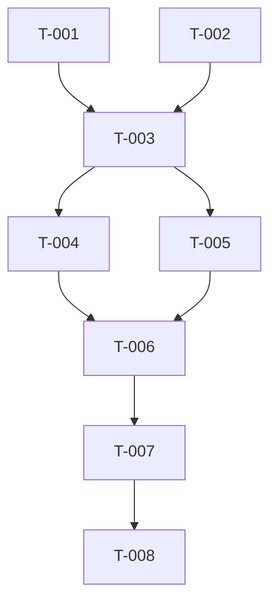

# Build Site — TEST-001 fixture

8 tasks across 2 tiers. Minimal cavekit-shaped build site historically
exercised by the ark orchestrator crate's contract tests (crate removed
in cleanup Packet A Tier 1).

## Tier 0 — Foundations

| Task | Title | Cavekit | Effort |
|------|-------|---------|--------|
| T-001 | Scaffold fixture crate | testing | S |
| T-002 | Add path constants | testing | S |
| T-003 | Populate cavekit project tree | testing | M |

## Tier 1 — Watchers exercise fixture

| Task | Title | Cavekit | Effort |
|------|-------|---------|--------|
| T-004 | Impl-tracking parser contract | orchestrator-cavekit | M |
| T-005 | Ralph-loop parser contract | orchestrator-cavekit | S |
| T-006 | Findings parser contract | orchestrator-cavekit | M |
| T-007 | Build-site extractor contract | orchestrator-cavekit | S |
| T-008 | Wire fixtures through test helper | testing | S |
