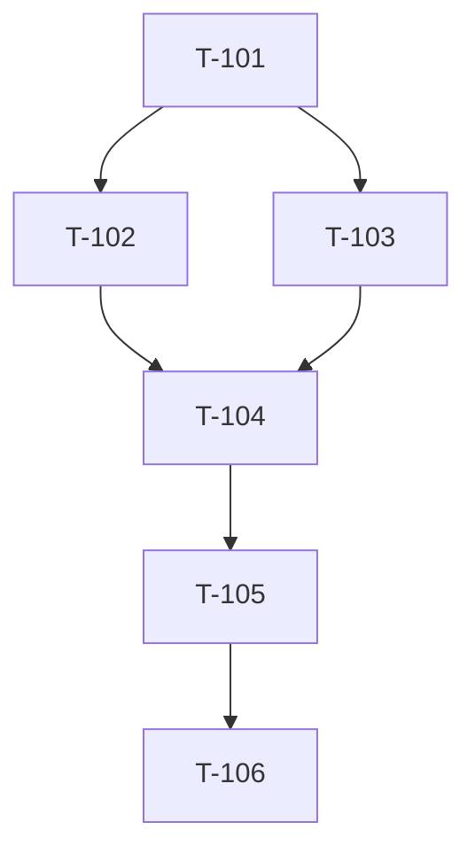

# Build Site — TEST-001

Fixture site for orchestrator watcher contract tests. 6 tasks, single tier.

## Tier 0

| Task | Title | Cavekit | Effort |
|------|-------|---------|--------|
| T-101 | Load fixture cwd | testing | S |
| T-102 | Assert detect succeeds | orchestrator-cavekit | S |
| T-103 | Scan watchers bootstrap | orchestrator-cavekit | M |
| T-104 | Emit iteration event | orchestrator-cavekit | S |
| T-105 | Emit findings events | orchestrator-cavekit | M |
| T-106 | Assert done-resolver | orchestrator-cavekit | S |

Total tasks: 6.
